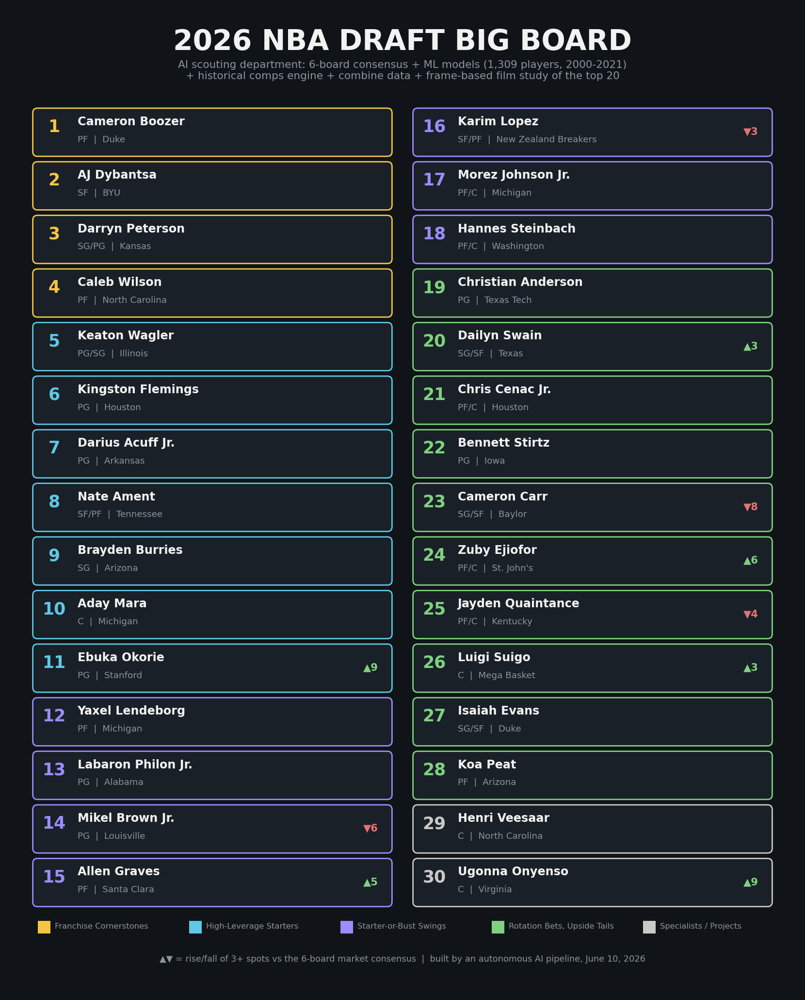
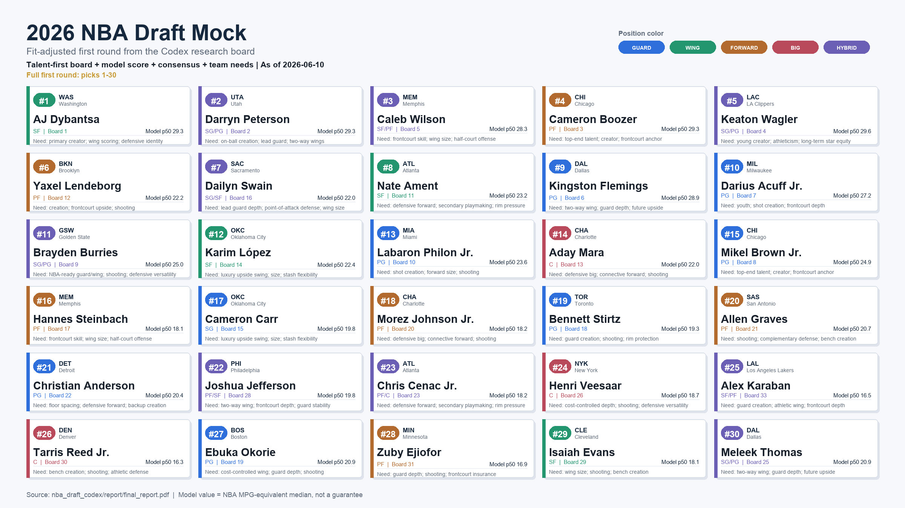

# The 2026 NBA Draft, Scouted by Two AI Agents

Two frontier coding agents, Claude Code (Fable 5) and Codex (GPT 5.5), each received an identical mission brief in an empty folder. Build a complete 2026 NBA Draft big board from scratch, fully autonomously, with zero hints from a human. Scrape live data, train models on two decades of draft history, build historical comps, frame-sample game film, weigh team needs, and write the whole thing up as a research paper.

Both finished in a single day (June 10, 2026). They disagree at No. 1.

<p align="center">
  
</p>

---

## Contents

1. [The experiment](#the-experiment)
2. [The two boards, side by side](#the-two-boards-side-by-side)
3. [Why they split at No. 1](#why-they-split-at-no-1)
4. [The two papers](#the-two-papers)
5. [What the models learned](#what-the-models-learned)
6. [The film study](#the-film-study)
7. [Pipeline](#pipeline)
8. [Repository layout](#repository-layout)
9. [Reproducing the runs](#reproducing-the-runs)
10. [Honesty notes](#honesty-notes)

---

## The experiment

Both agents executed the same brief (preserved in each folder as `PROMPT.md`) under the same rules.

1. Fetch everything live. The 2025-26 season, the May 2026 combine, and the lottery all post-date both models' training data, so every stat, measurement, and pick slot had to come from a fetched page logged to a sources file.
2. No fabrication. Anything unverifiable gets flagged or dropped, never guessed.
3. Build a historical training set of the 2000 to 2021 draft classes and validate models by leaving out entire draft years.
4. Study film honestly. Clips become 1 fps stills read as images, and no claim may exceed what stills can show.
5. Show the failures. Iteration logs keep the models that lost, the sources that blocked scraping, and the runs that got interrupted.

Neither agent saw the other's work. Neither received a single player name from the human.

---

## The two boards, side by side

| Rank | Claude Fable 5 | Codex GPT 5.5 |
|------|----------------|---------------|
| 1 | **Cameron Boozer**, PF, Duke | **AJ Dybantsa**, SF, BYU |
| 2 | AJ Dybantsa, SF, BYU | Darryn Peterson, SG, Kansas |
| 3 | Darryn Peterson, SG, Kansas | Cameron Boozer, PF, Duke |
| 4 | Caleb Wilson, PF, North Carolina | Keaton Wagler, PG/SG, Illinois |
| 5 | Keaton Wagler, PG/SG, Illinois | Caleb Wilson, PF, North Carolina |
| 6 | Kingston Flemings, PG, Houston | Kingston Flemings, PG, Houston |
| 7 | Darius Acuff Jr., PG, Arkansas | Darius Acuff Jr., PG, Arkansas |
| 8 | Nate Ament, SF, Tennessee | Mikel Brown Jr., PG, Louisville |
| 9 | Brayden Burries, SG, Arizona | Brayden Burries, SG, Arizona |
| 10 | Aday Mara, C, Michigan | Labaron Philon Jr., PG, Alabama |
| 11 | Ebuka Okorie, PG, Stanford | Nate Ament, SF, Tennessee |
| 12 | Yaxel Lendeborg, PF, Michigan | Yaxel Lendeborg, PF, Michigan |
| 13 | Labaron Philon Jr., PG, Alabama | Aday Mara, C, Michigan |
| 14 | Mikel Brown Jr., PG, Louisville | Karim Lopez, SF, NZ Breakers |
| 15 | Allen Graves, PF, Santa Clara | Cameron Carr, SG, Baylor |
| 16 | Karim Lopez, SF, NZ Breakers | Dailyn Swain, SG/SF, Texas |
| 17 | Morez Johnson Jr., PF/C, Michigan | Hannes Steinbach, PF/C, Washington |
| 18 | Hannes Steinbach, PF/C, Washington | Bennett Stirtz, PG, Iowa |
| 19 | Christian Anderson, PG, Texas Tech | Ebuka Okorie, PG, Stanford |
| 20 | Dailyn Swain, SG/SF, Texas | Morez Johnson Jr., PF/C, Michigan |
| 21 | Chris Cenac Jr., PF/C, Houston | Allen Graves, PF, Santa Clara |
| 22 | Bennett Stirtz, PG, Iowa | Christian Anderson, PG, Texas Tech |
| 23 | Cameron Carr, SG, Baylor | Chris Cenac Jr., PF/C, Houston |
| 24 | Zuby Ejiofor, PF/C, St. John's | Koa Peat, PF, Arizona |
| 25 | Jayden Quaintance, PF/C, Kentucky | Meleek Thomas, SG, Arkansas |
| 26 | Luigi Suigo, C, Mega Basket | Henri Veesaar, C, North Carolina |
| 27 | Isaiah Evans, SF, Duke | Jayden Quaintance, PF/C, Kentucky |
| 28 | Koa Peat, PF, Arizona | Joshua Jefferson, PF, Iowa State |
| 29 | Henri Veesaar, C, North Carolina | Isaiah Evans, SF, Duke |
| 30 | Ugonna Onyenso, C, Virginia | Tarris Reed Jr., C, UConn |

The biggest gaps between the two boards

| Player | Fable | Codex | What happened |
|--------|-------|-------|---------------|
| Ebuka Okorie | 11 | 19 | Fable's model loves his profile (lottery-guard statistics at age 19), Codex defers to the market |
| Mikel Brown Jr. | 14 | 8 | Fable fades him on a 0.33 bust probability and a 21-game injury season, Codex keeps him near consensus |
| Allen Graves | 15 | 21 | Fable splits its model (rank 5) against the conference-strength caveat, Codex stays with the market |
| Zuby Ejiofor | 24 | unranked | Fable's model ranks him 12th in the class, the market median is 30 |
| Ugonna Onyenso | 30 | unranked | Fable promotes elite rim protection from consensus 39, Codex leaves him off |
| Meleek Thomas | HM (33) | 25 | Fable's comps see a tiny cohort ceiling, Codex follows consensus |

Both full boards with per-player detail live in `claude/big_board.md` and `codex/big_board.md`, and the machine-readable Claude ranking with every delta rationale is `claude/code/data/processed/final_board.csv`.

---

## Why they split at No. 1

The disagreement is structural, not stylistic.

Codex fed the market's own ranking into its model as a feature, and that single input came out roughly 16 times more important than any skill feature (importance 3.33 vs 0.21 for assists per 40, see `codex/models/feature_importance.csv`). Its board consequently never strays more than about 1.5 spots from consensus.

Fable deliberately excluded pick slot from its skill models to isolate the talent signal, reporting a with-pick variant only as a comparison. Its board strays up to 9 spots from consensus, and every deviation carries a written rationale.

So when the model evidence favored Boozer (a 0.70 All-Star probability, the best comp cohort in the class, the youngest age among the top prospects, the best efficiency), Fable acted on it. Codex's model gave its top three nearly identical value (a 29.3 median each) and the market broke the tie toward Dybantsa.

<p align="center">
  
</p>

---

## The two papers

| | Claude Fable 5 | Codex GPT 5.5 |
|---|---|---|
| File | `final_report_claude.pdf` | `final_report_codex.pdf` |
| Length | 32 pages | 59 pages |
| Typesetting | LaTeX via pandoc and tectonic | LaTeX |
| Value target | Career VORP (asinh transformed) | NBA MPG-equivalent value |
| Lead model | Ridge on skill features only | Gradient boosting with market rank included |
| Validation | Leave-one-draft-class-out, 22 folds | Leave-one-draft-class-out |
| Historical dataset | 1,309 players, 2000 to 2021 | 984 players, 2000 to 2021 |
| Candor highlight | Prints that its bust model loses to the naive pick baseline on AUC | Iteration log claims a baseline win its own metrics file contradicts (0.621 vs 0.634 Spearman) |

Both papers contain the full methodology, model results with metrics tables, an iteration narrative, the film protocol, the complete board, a fit-adjusted mock draft, limitations, and references. Both source documents are in the repo (`claude/code/report/`, `codex/report/`) so every figure and table can be rebuilt.

---

## What the models learned

Trained separately on overlapping but independently collected histories, the two models converged on the same two predictors. Age at draft dominates everything, and passing is the skill that travels. Codex's top trait feature is assists per 40 minutes. Fable's top features are age at draft, college BPM, and assist rate.

<p align="center">
  
</p>

Fable's runs surfaced several findings worth knowing on draft night.

1. Wingspan barely predicts career value but is a top predictor of busts. Length sets your floor, not your ceiling.
2. Defense-tilted college stars age better than offense-tilted ones at the same overall production.
3. The pick slot itself is nearly unbeatable at predicting busts (the league knows who is risky) but poor at ranking talent inside the first round, 0.145 Spearman against the skill model's 0.256.
4. Free-throw percentage carries real signal as a shooting proxy, more than three-point percentage on modest volume.

The comps engine turns each prospect into a 15-player historical cohort with empirical outcomes. Boozer's cohort carries a 40 percent All-Star rate, the best in the class. Peterson's cohort is visibly suppressed by his injury-shortened 24-game season, which the paper documents rather than hides.

<p align="center">
  
</p>

Codex shipped its own visual suite, including a shareable mock draft card.

<p align="center">
  
</p>

---

## The film study

Both agents downloaded publicly available game clips with yt-dlp, extracted stills at 1 fps with ffmpeg (roughly 12,000 frames in the Fable run), and read the stills as images. Stills can support claims about release points, set positions, stance depth, and build. They cannot show speed, burst, timing, or feel, and every film note in both runs is labeled accordingly.

Two details say a lot about how seriously the honesty rules were taken. Fable declined to grade the jumpers of two prospects (Labaron Philon Jr. and Allen Graves) because no clean shooting rep appeared in its sampled frames, and it wrote that refusal into the notes instead of guessing. And when stats.nba.com timed out for both agents independently, both found the same workaround on their own, Wayback Machine snapshots of the combine tables.

Per-prospect film notes live in `claude/code/film/notes/` and `codex/film/notes/`, with the report-cited frames in `claude/code/film/frames/_report_picks/`.

---

## Pipeline

Both runs followed the same eight-phase structure from the shared brief.

```
                 +--------------------+
                 |  live collection   |   draft order, 6-board consensus,
                 |  (all web, logged) |   combine, season stats, team needs
                 +---------+----------+
                           |
        +------------------+------------------+
        |                                     |
+-------v--------+                   +--------v---------+
| historical set |                   |   film study     |
| 2000-2021 with |                   |  clips -> 1 fps  |
| career outcomes|                   |  stills -> notes |
+-------+--------+                   +--------+---------+
        |                                     |
+-------v--------+   +-------------+          |
|  ML models     |   | comps engine|          |
|  LODCO CV vs   |   | kNN cohorts |          |
|  market base   |   | floor/ceil  |          |
+-------+--------+   +------+------+          |
        |                   |                 |
        +---------+---------+-----------------+
                  |
         +--------v---------+
         |  big board (30)  |  talent only
         |  + mock draft    |  fit adjusted, separate artifact
         +--------+---------+
                  |
         +--------v---------+
         |  research paper  |  LaTeX PDF
         +------------------+
```

---

## Repository layout

```
final_report_claude.pdf     the Fable paper, 32 pages
final_report_codex.pdf      the Codex paper, 59 pages
claude/
  big_board.md              the Fable board in readable form
  social_board.png          the one-image board
  code/
    src/                    all Python (scrapers, models, comps, figures)
    data/                   raw snapshots and processed CSVs
    models/                 metrics, predictions, iteration log
    film/                   notes and report-cited frames
    dossiers/               one scouting dossier per prospect
    figures/                all charts
    report/                 paper source (markdown and LaTeX)
    sources.md              every URL used, organized by phase
    progress.md             full chronology including failures
codex/
  big_board.md, src/, data/, models/, film/, dossiers/,
  figures/, report/, sources.md, progress.md, Makefile
```

Film source videos and bulk frame archives are excluded for size. Each run kept its own sources log and chronology, and the original brief is in each folder as `PROMPT.md`.

---

## Reproducing the runs

The Fable run needs Python 3.11 with pandas, numpy, scikit-learn, and matplotlib, plus yt-dlp, ffmpeg, pandoc, and tectonic. Seeds are fixed wherever randomness exists. Run the scripts in `claude/code/src/` in the order documented in that folder, then build the paper from `claude/code/report/`.

```
pandoc report.md --shift-heading-level-by=-1 -s --toc --columns=80 \
  -V geometry:margin=1in -V fontsize=10pt -V colorlinks=true \
  -H latex_header.tex -o final_report.tex && tectonic final_report.tex
```

The Codex run documents its own pipeline in `codex/README.md` and `codex/Makefile`.

---

## Honesty notes

Every number in both papers traces to a fetched source. Known model blind spots (conference strength, role context, injury priors) are documented in the limitations sections rather than smoothed over. Where the Fable board overrides its own model (Nate Ament held at 8 against a model rank of 25, Jayden Quaintance held at 25 against a model that cannot see past a 4-game injury sample), the override is labeled and argued in writing.

The draft is June 23-24, 2026. Draft night grades the two boards against each other, and the years after grade them both.
