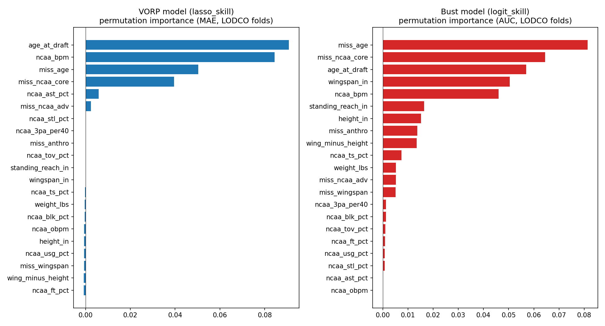
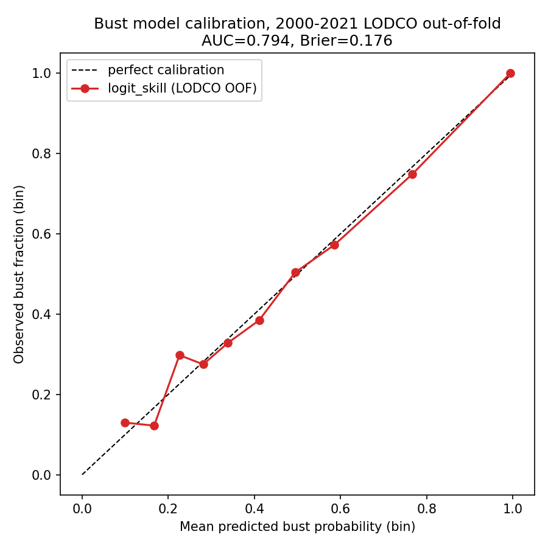
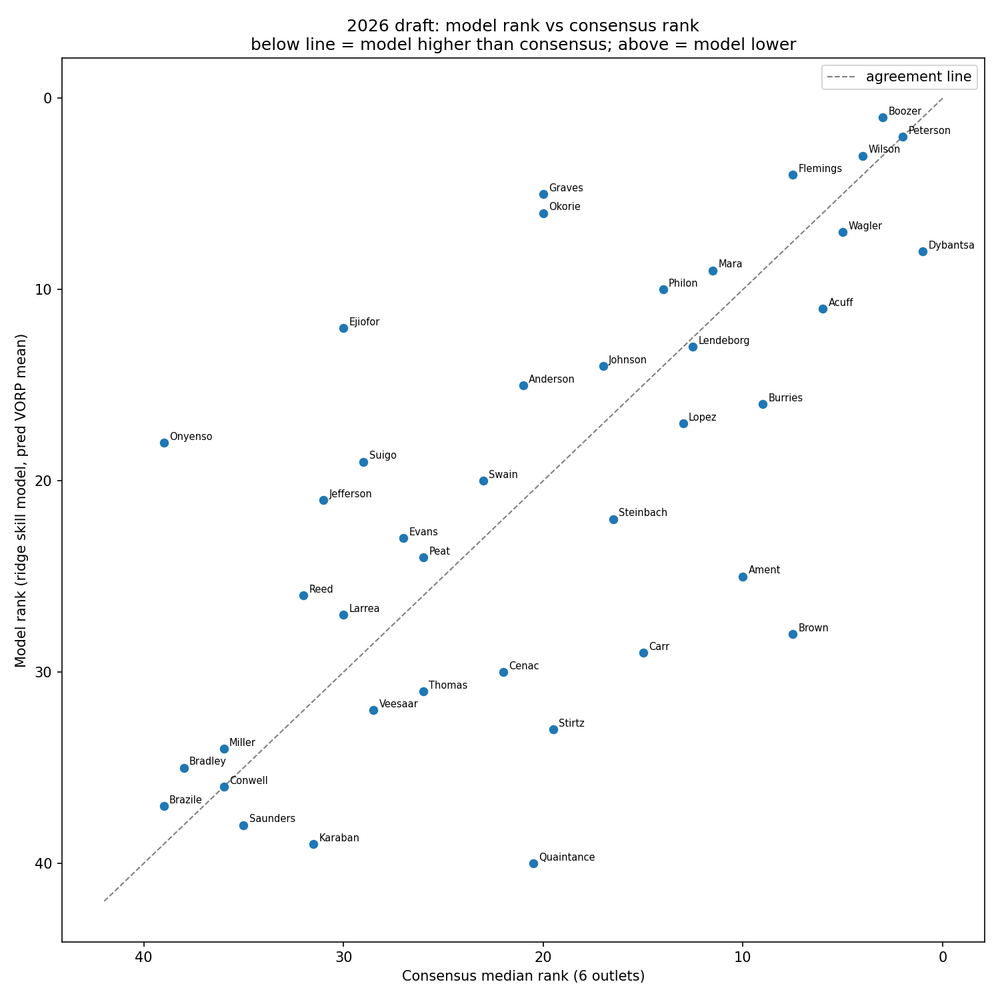
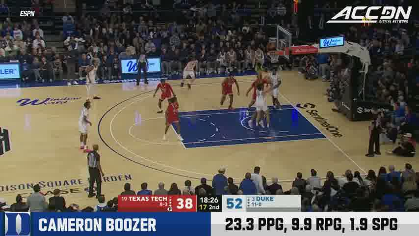
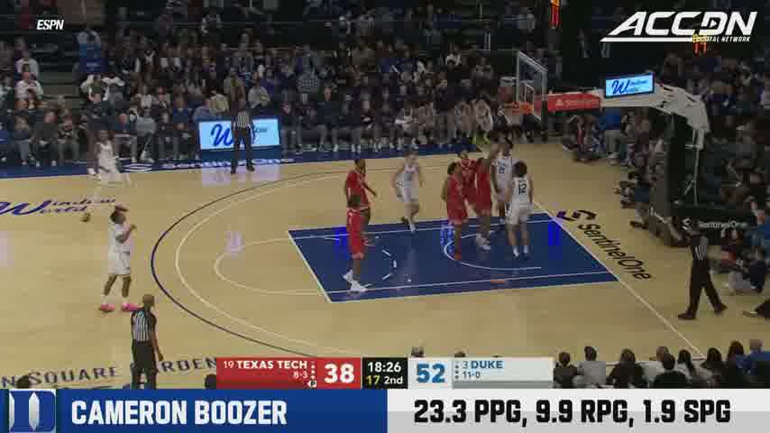
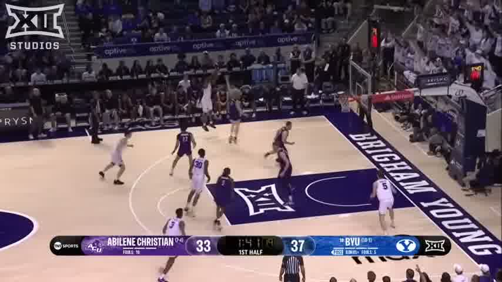
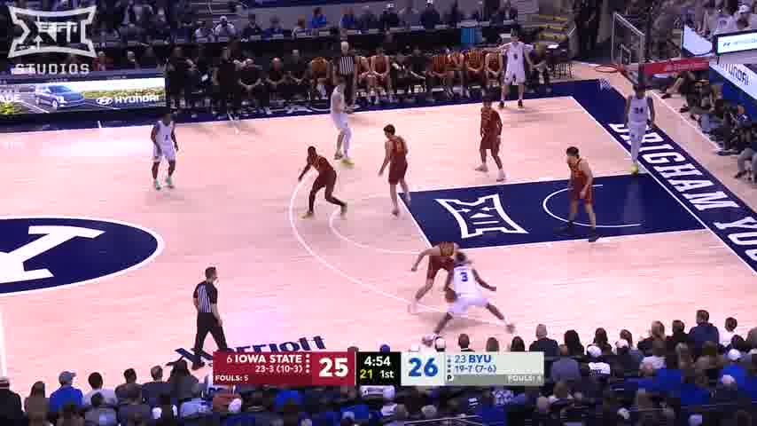
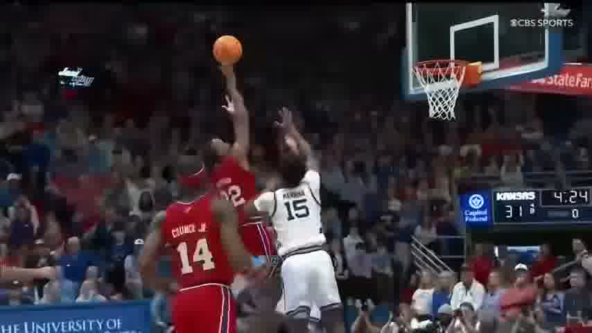
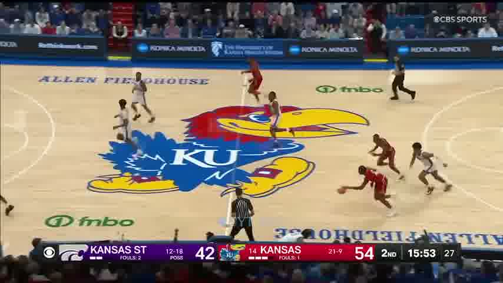
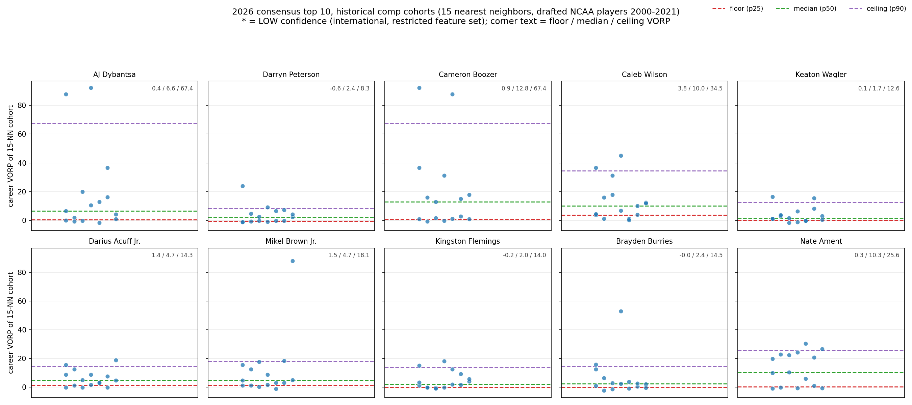

# The 2026 NBA Draft Big Board: A Five-Stream Evidence Pipeline

\newpage

## 1. Abstract

This project builds a complete, self-contained evaluation of the 2026 NBA Draft class from raw public data to a final 30-player big board and a fit-adjusted mock draft. Five evidence streams were collected and integrated: (1) a six-outlet consensus board covering 45 prospects (ESPN, The Ringer, Yahoo, Tankathon, CBS, Bleacher Report); (2) a 1,309-player historical dataset of the 2000-2021 draft classes enriched with final-season college statistics; (3) a suite of leave-one-draft-class-out (LODCO) validated models, a ridge VORP regression on skill features that beats the pick-slot market baseline within the first round (Spearman 0.256 vs 0.145, MAE 7.25 vs 8.14), a five-tier career classifier, and a calibrated bust logistic (AUC 0.794, Brier 0.176); (4) a weighted z-space kNN comps engine over 781 historical NCAA draftees producing 15-player cohorts with floor, median, and ceiling outcomes; and (5) frame-based film study of the consensus top 20 (roughly 11,000 stills at 1 fps, with explicit honesty rules about what stills cannot show). The headline call is Cameron Boozer at No. 1 over consensus No. 1 AJ Dybantsa: Boozer is the model's top prospect by a wide margin (0.70 All-Star probability, 0.006 bust probability), owns the best comp cohort in the class (Love, Bosh, Bogut; 40% All-Star rate), and is the youngest top prospect with the best efficiency (65.3 TS% on 29.9 usage). Other headline calls: Mikel Brown Jr. falls from consensus 7.5 to 14 on production evidence, Ebuka Okorie rises from 20 to 11, and Jayden Quaintance is held at 25 as a priced medical swing. Every number in this report traces to files in the project repository.

## 2. Introduction and Problem Statement

The NBA draft is a prediction-under-uncertainty problem with unusually punishing economics. A team converts one pick into one player whose career value spans roughly -2 to +159 VORP in our 2000-2021 outcome data, with a heavily right-skewed distribution: 43.6% of all drafted players in that window meet a "bust" definition (under 100 career games or under 2 win shares), while a handful of picks return franchise-altering value. The market's own signal, the pick slot itself, explains only part of the variance (first-round Spearman of 0.145 against career VORP in our out-of-fold evaluation). Any single information source, scouting consensus, box-score production, measurements, or film, is individually weak; the practical question is how to combine them without letting any one stream silently dominate.

This project treats the 2026 class as a full-stack research exercise and answers with five deliberately separated evidence streams:

1. **Market consensus**: a merged six-outlet board (45 players) capturing what the industry collectively believes, including its disagreements (per-player rank spreads up to 17 slots).
2. **Historical outcome modeling**: regression, tier classification, and bust models trained on 1,309 drafted players (2000-2021) with college production, age, and anthropometrics as features, validated by leaving out entire draft classes.
3. **Statistical comps**: nearest-neighbor cohorts in a weighted z-scored feature space, summarized as floor/median/ceiling VORP and empirical bust and All-Star rates.
4. **First-party film**: 1 fps frame studies of the top 20 prospects with strict rules about which claims stills can support, paired with cited human scouting.
5. **Measurements and context**: 2026 combine anthropometrics and athletic testing (78 players), prospect season statistics with injury flags (40 players), and team-by-team needs for all 30 first-round slots.

The board itself is a talent-only expected-value ranking; team fit is deliberately quarantined in a separate mock draft so that the two questions ("who is best?" and "who should team X take?") never contaminate each other.

## 3. Related Work

Public, stat-driven draft modeling has a long informal tradition: consensus-aggregation approaches that average or rank-merge multiple outlet boards to estimate market value, and college-production regressions that map NCAA box-score and advanced statistics (typically age, BPM-family metrics, usage, and efficiency) onto NBA career outcomes such as VORP, win shares, or rotation survival. Published public models consistently find that age at draft and overall college impact metrics carry most of the recoverable signal, that draft slot itself is a strong baseline because it aggregates private team intelligence, and that out-of-class validation is essential because outcomes within a draft class are correlated. This project follows that general design philosophy, market baseline first, skill models second, honest comparison between them, without depending on any specific prior implementation; all results here are derived from data collected in this repository.

## 4. Data

All data were collected on June 10, 2026, from public sources, with raw snapshots preserved under `data/raw/`. Full provenance is in `sources.md`; per-dataset collection notes live in `data/raw/*.md`.

### 4.1 Dataset summary

| Dataset | File | Size | Source / method | Known gaps |
|-------------------|----------------------------------------------|------------------------------|--------------------------------------------------------------------------------------------------------|------------------------------------------------------------------------------|
| Draft order 2026 | `data/processed/draft_order.csv` | 30 picks | Tankathon + CBS cross-validated; Wikipedia for trade provenance | Pick 22/30 routing details single-source, flagged UNVERIFIED |
| Consensus board | `data/processed/consensus_board.csv` | 45 players, 6 outlets | ESPN, Ringer, Yahoo (KOC Mock 7.0), Tankathon, CBS, Bleacher Report | Ringer truncated at 30; CBS at 28; NBADraft.net 403; The Athletic paywalled |
| Combine 2026 | `data/processed/combine_2026.csv` | 78 rows (75 anthro, 71 tested) | Wayback snapshots of NBADraft.net tables, cross-checked vs Yahoo and ESPN | Height-in-shoes, hand size, body fat blank for all (stats.nba.com unreachable) |
| Prospect stats 2026 | `data/processed/prospect_stats_2026.csv` | 40 players, 29 cols | Sports-Reference per-player pages; RealGM for birthdates and international stats | 3 internationals have UNVERIFIED usage/BPM (not published for their leagues) |
| Historical outcomes | `data/processed/historical.csv` | 1,309 players, 2000-2021 | Basketball-Reference draft pages + player index; Wikipedia All-Star list; GitHub combine-anthro snapshot | Wingspan 63% coverage; ~12% never played (outcomes are true zeros) |
| Historical enriched | `data/processed/historical_enriched.csv` | 1,309 rows, 36 cols | + Barttorvik bulk data (2009-2021) and Sports-Reference college pages (2000-2008 first-rounders) | Advanced rates 34% pre-2009; internationals blank by design |
| Comps | `data/processed/comps_2026.csv` | 40 prospects | `src/comps_engine.py` over a 781-player NCAA pool | 3 internationals LOW confidence |
| Model predictions | `models/predictions_2026.csv` | 40 prospects | `src/apply_2026.py`, ridge + tier + bust models, 200-rep bootstrap | 5 consensus-board players not modeled (no stats row) |
| Film | `film/notes/` + `film/frames/` | 20 prospects, ~11,000 frames | yt-dlp 480p clips, ffmpeg 1 fps extraction | Stills only; 2 prospects without clean jumper reps sampled |
| Team fit / mock | `data/processed/team_fit.md`, `mock_draft.csv` | 30 slots / 30 picks | `team_context.md` (24 team entries) + project-internal files | Cap/apron details UNVERIFIED where no June 2026 source found |

### 4.2 Consensus board

Six outlet boards were fetched on June 10, 2026 and merged by normalized player name into `consensus_board.csv` (45 players with per-outlet ranks plus mean, median, min, max, and spread). Two boards are partially truncated (The Ringer stops at pick 30, CBS at 28), so deep ranks average over fewer outlets. The consensus top five: Dybantsa (median 1.0), Peterson (2.0), Boozer (3.0), Wilson (4.0), Wagler (5.0). The market's internal disagreements are themselves informative: Luigi Suigo's spread is 17 slots, Karim Lopez 16, Joshua Jefferson 13. NBADraft.net returned HTTP 403 and The Athletic is paywalled; both were skipped and documented in `data/raw/consensus_notes.md`.

### 4.3 2026 combine

The combine (May 10-17, 2026, Chicago) tables were recovered from Wayback Machine snapshots of NBADraft.net (the live pages are Cloudflare-blocked) and cross-validated against Yahoo's independent 73-row table and ESPN spot checks. The file holds 78 player rows: 75 with anthro, 71 with athletic testing. Height-in-shoes, hand length/width, and body fat are blank for every player: those columns exist only on stats.nba.com, whose API timed out on every attempt and has no Wayback snapshot, and no secondary outlet republished them (`data/raw/combine_notes.md`). Notable absences: Quaintance and Saunders measured but skipped testing post-injury; Kayil and De Larrea were no-shows (overseas club seasons still running). Source discrepancies (e.g., Dybantsa wingspan 7'0.5" vs 7'0.25" across outlets) are logged with the resolution rule used; two garbled search-snippet numbers (a vertical misattributed to Stirtz, another to Cenac) were caught against the full tables and discarded.

### 4.4 2026 prospect statistics

Forty prospects (the Tankathon top-40 list) have full 2025-26 season lines from Sports-Reference (per-game plus advanced) and birthdates from RealGM, with 100% coverage on birthdate, TS%, and BPM. The three internationals (Lopez, Suigo, De Larrea) carry pro-league counting stats with usage/AST%/BPM marked UNVERIFIED, as those leagues do not publish them. Injury flags captured at collection: Peterson hamstring (24 GP), Wilson broken thumb (24 GP), Brown back (21 GP), Quaintance knee (4 GP), Saunders ACL (torn Feb 14, 2026, out).

### 4.5 Historical dataset (2000-2021)

`src/build_historical.py` parses 22 Basketball-Reference draft pages (one transient 403, recovered with a single backoff) into 1,309 rows: every pick in both rounds with career-to-date G, MP, WS, WS/48, BPM, VORP, plus drafting team and college. Birthdates and listed height/weight come from the BBR player index (5,416 rows); the All-Star flag from Wikipedia's all-time list (466 players, with name-collision logic); historical combine anthro from a public GitHub snapshot of the stats.nba.com API (1,788 rows, combine seasons 2000-2025), since the live API was unreachable. Per `data/raw/historical_coverage.md`: age coverage 88%, height/weight 92%, wingspan and standing reach 63% (59% for 2000-2009 classes, 68% for 2010-2019, 52% for 2020-2021), career outcome columns 88% (blank only for the ~12% who never played an NBA game; in modeling these are filled with true zeros, not imputations). Nothing was imputed at the data layer.

The enrichment pass (`src/enrich_college_stats.py`) adds final-college-season statistics from two sources: Barttorvik bulk data for the 2009-2021 classes (61,061 player-season rows, spot-checked against public season lines for Zion Williamson, Curry, Davis, Trae Young, and Hield, all matching) and scraped Sports-Reference college pages for 2000-2008 first-round picks (snapshots in `data/raw/historical/college/sref/`, match decisions in `match_log.md`). Coverage: 100% of NCAA first-rounders 2009-2021, 98.5% for 2000-2008; usage and advanced rates are thinner pre-2009 (34%) because the 2000-2008 scrape was scoped to first-rounders, a documented cut. International draftees have blank NCAA columns by design. The result is `historical_enriched.csv` (1,309 rows, 36 columns).

Per-year row counts and feature coverage (%), reproduced from `data/raw/historical_coverage.md`:

| year | rows | age | height | weight | wingspan | reach | games | WS | WS/48 | BPM | VORP |
|----|----|---|------|------|--------|-----|-----|---|-----|---|----|
| 2000 | 58 | 86 | 93 | 93 | 41 | 41 | 86 | 86 | 86 | 86 | 86 |
| 2001 | 57 | 86 | 91 | 91 | 70 | 70 | 86 | 86 | 86 | 86 | 86 |
| 2002 | 57 | 84 | 95 | 95 | 67 | 67 | 84 | 84 | 84 | 84 | 84 |
| 2003 | 58 | 81 | 83 | 83 | 50 | 50 | 81 | 81 | 81 | 81 | 81 |
| 2004 | 59 | 78 | 90 | 90 | 61 | 61 | 78 | 78 | 78 | 78 | 78 |
| 2005 | 60 | 92 | 92 | 92 | 63 | 63 | 92 | 92 | 92 | 92 | 92 |
| 2006 | 60 | 87 | 88 | 88 | 50 | 50 | 87 | 87 | 87 | 87 | 87 |
| 2007 | 60 | 82 | 92 | 92 | 65 | 65 | 82 | 82 | 80 | 80 | 82 |
| 2008 | 60 | 85 | 97 | 97 | 55 | 55 | 85 | 85 | 85 | 85 | 85 |
| 2009 | 60 | 83 | 87 | 87 | 70 | 70 | 83 | 83 | 83 | 83 | 83 |
| 2010 | 60 | 85 | 90 | 90 | 73 | 73 | 85 | 85 | 85 | 85 | 85 |
| 2011 | 60 | 90 | 92 | 92 | 70 | 70 | 90 | 90 | 90 | 90 | 90 |
| 2012 | 60 | 93 | 95 | 95 | 83 | 83 | 93 | 93 | 93 | 93 | 93 |
| 2013 | 60 | 85 | 88 | 88 | 70 | 68 | 85 | 85 | 85 | 85 | 85 |
| 2014 | 60 | 90 | 95 | 95 | 70 | 70 | 90 | 90 | 90 | 90 | 90 |
| 2015 | 60 | 73 | 80 | 80 | 58 | 58 | 73 | 73 | 73 | 73 | 73 |
| 2016 | 60 | 92 | 93 | 93 | 62 | 62 | 92 | 92 | 92 | 92 | 92 |
| 2017 | 60 | 95 | 95 | 95 | 63 | 63 | 95 | 95 | 95 | 95 | 95 |
| 2018 | 60 | 95 | 98 | 98 | 63 | 63 | 95 | 95 | 95 | 95 | 95 |
| 2019 | 60 | 97 | 98 | 98 | 68 | 68 | 97 | 97 | 97 | 97 | 97 |
| 2020 | 60 | 97 | 97 | 97 | 40 | 40 | 97 | 97 | 97 | 97 | 97 |
| 2021 | 60 | 93 | 95 | 95 | 63 | 63 | 93 | 93 | 93 | 93 | 93 |

Wingspan coverage is the weak column throughout (combine-era artifact); career outcome coverage tracks the never-played share of each class.

### 4.6 Cleaning decisions and gaps, summarized

- height_in mixes combine barefoot height with BBR listed height (387 flagged rows); 2026 prospects use listed height for consistency with the historical convention, with combine wingspan/reach/weight where measured.
- Never-played players (161, notes column verifies "never played") have outcome columns set to 0 as real outcomes, not missing data.
- 2026 STL% and BLK% are not published for prospects and were approximated from per-game steals and blocks with fixed possession constants (formulas in `src/apply_2026.py`); ordering is preserved, absolute level is approximate, and the choice is documented.
- Five consensus-board players (Amari Allen, Maliq Brown, Jack Kayil, Braden Smith, Izaiyah Nelson) have no prospect-stats row and are not modeled.

## 5. Methodology

### 5.1 Consensus aggregation

Each outlet board was extracted verbatim into `data/raw/consensus_notes.md`, then merged by normalized name (`data/raw/build_consensus.py`). Per player we report each outlet rank plus mean, median, min, max, and spread. The median is the availability proxy used downstream (team fit treats a player as plausibly available within roughly +/-6 of his median). Truncated boards contribute only where they actually rank a player; no rank is invented for missing entries.

### 5.2 Model suite

All models train on `historical_enriched.csv` (n=1,309) with seed 42, implemented in `src/model_common.py` and `src/train_models.py`.

**Baseline.** A pick-slot isotonic regression (monotone decreasing, fit per training fold) is the market baseline. Archived multi-outlet boards do not exist for 2000-2021, so draft slot serves as the market-consensus proxy; this is standard practice and documented as such.

**Skill regression.** Ridge, lasso, and HistGradientBoosting on a 21-feature skill set: age at draft; height, weight, wingspan, standing reach, wingspan-height differential; NCAA TS%, USG%, AST%, TOV%, STL%, BLK%, FT%, 3PA per 40 minutes, OBPM, BPM; and five explicit missingness indicators (miss_age, miss_anthro, miss_wingspan, miss_ncaa_core, miss_ncaa_adv). Pick slot is excluded from skill models by design (we want the talent signal, not the market echo); with-pick variants are reported for comparison only. The target is career VORP under an asinh transform, chosen by a transform scan (identity vs asinh vs signed-sqrt): raw VORP is extremely right-skewed (max 159 vs median 0), and asinh improved ridge MAE from 5.64 to 4.59 and pooled Spearman by about 0.02 while handling negative VORP naturally. Metrics are always computed back on the raw VORP scale. Missing features are median-imputed inside each CV training fold; the indicators keep missingness explicit rather than silent.

**Tier classifier.** A five-tier career outcome label predicted by multinomial logistic regression and an HGB classifier on the same skill features, against a pick-only logistic baseline. The tiers (`models/tier_definitions.md`, first match wins):

| Tier | Exact rule | n | Median career VORP |
|--------|-------------------------------------------|---|------------------|
| AllStar | at least one All-Star selection | 119 | 21.0 |
| Starter | career minutes >= 12,000 and career WS >= 25 | 158 | 9.1 |
| Rotation | career minutes >= 5,000 and career WS >= 5 | 297 | 1.7 |
| Bench | career games >= 100 and career WS > 2 | 158 | -0.2 |
| Bust | everything else | 577 | -0.1 |

Tier medians are monotone in career VORP, which sanity-checks the ordering; Bench and Bust separate on longevity rather than VORP, by design.

**Bust logistic.** Binary label `bust = (career_games < 100) OR (career_ws < 2.0)`, base rate 43.6% over all picks, 19.9% among first-rounders, 11.0% in the lottery. The label deliberately does not depend on draft position, because the skill models exclude pick.

### 5.3 Validation: LODCO, and why random splits leak

All evaluation uses leave-one-draft-class-out cross-validation: 22 folds, each holding out one full draft year (2000-2021). Random row-level splits leak in this setting in two ways. First, outcomes within a class are correlated (shared era, shared league context, a shared cap on available minutes and roles), so a random split lets the model see the held-out class's context through its classmates. Second, the deployment task is exactly a LODCO fold: ranking a class the model has never seen. Reported metrics are out-of-fold predictions pooled across all 22 folds, plus the mean of within-year Spearman (the within-class ranking skill that matters on draft night). A known censoring caveat: career-to-date outcomes give the 2020 and 2021 classes only 4-6 seasons of accumulation, so those folds understate upside (2020-21 combined: 1 Starter, 10 All-Stars, 50 Busts out of 120); accepted per project design and documented in `models/tier_definitions.md`.

### 5.4 Uncertainty: bootstrap over draft classes

2026 predictions come with distributions, not points. The ridge model is refit 200 times on bootstrap resamples of the 22 draft classes (resampling whole classes with replacement, seed 42). `pred_vorp_mean` is the mean of bootstrap-only draws (model uncertainty); the percentile columns (p10 through p90) additionally inject LODCO out-of-fold residual noise (sd 1.66 on the asinh scale, estimated from picks 1-45) to describe outcome spread. Two distribution corrections were required and are narrated in Section 7: a convexity fix (inverse asinh is convex, so residual noise inflates means) and winsorization of outcome draws at the historical maximum (159.4 VORP).

### 5.5 Comps engine

`src/comps_engine.py` (deterministic, no web access) computes weighted z-scored distances over 15 features (heaviest weights: age 1.50; height, TS%, and usage 1.25 each) against a candidate pool of 781 NCAA draftees from the enriched historical file. Missing features are handled by pairwise renormalization: each pairwise distance averages only over features present for both players, requiring at least 60% of total feature weight to be shared, so a missing wingspan shrinks the comparison set instead of silently zero-filling. Outputs per prospect: the 5 nearest comps with their career VORP, and a 15-player cohort summarized as floor (25th percentile), median (50th), and ceiling (90th percentile) cohort career VORP plus empirical bust and All-Star rates ("cohort15"). International prospects (Lopez, De Larrea, Suigo) are comped on a restricted anthro/age/basic-stats set and flagged LOW confidence. Size or role mismatches inside a cohort are annotated (e.g., a creation-role mismatch when AST% differs wildly). Spot checks passed on the first iteration (Boozer to Love/Bogut/Bosh; Mara to Hibbert/Mobley/Thabeet) and the v1 weights shipped unchanged.

### 5.6 Film protocol: stills-only honesty rules

For each of the consensus top 20: a game or season highlight reel was located on YouTube, downloaded with yt-dlp at 480p or below, and decomposed by ffmpeg into 1 fps stills (about 11,000 frames total). Notes (`film/notes/<slug>.md`) follow a strict two-section format: frame-based observations (ours, every claim tagged to specific frame files) and sourced scouting observations (human scouts, cited with URLs). The honesty rules: 1 fps stills can support claims about posture, release height, body frame, positioning, and extension; they cannot support claims about burst, speed, timing, or feel, and every note states explicitly what is not claimed. Where no clean rep of a skill landed on a sampled second (e.g., no jumper rep for Philon or Graves), no mechanics claim is made at all. Three or four representative frames per top-10 prospect were copied to `film/frames/_report_picks/`.

### 5.7 Team fit and the board-vs-mock separation

The big board ranks expected value per pick with zero fit input. Team fit lives entirely in `team_fit.md` (all 30 slots: pick provenance, needs, timeline, best fits plausibly available, and an explicit fit-vs-talent verdict) and `mock_draft.csv` (a 30-pick simulation where players are available within roughly +/-6 of consensus median and teams draft by need, tendency, and value). This separation means a fit-driven reach (e.g., the Clippers taking Ament at 5) appears in the mock with its reasoning, while the board remains a pure talent ranking. The mock validated: 30 unique players, all availability constraints satisfied.

## 6. Model Results

### 6.1 VORP regression: skill features beat the market proxy

All numbers are LODCO out-of-fold on the raw VORP scale, from `models/metrics_regression.json`.

The transform scan that selected the asinh target (ridge and HistGB, all picks):

| Transform | Ridge MAE | Ridge Spearman (pooled) | HistGB MAE | HistGB Spearman (pooled) |
|-----------|---------|-----------------------|----------|------------------------|
| identity | 5.64 | 0.255 | 5.65 | 0.210 |
| asinh | **4.59** | **0.273** | 4.59 | 0.249 |
| signed sqrt | 4.57 | 0.273 | 4.61 | 0.247 |

Main comparison, all picks (n=1,309):

| Model | MAE | RMSE | Spearman (pooled) | Spearman (within-year mean) |
|---------------------------|----|-----|-----------------|---------------------------|
| Pick-slot isotonic baseline | 5.26 | 10.21 | 0.208 | 0.245 |
| Ridge (skill) | 4.59 | 11.04 | 0.273 | 0.269 |
| Lasso (skill) | 4.59 | 11.09 | 0.274 | 0.277 |
| HistGB (skill) | 4.59 | 10.91 | 0.249 | 0.246 |
| Ridge (skill + pick) | 4.55 | 10.99 | 0.288 | 0.287 |
| HistGB (skill + pick) | 4.53 | 10.65 | 0.277 | 0.281 |

First round only (picks 1-30, n=658, the 2026 use case):

| Model | MAE | Spearman (pooled) | Spearman (within-year mean) |
|---------------------------|----|-----------------|---------------------------|
| Pick-slot isotonic baseline | 8.14 | 0.145 | 0.211 |
| Ridge (skill) | 7.25 | **0.256** | 0.245 |
| Lasso (skill) | 7.26 | 0.246 | 0.245 |
| HistGB (skill) | 7.25 | 0.213 | 0.197 |
| Ridge (skill + pick) | 7.24 | 0.275 | 0.268 |
| HistGB (skill + pick) | 7.20 | 0.268 | 0.260 |

Findings, stated plainly. Skill-only linear models beat the pick baseline on every regression metric except RMSE (the transform deliberately stops chasing the extreme right tail, which costs RMSE and is the right trade for ranking prospects). Within the first round the gap is large in relative terms: Spearman 0.256 vs 0.145. Adding pick on top of skills helps a little more (0.288 pooled), meaning the market does know things box scores do not (intel, film, character), but the increment is small (about 0.015): most of the market's ranking information is recoverable from age, NCAA stats, and anthro. Lasso and ridge are a statistical tie; ridge was chosen for the 2026 application because it wins the first-round subset and its coefficients are stable, while lasso confirms feature selection (it zeroes 6 of 21 features and keeps the same leaders). HistGB underperforms the linear models, an honest negative result discussed in Section 7.

### 6.2 Tier classifier

From `models/metrics_tiers.json` (5 tiers, LODCO):

| Model | Accuracy | Macro-F1 |
|--------------------------|--------|--------|
| Pick-only logistic baseline | 0.494 | 0.222 |
| Multinomial logistic (skill) | 0.466 | 0.266 |
| HGB classifier (skill) | 0.441 | 0.294 |

The pick baseline wins raw accuracy by predicting only the dominant classes (its confusion matrix never predicts AllStar, Starter, or Bench at all); the skill models win macro-F1 by actually discriminating the rare tiers. Neither is strong: five-way career-tier prediction from pre-draft statistics is hard, and we say so. The multinomial logistic supplies the 2026 tier probabilities (better calibrated than HGB, whose macro-F1 edge comes mostly from the Bench tier).

### 6.3 Bust model: the pick baseline wins AUC, and we say so

From `models/metrics_bust.json`:

| Model | AUC | Brier | Log loss | AUC (first round) |
|---------------------------|---------|---------|---------|-----------------|
| Pick-only logistic baseline | **0.806** | 0.178 | 0.532 | **0.668** |
| Logistic (skill) | 0.794 | **0.176** | **0.516** | 0.642 |
| HGB (skill) | 0.776 | 0.184 | 0.539 | - |

The pick baseline beats the skill model on bust AUC, both overall (0.806 vs 0.794) and within the first round (0.668 vs 0.642). Where a player gets picked is genuinely the single best washout predictor, because the market aggregates private intelligence we do not have. The skill logistic remains the production bust model for two reasons: it is the only model that can actually be applied to 2026 prospects (who have no pick yet), and it is well calibrated (near-diagonal reliability curve, Brier 0.176, slight underconfidence below p=0.3). The correct reading of every 2026 `bust_prob` is therefore "skills-only risk," not market-informed risk.

### 6.4 Feature importance

Top VORP-model features by permutation importance (standardized ridge coefficients in parentheses): age_at_draft 0.091 (-0.38), ncaa_bpm 0.084 (+0.35), miss_age 0.050 (-0.17), miss_ncaa_core 0.039 (-0.24), ncaa_ast_pct 0.006 (+0.10). The hierarchy is clean: younger at the same production level is far better; overall college impact is the second pillar; passing (AST%) is the clearest skill predictor after age and BPM; efficiency (TS%, coef +0.05) and free-throw touch (+0.03) help. Notable secondary findings: OBPM gets a negative coefficient conditional on total BPM (given equal impact, defense-leaning college players age better than offense-leaning ones, and lasso keeps the sign); wingspan and reach contribute almost nothing to VORP once height and weight are in (partly an artifact of 37% wingspan missingness), yet wingspan is the No. 4 feature in the bust model; raw height is slightly negative conditional on everything else (the skill stats already encode position, so raw "big" is not a bonus). The bust model's top features are miss_age, miss_ncaa_core, age_at_draft, wingspan_in, and ncaa_bpm: older, statless, and short-armed is the washout profile. A reading note for 2026 outputs: every NCAA prospect has miss_age = miss_ncaa_core = 0, so their scores ride on age, BPM, and AST%; the three internationals receive the miss_ncaa_core penalty, which functions as the intended wide-uncertainty flag.

### 6.5 Model vs consensus on the 2026 class

The biggest gaps (consensus median minus model rank): model HIGHER on Onyenso (+21), Ejiofor (+18), Graves (+15), Okorie (+14); model LOWER on Mikel Brown (-20.5), Quaintance (-19.5), Ament (-15), Carr (-14), Stirtz (-13.5). The pattern and its interpretation are taken up in Section 11.

## 7. Iteration Narrative

Condensed from `models/iterations.md`; all runs `python3 src/train_models.py`, seed 42 everywhere.

**Iteration 1, baseline and transform scan.** Established the pick-slot isotonic baseline, then scanned target transforms. The asinh transform was chosen: it lifted ridge from MAE 5.64 / pooled Spearman 0.255 to 4.59 / 0.273 (signed-sqrt essentially tied; asinh handles negative VORP without a sign hack). RMSE got slightly worse under the transform because the model stops chasing the Jokic/LeBron tail; accepted deliberately.

**Iteration 2, full model set.** The headline comparison of Section 6. Two honest negative results landed here. First, HistGB underperforms ridge and lasso (pooled Spearman 0.249 vs 0.273): with roughly 20 mostly linear features and n=1.3k, trees add variance, not signal, so linear models are the headline models. Second, the pick baseline beats the skill bust model on AUC (0.806 vs 0.794); documented rather than buried.

**Iteration 3, first-round-only training.** Since the 2026 board is a top-45 exercise, we tested training only on picks 1-30 (n=658). It hurts: FR-only ridge scores 0.235 pooled Spearman on first-rounders vs 0.256 for the all-picks model evaluated on the same subset, and HGB collapses to 0.150. Second-rounders roughly double n and sharpen the age and BPM gradients. All-picks training kept.

**Iteration 4, 2026 application.** Refit ridge on all 22 classes, merged the three 2026 files by normalized name (40 of 40 matched), and generated bootstrap distributions. Two distribution bugs were caught and fixed, both documented in code. (1) Convexity inflation: the first run reported the mean of residual-noised draws; inverse asinh is convex, so the noise inflated means, producing a nonsense 104 expected VORP for Boozer. Fix: report the mean of bootstrap-only draws; keep residual noise only in the percentile columns, which are meant to describe outcome spread. (2) Impossible tails: multiplicative residual noise on the asinh scale let elite profiles draw outcomes above anything in NBA history (p90 near 288 VORP, above LeBron's 159). Outcome draws are clipped at the training maximum (159.4), affecting only the extreme right tail of the top ~3 prospects. Sanity checks passed: Boozer's predicted mean of 22.4 VORP matches the historical average outcome of a No. 1 pick; the bust probability range (0.006 to 0.545) tops out on Quaintance (4 GP, knee) and Mikel Brown, which is sensible; tier probabilities sum to 1.

The cross-cutting lesson: every fancier move was tested against a dumber alternative, and three of them (gradient boosting, first-round-only training, naively residual-noised means) lost or broke. What survived is a ridge regression on 21 features, which is the point: the value is in the validation design and the data, not in model exotica.

## 8. Film Study

### 8.1 Protocol

For each consensus top-20 prospect: locate a representative highlight reel or single-game video, download at 480p or lower with yt-dlp, extract stills at 1 fps with ffmpeg, then write a two-section note: frame-based observations (every claim tagged to specific frame files) and sourced scouting observations (cited human scouts). Roughly 11,000 frames were extracted across the 20 prospects. Video IDs and frame counts are recorded at the top of each note; clips are preserved in `film/clips/`.

### 8.2 What stills can and cannot support

Stills at 1 fps reliably show: release point and apex height relative to contests, follow-through position, body frame relative to opponents in the same frame, handle and post posture, base width, floor positioning, and extension at the rim. They categorically cannot show: burst, first-step speed, gather-to-release time, defensive timing, recovery quickness, or feel, because the actual movement falls between sampled seconds. Every note carries an explicit "not claimed from frames" list, and the highlight-reel sourcing adds a made-plays-only selection bias that the notes also flag.

### 8.3 Example observations

**Cameron Boozer** (685 frames, ACC Digital Network reel, `film/notes/boozer.md`). A post-up versus Texas Tech shows a wide, low post seal with the defender pinned on his hip (frame_0287 through frame_0290), then airborne at the rim a frame later with the ball carried high and away from the swipe; the frames support a strong wide-base seal and high ball position, not how quickly he elevated. Across multiple games he reads as already filled out, thick through the chest, glutes, and thighs, holding base width under contact. The reel produced no clean perimeter jumper rep at sampled seconds, so the note makes no claim about his three-point set point.

**AJ Dybantsa** (1,503 frames, Big 12 Studios reel, `film/notes/dybantsa.md`). A left-wing jumper versus Abilene Christian (frame_0544, ball flight at frame_0547) releases above and slightly in front of his head at the top of the jump, well above the closest defender's contest. A finishing sequence versus California Baptist (frame_0302 to frame_0304) ends fully extended at the rim with the ball above the cylinder, long and balanced rather than crashing sideways. Close-ups show broad square shoulders on a lean torso, a wing build with room for mass; nothing in the frames supports claims about his famous burst, and the note says so.

**Aday Mara** (248 frames, Final Four versus Arizona, `film/notes/mara.md`). Standing flat-footed under the basket his head sits roughly at the bottom edge of the backboard (frame_0061), so his set point on any close shot starts above typical contest height before he leaves the floor. He catches at the elbow with the ball kept at chest-to-chin level, torso upright, shielding with the off shoulder rather than lowering into a dribble crouch (frame_0091, frame_0181). Block timing and foot speed are explicitly not claimable from stills.

### 8.4 Selected report frames

### 8.5 Limitations of the film stream

This is the weakest of the five evidence streams and is weighted accordingly. The sampling rate destroys all motion information; the source reels are made-play compilations with severe selection bias; several prospects are represented by a single game; two prospects (Philon, Graves) produced no clean jumper rep at sampled seconds despite shooting being central to their evaluation, so their notes make no mechanics claims; Philon's only available reel predates the sophomore leap his ranking depends on; one source (Burries) was 360p. Player identification in wide frames sometimes rests on the reel being that player's compilation rather than a legible jersey number, and the notes flag this. The film stream is used to confirm or deny physical and postural claims from scouting reports, never to generate athleticism or skill claims of its own.

## 9. The 2026 Big Board

The board is a talent-only expected-value ranking built from all five evidence streams (full per-player dossiers in `dossiers/`, assembled board in `big_board.md`, machine-readable ranking with per-player delta rationales in `data/processed/final_board.csv`).

### 9.1 Tier definitions

| Tier | Ranks | Label | Meaning |
|----|-----|-------------------------------|------------------------------------------------------------------------|
| 1 | 1-4 | Franchise Cornerstones | Evidence (production, age, cohort) or ceiling strong enough to build around |
| 2 | 5-11 | High-Leverage Starters | Starter-probable profiles, several with live star tails |
| 3 | 12-18 | Starter-or-Bust Swings | Real starter cases with a documented flaw, injury, or data gap on the other side |
| 4 | 19-28 | Rotation Bets with Upside Tails | Likely rotation players whose cohorts carry one famous tail outcome |
| 5 | 29-30 | Specialists / Projects | One elite NBA skill or one defining fit, priced at the end of the round |

### 9.2 The board at a glance

| Rank | Player | Pos | School/Team | Age | Consensus median | Model rank | Tier |
|----|------------------|-----|--------------------|-----|----------------|----------|----|
| 1 | Cameron Boozer | PF | Duke | 18.94 | 3.0 | 1 | 1 |
| 2 | AJ Dybantsa | SF | BYU | 19.40 | 1.0 | 8 | 1 |
| 3 | Darryn Peterson | SG/PG | Kansas | 19.44 | 2.0 | 2 | 1 |
| 4 | Caleb Wilson | SF/PF | North Carolina | 19.94 | 4.0 | 3 | 1 |
| 5 | Keaton Wagler | SG/PG | Illinois | 19.39 | 5.0 | 7 | 2 |
| 6 | Kingston Flemings | PG | Houston | 19.47 | 7.5 | 4 | 2 |
| 7 | Darius Acuff Jr. | PG | Arkansas | 19.61 | 6.0 | 11 | 2 |
| 8 | Nate Ament | SF | Tennessee | 19.54 | 10.0 | 25 | 2 |
| 9 | Brayden Burries | SG/PG | Arizona | 20.77 | 9.0 | 16 | 2 |
| 10 | Aday Mara | C | Michigan | 21.22 | 11.5 | 9 | 2 |
| 11 | Ebuka Okorie | PG | Stanford | 19.21 | 20.0 | 6 | 2 |
| 12 | Yaxel Lendeborg | PF | Michigan | 23.73 | 12.5 | 13 | 3 |
| 13 | Labaron Philon Jr. | PG | Alabama | 20.58 | 14.0 | 10 | 3 |
| 14 | Mikel Brown Jr. | PG | Louisville | 20.23 | 7.5 | 28 | 3 |
| 15 | Allen Graves | PF | Santa Clara | 19.91 | 20.0 | 5 | 3 |
| 16 | Karim Lopez | SF | NZ Breakers (NBL) | 19.2 | 13.0 | 17 | 3 |
| 17 | Morez Johnson Jr. | PF/C | Michigan | 20.41 | 17.0 | 14 | 3 |
| 18 | Hannes Steinbach | PF/C | Washington | 20.15 | 16.5 | 22 | 3 |
| 19 | Christian Anderson | PG | Texas Tech | 20.23 | 21.0 | 15 | 4 |
| 20 | Dailyn Swain | SG/SF | Texas | 20.94 | 23.0 | 20 | 4 |
| 21 | Chris Cenac Jr. | PF/C | Houston | 19.39 | 22.0 | 30 | 4 |
| 22 | Bennett Stirtz | PG | Iowa | 22.73 | 19.5 | 33 | 4 |
| 23 | Cameron Carr | SG/SF | Baylor | 21.59 | 15.0 | 29 | 4 |
| 24 | Zuby Ejiofor | PF/C | St. John's | 22.18 | 30.0 | 12 | 4 |
| 25 | Jayden Quaintance | PF/C | Kentucky | 18.96 | 20.5 | 40 | 4 |
| 26 | Luigi Suigo | C | KK Mega Basket (ABA) | 19.40 | 29.0 | 19 | 4 |
| 27 | Isaiah Evans | SF | Duke | 20.55 | 27.0 | 23 | 4 |
| 28 | Koa Peat | PF | Arizona | 19.43 | 26.0 | 24 | 4 |
| 29 | Henri Veesaar | C | North Carolina | 22.24 | 28.5 | 32 | 5 |
| 30 | Ugonna Onyenso | C | Virginia | 21.75 | 39.0 | 18 | 5 |

### 9.3 Tier 1, Franchise Cornerstones (1-4)

**1. Cameron Boozer, PF, Duke | Age 18.94 | Consensus 3.0 | Model 1**

- Measurements: 6'8.25" barefoot, 252.8 lbs, 7'1.5" wingspan, 9'0" standing reach; modest testing (35.0" max vert, 11.06s lane agility).
- 2025-26: 22.5/10.2/4.1 with 1.4 spg in 38 GP; class-best 65.3 TS% on 29.9 usage, 39.1% from three, 78.9 FT%; class-best 18.7 BPM with 25.6 AST% vs 12.8 TOV%.
- Model: rank 1 by a wide margin; median VORP 19.8 (p25-p75 band 7.0-105.4, the widest and highest in the class); 0.70 All-Star probability; bust 0.006, effectively the floor of the dataset.
- Comps: floor Grant Williams, ceiling Kevin Love, with Bosh and Bogut in the top five; cohort 13.3% bust, 40% All-Star, the best star-hit cohort in the class.
- Film (stills only): 685-frame ACC reel shows a wide low-post seal into a high-carried rim finish and an already filled-out frame; stills cannot show how quickly he elevates.
- Why 1 over consensus 3: model No. 1, best comp cohort, youngest top prospect with the best efficiency; production plus age plus cohort outweigh the market's athletic-ceiling preference for Dybantsa.
- Verdict: the rare No. 1 case built on evidence rather than projection; the honest concern is athletic ceiling, which is exactly why the market slots him third.

**2. AJ Dybantsa, SF, BYU | Age 19.40 | Consensus 1.0 | Model 8**

- Measurements: 6'8.5" barefoot, 217.0 lbs, 7'0.5" wingspan, 8'10" reach; standout 42.0" max vert.
- 2025-26: class-high 25.5 ppg with 6.8 rpg, 3.7 apg in 35 GP; 60.0 TS% on a heavy 33.9 usage, 33.1% from three, 77.4 FT% on 8.5 FTA/g; 11.7 BPM.
- Model: rank 8; median VORP 3.6 (band 1.2-27.9); 0.49 All-Star probability, second best in the class; bust 0.053. The regression dings efficiency relative to enormous load.
- Comps: floor Jarrett Culver, ceiling Mike Miller; cohort 0% bust but only 20% All-Star, milder than the scouting hype implies.
- Film (stills only): 1,503-frame Big 12 reel shows a high-apex release well above contests and long balanced rim extension; 1 fps cannot show burst or first-step speed.
- Why 2 under consensus 1: ranked below Boozer on evidence, not talent ceiling; Boozer produced more, more efficiently, at a younger age.
- Verdict: the class's clearest bet on scoring talent, 25.5 a game as a teen wing with a 42-inch vert; the model's skepticism is legible, so he stays Tier 1 at No. 2.

**3. Darryn Peterson, SG/PG, Kansas | Age 19.44 | Consensus 2.0 | Model 2**

- Measurements: 6'4.5" barefoot, 198.8 lbs, 6'9.75" wingspan, 8'7" reach; 37.5" max vert.
- 2025-26: 20.2 ppg in 24 GP (hamstring strain cost 7 straight games); class-heaviest 33.5 usage at 57.8 TS%, 38.2% from three, 82.6 FT%; 14.1 BPM, 8.3 TOV%.
- Model: rank 2; median VORP 8.6 (band 2.5-39.2, second-best median); 0.30 All-Star probability; bust 0.044; INJURY flag.
- Comps: cohort visibly suppressed by the 24-GP season (documented); nominal ceiling Eric Gordon; the model's 0.30 All-Star probability is the better-calibrated read.
- Film (stills only): single-game 27-point reel vs Kansas State shows a shielded gather into a balanced vertical pull-up and a held high follow-through; gather-to-release speed not claimable.
- Why 3: the only unanimous slot on the consensus (all six outlets at 2); the one-spot slide reflects Boozer and Dybantsa, not doubt about Peterson.
- Verdict: the cleanest lead-guard bet in the draft, extreme usage at positive efficiency with elite free-throw touch and low turnovers as a freshman; the only blemish is the sample.

**4. Caleb Wilson, SF/PF, North Carolina | Age 19.94 | Consensus 4.0 | Model 3**

- Measurements: 6'9.25" barefoot, 210.8 lbs, 7'0.25" wingspan, 9'0" reach; standout 34.5" standing / 39.5" max vert for his size.
- 2025-26: 19.8/9.4 with the group's best stocks (1.5 spg, 1.4 bpg) in 24 GP; season ended by a broken right thumb (March 5 surgery); 62.6 TS% on 28.7 usage, but 25.9% from three on 1.1 attempts; 14.0 BPM.
- Model: rank 3; median VORP 3.4 (band 1.6-21.7); tier probabilities nearly even across Rotation/Starter/All-Star; bust 0.036.
- Comps: Love, Bogut, Bosh, Portis; cohort 0% bust, 26.7% All-Star, the highest cohort floor (3.8 VORP) among the studied eight.
- Film (stills only): 724-frame ACC reel shows a wide-base turnaround and an under-rim frame with head near rim level; reel biased to made plays, no claim on jumper consistency.
- Why 4: zero outlet spread, every board at exactly 4; the rare slot where consensus and model simply agree, and the injury is a hand, not a knee.
- Verdict: the safest non-Boozer pick by the data; everything hinges on the theoretical jumper, while the athletic testing says the play-finishing and defense translate immediately.

### 9.4 Tier 2, High-Leverage Starters (5-11)

**5. Keaton Wagler, SG/PG, Illinois | Age 19.39 | Consensus 5.0 | Model 7**

- Measurements: 6'5" barefoot, 188.0 lbs, 6'6.25" wingspan; ordinary testing across the board.
- 2025-26: 17.9/5.1/4.2 in a full 37 GP; 59.6 TS% on 25.2 usage, 39.7% from three on 5.9 attempts, 79.6 FT%; 23.2 AST% vs 10.6 TOV%, 12.3 BPM.
- Model: rank 7; bust 0.053; the only top-ten profile with zero flags in any input file.
- Comps: Monk/Kennard shooting-guard cohort, 6.7% bust, 13.3% All-Star; careers rather than stars, which caps him at the top of Tier 2.
- Film (stills only): upright shielded driving posture, high two-hand set point above the contest line; no catch-and-shoot or defensive rep landed on a sampled second.
- Verdict: the steady pick in a tier of swings, a full season at 39.7% from three on volume; realistic outcome is high-end rotation guard or low-end starter, with warp-speed processing as the path above the cohort median.

**6. Kingston Flemings, PG, Houston | Age 19.47 | Consensus 7.5 | Model 4**

- Measurements: 6'2.5" barefoot, 183.4 lbs, 6'3.5" wingspan (shortest of the studied eight); fastest lane agility (10.61s) and shuttle (2.69s) in the group, 40.5" max vert.
- 2025-26: 16.1/4.1/5.2 with 1.5 spg in 37 GP; 56.3 TS%, group-best 84.5 FT%; 32.6 AST% vs 11.1 TOV%, 12.6 BPM with the group's best defensive split (6.0 DBPM).
- Model: rank 4; median VORP 5.9 (band 2.0-21.7, third-best median); bust 0.061.
- Comps: De'Aaron Fox and Derrick Rose in the list; cohort 20% bust, 20% All-Star, a genuine boom-or-role-player distribution.
- Film (stills only): visibly lean build, a low wide crossover into a held follow-through; nothing in frames speaks to his famous speed.
- Why 6 over consensus 7.5: model conviction plus the one Tier 2 guard cohort with real star outcomes moves him one spot ahead of Acuff despite seven fewer points a game.
- Verdict: the board's quiet model favorite; the thin frame, shortest wingspan in the group, and critiqued jumper mechanics are the bet's honest price.

**7. Darius Acuff Jr., PG, Arkansas | Age 19.61 | Consensus 6.0 | Model 11**

- Measurements: 6'2" barefoot, 185.8 lbs, 6'6.5" wingspan; fastest sprint of the group (3.06s).
- 2025-26: 23.5 ppg and 6.4 apg in a class-high 35.1 mpg; 60.4 TS% on 29.5 usage, group-best 44.0% from three; 32.2 AST% vs 10.0 TOV%; but a 10.1 BPM with just 0.7 of it defensive, easily the worst defensive split of the eight.
- Model: rank 11; barbell tier shape (All-Star 0.31 / Rotation 0.27); bust 0.110, highest of the top seven.
- Comps: floor Bayless, ceiling Devin Harris, with Stuckey, Sexton, and Burke between; cohort 20% bust, 20% All-Star, ceilings at good-starter rather than franchise level.
- Film (stills only): 316 frames of the 49-point Alabama game; real pull-up architecture (tucked elbow, shot peaking above the backboard) on a wiry frame that visibly bends away from contact.
- Verdict: the best volume scorer among the guards; the problem is everything around the scoring, a 0.7 defensive BPM, scouts saying he dies on screens, and the tier's highest bust probability.

**8. Nate Ament, SF, Tennessee | Age 19.54 | Consensus 10.0 | Model 25**

- Measurements: 6'9.5" barefoot, 210.8 lbs, 6'11.5" wingspan, tallest reach of the studied eight at 9'1.5".
- 2025-26: 16.7/6.3/2.3 in 35 GP; the efficiency is the problem, 53.4 TS% (worst of the eight) on 29.0 usage, 33.3% from three; 8.4 BPM, lowest in the group.
- Model: rank 25; median VORP 1.6 (band 0.5-6.7, the thinnest distribution on the board); bust 0.194.
- Comps: floor Harrison Barnes (a decade-long starter as the floor), ceiling Jayson Tatum, all five named comps had double-digit-VORP careers; cohort 6.7% bust, 33.3% All-Star, 25.6 ceiling VORP.
- Film (stills only): a notably low live-dribble crouch for a player listed 6'10 and a vertical non-drifting pull-up over contests.
- Why 8 over model 25: the board's biggest model override, documented as exactly that; the model has no concept of teenage 6'10 shot-creators, and the cohort of that archetype says models systematically miss it.
- Verdict: the most honest disagreement on the board; ranking him 8th prices real bust risk while refusing to let a feature-blind regression have the last word.

**9. Brayden Burries, SG/PG, Arizona | Age 20.77 | Consensus 9.0 | Model 16**

- Measurements: 6'3.75" barefoot, 215.4 lbs; standout 10.59s lane agility, 38.5" max vert.
- 2025-26: 16.1/4.9/2.4 with 1.5 spg in 39 GP for a Final Four team; 61.6 TS%, 39.1% from three, 80.5 FT%; 11.7 BPM split nearly evenly both ways.
- Model: rank 16; bust 0.07, among the lowest in this range; the model's complaint is about ceiling, not viability.
- Comps: ceiling Kennard, Afflalo in the middle; cohort 0% bust, 6.7% All-Star.
- Film (stills only): balanced transition-three rise vs Kansas, body-first finishing posture through traffic; source was 360p (noted).
- Verdict: the cleanest risk-adjusted buy in the 9-12 range, a 39-game 61.6 TS% season with real defense and a cohort that has literally never produced a bust; if he is only Afflalo with a better handle, the pick still returns value.

**10. Aday Mara, C, Michigan | Age 21.22 | Consensus 11.5 | Model 9**

- Measurements: 7'3" barefoot, 259.8 lbs, 7'6" wingspan, historic 9'9" standing reach; testing near the bottom of the class (28.0" max vert, 3.61s sprint).
- 2025-26: 12.1/6.8/2.4 with 2.6 bpg in just 23.4 mpg over 40 GP; 65.9 TS%, 66.8 FG%, but 56.4 FT%; 14.3 BPM tilted to defense (8.4 DBPM); unusual 19.0 AST% for a center vs 17.7 TOV%.
- Model: rank 9; Bench tier 0.51 (the Thabeet path, priced); bust 0.07.
- Comps: ceiling Evan Mobley, floor Hasheem Thabeet, with Hibbert and Haywood between; cohort 6.7% bust, 26.7% All-Star; the passing is the trait none of the cautionary comps had.
- Film (stills only): Final Four 26-point game; overhead vertical-extension finishes with the ball never below the shoulder line; flat-footed head at the bottom edge of the backboard; block timing and foot speed not claimable.
- Verdict: the board's most legible bet; take him at 10, accept that the median outcome is a very good backup, and treat anything Mobley-shaped as the free tail.

**11. Ebuka Okorie, PG, Stanford | Age 19.21 | Consensus 20.0 | Model 6**

- Measurements: 6'1.25" barefoot, 186.0 lbs, 6'7.75" wingspan (+6.5" vs height); 10.71s lane agility, 37.5" max vert.
- 2025-26: 23.2 ppg at 31.0 usage with only an 8.7 TOV%, one of the rarest usage-to-turnover combinations in the file; 58.9 TS%, 35.4% from three, 83.2 FT% on a heavy 7.3 FTA/g; 10.6 BPM.
- Model: rank 6; 0.38 All-Star probability, third highest in the class; bust 0.08.
- Comps: ceiling Devin Harris, with Sexton, Mayo, and Bayless in the list; cohort 13.3% bust, 26.7% All-Star, 24.1 ceiling VORP, top five in the class.
- Film (stills only): game-winner at Virginia Tech with a set point above his head; his celebrated change of pace cannot be shown by stills and is not claimed.
- Why 11 over consensus 20: the biggest upgrade on the board; the market anchors on program and height while every leading indicator the model weighs (age, BPM, FT volume and percentage, ball security at extreme usage) is loudly positive.
- Verdict: a lottery-guard statistical profile wearing a Stanford jersey; if he is there in the late teens of the real draft he is the value pick of the night.

### 9.5 Tier 3, Starter-or-Bust Swings (12-18)

**12. Yaxel Lendeborg, PF, Michigan | Age 23.73 | Consensus 12.5 | Model 13**

- Measurements: 6'8.75" barefoot, 241.4 lbs, 7'3.25" wingspan, 9'0.5" reach, legitimate center dimensions; 10.82s lane agility, good for the size.
- 2025-26: 15.1/6.8/3.2 with 1.1 spg + 1.2 bpg in all 40 GP; 64.6 TS% on a low-maintenance 20.4 usage, 37.2% from three; 16.7 BPM, the best of anyone ranked 9-16 here; 18.0 AST% vs 8.3 TOV%.
- Model: rank 13; bust 0.06; age 23.73 is the single heaviest discount in the feature set.
- Comps: ceiling Battier, with Cam Johnson and Mikal Bridges in the list; cohort 13.3% bust, 0% All-Star.
- Film (stills only): mature filled-out frame, two-hand overhead finishes kept high through contact, stationed outside the arc rather than the dunker spot.
- Verdict: the tightest three-way agreement on the board (market 12.5, model 13, board 12); the most certain rotation player in this stretch and the least likely star, and at 12 the Cam Johnson/Bridges version of that trade is worth paying for.

**13. Labaron Philon Jr., PG, Alabama | Age 20.58 | Consensus 14.0 | Model 10**

- Measurements: 6'2.5" barefoot, 176.2 lbs (lightest of the studied eight), 6'6.25" wingspan; quick 3.09s sprint, slower agility numbers.
- 2025-26: 22.0/3.5/5.0 in 33 GP; 62.6 TS% on 30.0 usage, 39.9% from three on 6.2 attempts; 31.9 AST% vs 12.7 TOV%; 11.3 BPM, heavily offense-driven.
- Model: rank 10; median VORP 3.4 with one of the fattest upside tails in this range (band 1.1-23.2); bust 0.12.
- Comps: ceiling Damian Lillard, the single highest comp value on the studied boards (a tail, not a projection); Devin Harris and Reggie Jackson in a deep list; cohort 13.3% bust, 20% All-Star.
- Film (stills only): freshman 2024-25 reel only, caveat preserved; no clean jumper rep sampled, so no frame-based claim about the shot.
- Verdict: the sophomore season is exactly what you ask of a fringe-lottery guard; the discounts are a 176-pound frame, a doubted defensive ceiling, and a frame study that has not seen the leap.

**14. Mikel Brown Jr., PG, Louisville | Age 20.23 | Consensus 7.5 | Model 28**

- Measurements: 6'3.5" barefoot, 190.2 lbs, 6'7.5" wingspan; fastest lane agility among the studied eight (10.57s), 39.5" max vert.
- 2025-26: 18.2/3.3/4.7 in only 21 GP, a lower back injury cost 14 games including the postseason; 41.0 FG%, 57.7 TS% on 31.4 usage; 30.3 AST% against a 16.4 TOV% (worst in the top 20); 6.6 BPM, by far the weakest in the 9-16 range; 84.4 FT% the one strong indicator.
- Model: rank 28; bust 0.33, the worst in the top 20; INJURY flag.
- Comps: ceiling Klay Thompson, D'Angelo Russell in the list; cohort 0% bust, 26.7% All-Star, flatly disagreeing with the regression; both can be right if the back injury suppressed the level.
- Film (stills only): fully elevated above-the-head releases over grounded defenders; a tall thin guard noticeably slighter than the bodies around him; passing feel not claimable.
- Why 14 under consensus 7.5: the board's biggest faller; the market is buying pedigree and passing flair, and the production evidence does not support top-8.
- Verdict: the clearest market-versus-evidence collision in the class; at 14 the Russell/Klay-shaped upside is finally worth the gamble.

**15. Allen Graves, PF, Santa Clara | Age 19.91 | Consensus 20.0 | Model 5**

- Measurements: 6'7.75" barefoot, 225.6 lbs, 7'0" wingspan; weak testing across the board (34.0" max vert, 11.76s lane agility), consistent with the mobility concerns.
- 2025-26: 11.8/6.5 with 1.9 spg + 0.9 bpg in just 22.6 mpg as a WCC sixth man; 61.3 TS%, 41.3% from three, tiny 6.9 TOV%; 13.4 BPM at age 19.9, against WCC competition.
- Model: rank 5; bust 0.03, lowest of the studied eight; but the model has no conference-strength adjustment, so a WCC 13.4 BPM reads like a Big 12 one (documented limitation).
- Comps: ceiling Jason Richardson (size mismatch flagged), Mike Miller and Otto Porter Jr. in the list; cohort 20% bust (highest among the studied eight), 13.3% All-Star, 23.4 ceiling VORP.
- Film (stills only): shot-ready catch into a lane rise through contact, genuinely deep point-of-attack stance; explicit caveat, no clean jump-shot rep landed on a sampled second despite shooting being his headline skill.
- Verdict: the quietest riser and the cleanest test of trusting our own model; 15 deliberately splits model 5 against consensus 20. What survives any WCC discount is the shooting plus a nearly unique freshman-forward steal-and-block combination.

**16. Karim Lopez, SF, New Zealand Breakers (NBL) | Age 19.2 | Consensus 13.0 | Model 17**

- Measurements: 6'8.25" barefoot, 221.8 lbs, 6'11.5" wingspan; solid all-around testing (38.0" max vert).
- 2025-26: 11.9/6.1/1.9 in 25.6 mpg over a full 30-game NBL season as a teenager against pros; 58.6 TS%, 32.2% from three; all advanced rates UNVERIFIED for the NBL and treated as missing.
- Model: rank 17, with INTL and unverified-stats flags, so the rank is soft by construction.
- Comps (LOW confidence, anthro + age + basic stats only): ceiling Luol Deng, Franz Wagner and Jonathan Isaac in the list; numbers that would justify a top-10 pick if the matching were trusted, which is exactly why it is not.
- Film (stills only): 32-point NBL game vs Melbourne United; one-foot rise into a full-extension finger roll above the rim line against pros.
- Verdict: the class's purest uncertainty trade, good shape of evidence at poor resolution; the market disagrees with itself (spread 16), and at 16 the variance is finally priced in our favor.

**17. Morez Johnson Jr., PF/C, Michigan | Age 20.41 | Consensus 17.0 | Model 14**

- Measurements: 6'9" barefoot, 250.6 lbs, 7'3.5" wingspan; outlier movement for a big, 39.0" max vert, 10.59s lane agility, 3.17s sprint at 250+ pounds.
- 2025-26: 13.1/7.3 with 1.1 bpg in 25.1 mpg over 40 GP; 67.7 TS% on 21.3 usage, 62.3 FG%, 78.2 FT%, unusually clean for a power big; 11.8 BPM.
- Model: rank 14; bust 0.037, the lowest of the studied eight in this stretch.
- Comps: Speights/Nnaji cluster near zero plus Bam Adebayo at 22.2; cohort 6.7% bust, 6.7% All-Star; safety plus a lottery ticket on the tail.
- Film (stills only): NCAA tournament reel; genuinely wide muscled shoulder girdle, compact two-hand gathers into above-the-rim finishes; no jumper or free-throw release appeared in the sample.
- Verdict: the cleanest agreement pick on the board, a 250-pound defensive big with rare movement testing and near-elite finishing; if the 78.2 FT% foreshadows a usable spot-up three, the distribution shifts a full tier.

**18. Hannes Steinbach, PF/C, Washington | Age 20.15 | Consensus 16.5 | Model 22**

- Measurements: 6'10.25" barefoot, 248.0 lbs, 7'2.25" wingspan, 9'0" reach; modest testing, 3.38s sprint the slowest of the studied eight.
- 2025-26: 18.5 ppg and a class-leading 11.8 rpg in 34.6 mpg, a genuine double-double engine; 63.6 TS%, 57.7 FG%; 10.1 BPM with offense (7.7 OBPM) clearly outpacing defense.
- Model: rank 22, held back by a 9.1 AST%; bust 0.057.
- Comps: Ayton, Bagley, Bosh; cohort 20% bust, 26.7% All-Star, 32.4 ceiling VORP, one of the widest spreads on the board.
- Film (stills only): 25-point, 16-rebound Big Ten Tournament game; high-kept gathers into above-rim finishes, wide early rebounding stance; no clean catch-and-shoot rep sampled.
- Verdict: the class's best rebounder and one of its most reliable producers; the tension is entirely on defense, where block rate and lateral quickness fail the eye and the numbers alike. At 18 you pay for the glass and the Bosh-shaped tail.

### 9.6 Tier 4, Rotation Bets with Upside Tails (19-28)

**19. Christian Anderson, PG, Texas Tech | Age 20.23 | Consensus 21.0 | Model 15**

- Measurements: 6'1" barefoot, 180.4 lbs, 6'6.25" wingspan; standout 40.5" max vert.
- 2025-26: 18.5 ppg and 7.4 apg in a heavy 38.4 mpg; 41.5% from three on 7.9 attempts, 62.6 TS%; a range-leading 35.2 AST% against 18.3 TOV%; 9.4 BPM.
- Model: rank 15; All-Star probability 0.276, the highest of the studied eight in this stretch; bust 0.162, reflecting the thin frame.
- Comps: Chris Paul (flagged volume mismatch, discount the outlier) and Tyrese Haliburton as statistical neighbors; cohort 6.7% bust, 20% All-Star, 6.9 median VORP.
- Verdict: the best pure value bet in this range, a 20-year-old running a Big 12 offense at a 35.2 AST% while shooting 41.5% on nearly eight threes a game; the production says lottery-adjacent, the body says late first.

**20. Dailyn Swain, SG/SF, Texas | Age 20.94 | Consensus 23.0 | Model 20**

- Measurements: 6'6.5" barefoot, 211.2 lbs, 6'10" wingspan, 8'8.5" reach; middling testing.
- 2025-26: 17.3/7.5/3.6 with 1.6 spg in 36 GP, a genuinely full wing line; 63.6 TS%, 81.5 FT%, but only 2.6 threes per game at 34.4%; 10.5 BPM, 21.0 AST%.
- Model: rank 20, matching the board exactly; bust 0.108.
- Comps: Childress, Dudley, Jeff Green, Will Barton, every named comp returned positive career VORP; the highest cohort floor among the studied eight (1.9 VORP).
- Verdict: the safest pick in this range, which is both the compliment and the ceiling; in a tier of coin flips, the one player whose downside is a decade-long rotation career is worth taking slightly ahead of his market.

**21. Chris Cenac Jr., PF/C, Houston | Age 19.39 | Consensus 22.0 | Model 30**

- Measurements: 6'10.25" barefoot, 239.6 lbs, 7'5" wingspan and 9'0.5" reach, both the longest in this stretch; solid mobility for the size.
- 2025-26: 9.5/7.9 in 24.8 mpg for a national contender, a role-player workload; 54.6 TS% on 19.9 usage, 62.1 FT%; 7.5 BPM, the weakest production profile in this range by some distance.
- Model: rank 30, with his age (youngest in this group) the only feature keeping it respectable; bust 0.129.
- Comps: Koufos, Looney, Tony Bradley; 7.7 cohort ceiling, the lowest in the teens-20s; even the good outcomes look like Looney rather than a star.
- Verdict: the purest projection bet in this range, the youngest player in the stretch with its longest wingspan attached to its weakest production; 21 is a fair price for tools, age, and positional scarcity.

**22. Bennett Stirtz, PG, Iowa | Age 22.73 | Consensus 19.5 | Model 33**

- Measurements: 6'2.5" barefoot, 186.2 lbs; ordinary testing matching the burst concerns.
- 2025-26: 19.8 ppg and 4.4 apg in a class-heavy 37.7 mpg; 60.7 TS%, 35.8% from three, 84.8 FT% (best of the studied eight); scouts cite 51.7% on catch-and-shoot threes; 24.9 AST% vs 10.1 TOV%; 10.2 BPM.
- Model: rank 33, driven almost entirely by the age-22.73 penalty; bust 0.253; the lowest median projection in the group (0.8).
- Comps: a true barbell, 20% bust and 20% All-Star, with Jalen Brunson (18.8 VORP) and Devin Harris as the tails and a 2.2 median as the honest base case.
- Film (stills only): low right-hand dribble with eyes up; a visibly high elevated release with full follow-through; burst and lateral speed not claimable.
- Verdict: the cleanest scouts-versus-model fight on the board; everything except his birthdate argues for him and everything about his birthdate argues against him. The Brunson outcome is exactly the tail a late first should chase.

**23. Cameron Carr, SG/SF, Baylor | Age 21.59 | Consensus 15.0 | Model 29**

- Measurements: 6'4.5" barefoot, 184.4 lbs, 7'0.75" wingspan; group-best 42.5" max vert and 10.46s lane agility.
- 2025-26: 18.9/5.8 with 1.3 bpg; 62.2 TS% on 25.3 usage, 37.4% from three on 6.1 attempts; 9.2 BPM, low 14.6 AST%.
- Model: rank 29, reading an older one-dimensional scorer; bust 0.274.
- Comps: Kevin Martin (16.1) tail in a cohort that almost never fully busted but carries a 0.4 median VORP; most likely he plays, the question is whether the minutes matter.
- Film (stills only): one-motion catch into a set point above his forehead, releasing over a closing defender; close-ups confirm the visibly slender chest and arms scouts flag.
- Verdict: the board's biggest fade (consensus 15, board 23), not a dismissal but a refusal to pay a mid-teens price for one translatable skill; the 3-and-D outcome is live.

**24. Zuby Ejiofor, PF/C, St. John's | Age 22.18 | Consensus 30.0 | Model 12**

- Measurements: 6'7.5" barefoot, 245.2 lbs, 7'2" wingspan (+6.5" vs height); group-best 2.76s shuttle, 38.0" max vert.
- 2025-26: 16.3/7.3/3.5 with 2.1 bpg + 1.2 spg, the most complete two-way line in this range; 60.9 TS%, 71.8 FT% on a heavy 7.0 FTA; a 14.5 BPM that laps this tier; 23.0 AST% from the frontcourt.
- Model: rank 12; the widest upside band in this stretch (0.9-20.0); bust 0.075.
- Comps: Collison, Tillman, Frye, Kenyon Martin, and Al Horford (45.1) as the tail; cohort 13.3% bust, 20% All-Star, a strong shape for pick 24.
- Verdict: the value play of this tier, priced as a fringe first-rounder by a market the model ranks 12th in the class; even the cohort's median outcome returns the pick, and the tail is the best one available this late. The age (22.2) is the entire discount.

**25. Jayden Quaintance, PF/C, Kentucky | Age 18.96 | Consensus 20.5 | Model 40**

- Measurements: 6'9" barefoot, 253.4 lbs, 7'5.25" wingspan, 9'1" reach; measured but skipped athletic testing, coming off a Feb 2025 ACL tear.
- 2025-26: effectively no usable season, 4 GP before Kentucky shut him down with recurring knee swelling; 5.0/5.0 in 16.8 mpg, all numbers flagged for extreme caution.
- Model: rank 40 (last); bust 0.55, the worst in the modeled class, on a near-empty sample the model cannot see past; INJURY and SMALL_SAMPLE_4GP flags.
- Comps: floors Harry Giles and Daniel Orton, ceilings Andre Drummond (18.9) and Steven Adams (12.9); cohort 33% bust, 20% All-Star.
- Verdict: the medical swing pick and the biggest gap on the board between what the model can measure and what the talent probably is; the market still partly prices the pre-injury top-10 evaluation. 25 prices the knee, not the talent; if a team's doctors clear him he is the best value in the back half of the round.

**26. Luigi Suigo, C, KK Mega Basket (ABA) | Age 19.40 | Consensus 29.0 | Model 19**

- Measurements: 7'2.75" barefoot, 289.0 lbs, 7'5.5" wingspan, 9'6" reach, the biggest frame at the combine; no athletic testing recorded.
- 2025-26: 7.9/5.1 with 1.0 bpg in 18.4 mpg over 26 ABA Liga games (a development-tier league); 58.9 TS% hand-computed, 27.1% from three, 64.7 FT%; all advanced rates UNVERIFIED.
- Model: rank 19, with INTL flags meaning the friendly probabilities deserve heavy discounting.
- Comps (LOW confidence): Robin Lopez, Len, Koufos, Dalembert, a backup-to-solid-starter band with no stars; Suigo is physically bigger than his own cohort.
- Verdict: the widest error bar on the board (board spread 17, the class's largest; two outlets do not rank him at all); the cohort floor outcomes are all multi-year NBA centers, more than most late-20s picks return. The right team stashes him and lets the touch prove itself overseas.

**27. Isaiah Evans, SF, Duke | Age 20.55 | Consensus 27.0 | Model 23**

- Measurements: 6'5.5" barefoot, 186.0 lbs, 6'8.75" wingspan; modest verticals, quick 2.89s shuttle.
- 2025-26: 15.0 ppg of pure volume shooting, 7.4 three-point attempts per game at 36.1%, 86.0 FT%, 59.0 TS%; an 8.3 AST% confirms the specialist shape, a 9.8 BPM says the specialty drove real value.
- Model: rank 23; bust 0.19.
- Comps: Lamb and Kennard ceilings, Afflalo and Monk between; cohort 6.7% bust, 0% All-Star, which caps the ceiling.
- Verdict: the cleanest one-skill bet in this range, and the skill is the right one; the rare slot where the market, the model, and the cohort all point to the same player.

**28. Koa Peat, PF, Arizona | Age 19.43 | Consensus 26.0 | Model 24**

- Measurements: 6'7" barefoot, 245.0 lbs, 6'11.25" wingspan; 34.5" standing vert at 245 pounds backs the physical profile.
- 2025-26: 14.1/5.6/2.6 in 36 GP; 55.7 TS%, 52.8 FG%, near-zero three-point volume and 62.3 FT%; but a real 16.7 AST%, genuine connective passing for a 19-year-old forward; 8.8 BPM.
- Model: rank 24; bust 0.10, one of the cleanest rows in this range.
- Comps: Wilcox, Luol Deng (22.9), Arthur, Hawes; cohort 0% bust, 20% All-Star, 3.4 median VORP, a remarkable no-bust shape with a Deng tail.
- Verdict: the highest-floor pick in the late 20s, a cohort in which literally nobody busted; no jumper volume and a 62% line mean the offense runs through physicality and touch, with the Deng-flavored tail alive.

### 9.7 Tier 5, Specialists / Projects (29-30)

**29. Henri Veesaar, C, North Carolina | Age 22.24 | Consensus 28.5 | Model 32**

- Measurements: 6'11.25" barefoot, 227.2 lbs, 7'2" wingspan, 9'3" reach; modest testing.
- 2025-26: 17.0/8.7 with 1.2 bpg, the stretch-five season in full; 66.4 TS%, 60.8 FG%, 42.6% from three on 3.0 attempts; the 61.5 FT% is the one outlier in the wrong direction.
- Model: rank 32, with the age-22 discount doing most of the suppression; bust 0.17.
- Comps: Toppin, Borchardt, Jakob Poeltl (11.9) as the tail; 0.1 cohort median, the honest read on older stretch bigs.
- Verdict: a fit pick more than a talent pick, and the board says so openly (team-fit demand slightly exceeds his pure talent rank); he should return value at 29 because the skill that got him drafted is the one that translates fastest. The risk is that it is also the only one.

**30. Ugonna Onyenso, C, Virginia | Age 21.75 | Consensus 39.0 | Model 18**

- Measurements: 6'11" barefoot, 236.8 lbs, 7'4.75" wingspan, 9'5" reach; modest verticals.
- 2025-26: 6.5/4.9 with a class-leading 2.9 bpg in just 18.6 mpg; 61.6 TS% on a tiny 15.5 usage; 12.2 BPM driven almost entirely by a 7.6 DBPM.
- Model: rank 18, driven by elite BLK%, the bust model's favorite trait, so the rank overstates its information; Bench tier 0.60; bust 0.15.
- Comps: a sobering named list (Speights, Haislip, Aldrich), but the cohort runs to a 19.4 ceiling with 20% All-Star, far more generous than the named comps.
- Verdict: a nine-spot promotion over a thin consensus (three of six boards do not rank him); a one-skill bet where the skill is rim protection, the profile that sticks as a third center and occasionally becomes much more, bought at the cheapest first-round price.

### 9.8 Honorable mentions (31-38)

**31. Joshua Jefferson, PF/SF, Iowa State (22.59).** 16.4/7.4/4.8 with 1.6 spg and a 13.0 BPM, a do-everything senior forward line. Model 21; comps run Caron Butler to Draymond Green, the highest-variance cohort in the class (33% bust, 20% All-Star). The Draymond-tail lottery ticket of the second round; the bust rate and 34.5% three-point shooting are why he is 31 and not 25.

**32. Sergio De Larrea, PG/SG, Valencia (20.56).** 6'5" guard with no combine data (EuroLeague playoffs with Valencia); 40.9% from three across EuroLeague + ACB, Liga Endesa Best Young Player; advanced rates UNVERIFIED. Model 27 with INTL and no-anthro flags; SGA headlines a LOW-confidence cohort with a near-zero median. The class's cleanest stash, a bet on the development curve rather than the current player.

**33. Meleek Thomas, SG/PG, Arkansas (19.89).** 15.6 ppg at 41.6% from three on 5.3 attempts with 84.3 FT% as a freshman, but a 7.0 BPM. Model 31; a cohort ceiling of just 4.1 VORP, tiny for a consensus-26 guard. The market likes him seven spots more than this board does, and the cohort ceiling is the whole disagreement.

**34. Tarris Reed Jr., C, UConn (22.89).** 14.7/9.0 with 2.0 bpg on 61.4 TS% and a 12.9 BPM, Big East rim-runner production with winning pedigree. Model 26; Collison base with a Kenyon Martin tail, but a 27% cohort bust rate. A ready-now backup-center floor; at 22.89 the version you draft is roughly the version you keep.

**35. Braden Smith, PG, Purdue (consensus 38).** 5'10.25" and 166.6 lbs with a 38.5" max vert and 10.76s lane agility, among the best guard testing at the combine; the NCAA's all-time career assists leader (1,103) and a two-time consensus first-team All-American (14.3 ppg, 8.8 apg as a senior, per the cited web lookup in the dossier). Not modeled (outside the stats top-40 collection), so no VORP band or comps exist for him. The most accomplished college player on this board and the smallest; second-round value where the floor is a decade of backup point guard play.

**36. Alex Karaban, SF/PF, UConn (23.62).** 13.2/5.3 at 37.4% from three with 85.1 FT% over a full 40 GP for the two-time champion program. Model 39 (0.33 bust probability); cohort ceiling 7.8 VORP with a 0% All-Star rate. The most plug-and-play shooter left after pick 30; a finished product, which is both the appeal and the limit.

**37. Baba Miller, SF/PF, Cincinnati (22.38).** 6'10.5" with remarkable movement testing (10.71s lane agility), 13.0/10.3/3.7 with a 23.3 AST%, but 19.2% from three. Model 34 with a 0.38 bust probability, one of the worst in the class; Parsons, Noah, and Lee headline a cohort his production has never matched. The tools-over-output bet usually loses and occasionally pays enormously.

**38. Richie Saunders, SG, BYU (24.76).** The oldest player on the board; 18.0 ppg at 63.2 TS% in 25 GP before a season-ending ACL tear (Feb 14, 2026); measured at the combine but skipped testing. Model 38 (0.37 bust probability); Cam Johnson is the statistical echo in a 27%-bust, 0%-All-Star cohort. A medical-redshirt pick: draft the shooting in the second round, stash the rehab year.

## 10. Fit-Adjusted Mock Draft

The mock (`data/processed/mock_draft.csv`, reasoning per slot in `data/processed/team_fit.md`) simulates all 30 first-round picks. Players become available within roughly +/-6 of their consensus median; teams pick by stated needs, roster timeline, and observed drafting tendencies from `team_context.md`. This is a prediction of behavior, not a restatement of the board: when fit bends a pick away from pure board order, the rationale says so.

| Pick | Team | Player | Rationale |
|----|----------------------|------------------|-----------------------------------------------------------------------------------------------------------------------------------|
| 1 | Washington Wizards | AJ Dybantsa | Consensus No. 1 and the franchise wing scorer who fits cleanly between Sarr's rim protection and Trae Young's playmaking. |
| 2 | Utah Jazz | Darryn Peterson | Consensus No. 2 is also their stated top need, a lead initiator and No. 1 perimeter shot creator. |
| 3 | Memphis Grizzlies | Cameron Boozer | Best player available for a full rebuild, an elite-production cornerstone scorer with the class's safest profile. |
| 4 | Chicago Bulls | Caleb Wilson | BPA whose two-way athleticism gives the Giddey-Buzelis core a defensive backbone; the center need waits for pick 15. |
| 5 | LA Clippers | Nate Ament | Fit-driven divergence, every guard here duplicates Garland, so they swing on the 6'10 wing with Tatum-cohort upside as star insurance behind a 35-year-old Kawhi. |
| 6 | Brooklyn Nets | Keaton Wagler | Pure BPA as the front office intends, the consensus No. 5 slips one spot and his processing lifts the young guard group. |
| 7 | Sacramento Kings | Darius Acuff Jr. | The teardown's stated top need is a franchise lead guard and Acuff is the best scoring point guard on the board. |
| 8 | Atlanta Hawks | Mikel Brown Jr. | Post-Trae creation need met with the class's best pick-and-roll passing flashes, matching their young-upside tendency. |
| 9 | Dallas Mavericks | Kingston Flemings | Elite rim-pressure guard as the secondary creator next to Flagg and insurance on Kyrie's age and ACL. |
| 10 | Milwaukee Bucks | Karim Lopez | Fit-and-tendency divergence over Burries, with the Giannis decision unset they take the 19-year-old athletic wing for optionality, matching their teen-upside drafting history. |
| 11 | Golden State Warriors | Brayden Burries | Consensus value that fell two spots, and the ready-made two-way guard fits their older plug-and-play drafting pattern for the Curry window. |
| 12 | Oklahoma City Thunder | Aday Mara | The stated backup-center need answered with the best rim protector in the class, plus passing that fits their connective offense. |
| 13 | Miami Heat | Labaron Philon Jr. | Lead-guard playmaking need plus asset value for the Giannis pursuit, the best on-ball creator left. |
| 14 | Charlotte Hornets | Yaxel Lendeborg | Slight slide stops here, a ready-made center-sized defender of all five positions fits their pivot to plug-and-play skill and their defensive needs. |
| 15 | Chicago Bulls | Morez Johnson Jr. | Fit-driven divergence two spots ahead of median, the rim-protecting defensive big is the loudest remaining need after the pick-4 forward. |
| 16 | Memphis Grizzlies | Cameron Carr | Older Big 12 shooting wing with elite vertical athleticism, exactly Memphis's plug-and-play drafting type and their shooting need. |
| 17 | Oklahoma City Thunder | Hannes Steinbach | Cheap rookie-scale frontcourt depth, the class's best rebounder for a tax-bound champion drafting for rotation slots. |
| 18 | Charlotte Hornets | Chris Cenac Jr. | Fit-driven divergence four spots ahead of median, the starting-center hole goes unfilled at 14 so the young 6'11 big is the sequencing play. |
| 19 | Toronto Raptors | Bennett Stirtz | Productive-college tendency meets the shooting and bench-scoring needs, 51.7% catch-and-shoot with the best feel in the class. |
| 20 | San Antonio Spurs | Jayden Quaintance | A patient contender with upside-teen tendencies absorbs the knee risk for star-level defensive tools as Wembanyama frontcourt insurance. |
| 21 | Detroit Pistons | Christian Anderson | One player answers two needs for a 60-win team, 41.5% three-point shooting around Cade plus backup playmaking. |
| 22 | Philadelphia 76ers | Dailyn Swain | Wing size and defense over another guard, the 6'7 two-way wing fills the clearest hole around Maxey, Embiid and Edgecombe. |
| 23 | Atlanta Hawks | Allen Graves | Value at median 20 that happens to shoot 41% from three with rare defensive instincts, fitting both the shooting need and the young-upside tendency. |
| 24 | New York Knicks | Ebuka Okorie | A guard-saturated late teens lets the backup-point-guard need meet a player sliding four spots below median, cheap rotation depth for a second-apron Finals team. |
| 25 | LA Lakers | Henri Veesaar | Fit-driven divergence, the 22-year-old stretch 7-footer answers the starting-center hole next to Luka and matches their older plug-and-play tendency. |
| 26 | Denver Nuggets | Isaiah Evans | Volume movement shooting for the bench-scoring need, squarely in their older-shooter drafting profile. |
| 27 | Boston Celtics | Koa Peat | Best talent in range, the athletic contact-seeking forward brings the bench rim pressure they lacked, value over a center reach. |
| 28 | Minnesota Timberwolves | Luigi Suigo | The 7'2 teen international is the Gobert succession swing that exactly matches their Beringer-style upside tendency. |
| 29 | Cleveland Cavaliers | Joshua Jefferson | Fit-driven pick over pure board order, the college-ready 6'8 versatile defender answers wing depth and point-of-attack defense for a second-apron contender. |
| 30 | Dallas Mavericks | Meleek Thomas | A positional run on bigs and forwards in the 20s drops the 41.6% shooter to a team that stated No. 30 suits a ready role player, wing shooting for Flagg. |

**The three biggest fit-driven divergences.** First, the Clippers take Nate Ament at 5, five slots above his consensus median of 10. Every guard plausibly available there duplicates Darius Garland, so the front office logic favors the one swing that doubles as succession planning behind a 35-year-old Kawhi Leonard; Ament's Tatum/Deng-flavored comp cohort is exactly that archetype, and this is the rare slot where `team_fit.md` concludes that fit legitimately bends the pick. Second, Charlotte takes Chris Cenac Jr. at 18, four spots above his median of 22: the Hornets pass on a center at 14 (taking Lendeborg, the better talent) and then pay a sequencing premium at 18 because the starting-center hole is still open and the center run behind them is real. Third, the Lakers take Henri Veesaar at 25, about 3.5 spots above his median of 28.5, because a 22-year-old stretch 7-footer who just shot 42.6% from three answers the starting-center need next to Luka and matches their older plug-and-play drafting tendency; the board itself ranks Veesaar 29 and openly labels him a fit pick. Honorable mention in the same spirit: Milwaukee taking Karim Lopez at 10 over the safer Burries, an optionality play with the Giannis decision unsettled.

## 11. Discussion: Where the Model and the Scouts Disagree, and Why

The six largest model-versus-consensus gaps in the class are not random; they form a pattern that tells you exactly what the model is and is not.

**The model is an age-and-production machine.** Its three dominant features are age at draft, college BPM, and assist rate (Section 6.4). Every case where it diverges hard from the market reduces to one of those levers:

- **Mikel Brown Jr.** (consensus 7.5, model 28, board 14). The market buys pedigree and passing flair; the model sees 41.0 FG%, a 16.4 TOV% (worst in the top 20), a 6.6 BPM, and 21 games. The board sides mostly with the model while acknowledging what the model cannot know: a lower back injury plausibly suppressed the entire season, and his comp cohort (D'Angelo Russell, Klay Thompson, 0% bust) flatly disagrees with the regression. Both can be right if the back explains the level.
- **Ebuka Okorie** (consensus 20, model 6, board 11). The inverse case. The market anchors on a 6'1.25" frame and a non-blueblood program; the model sees age 19.21, a 10.6 BPM, 23.2 ppg at 31% usage with an 8.7 TOV%, and heavy free-throw volume at 83.2%. Every leading indicator it weighs is positive, and the cohort (26.7% All-Star) agrees. The board rises to 11, pricing the size and defense rather than the jersey.
- **Allen Graves** (consensus 20, model 5, board 15). The model's single most aggressive call, and the one we trust least at face value, because it has no conference-strength adjustment: a 13.4 BPM in the WCC reads identically to one in the Big 12. The board splits the difference and documents the limitation rather than pretending it away.
- **Nate Ament** (consensus 10, model 25, board 8). The board's only large override of the model, justified on archetype grounds: the regression has no feature for "teenage 6'10 shot-creator," and the comp cohort built on his physical-statistical profile (Barnes, Deng, Tatum; 33% All-Star) says the model systematically misses this player type. The override is labeled as such in `final_board.csv`.
- **Jayden Quaintance** (consensus 20.5, model 40, board 25). A pure injury-prior failure. The model sees four bad games and a 0.55 bust probability; it has no concept of "projected top-10 before the ACL." The cohort's Drummond/Adams tail is real, and the board treats the slot as a priced medical.
- **Ugonna Onyenso** (consensus 39, model 18, board 30). The model loves elite BLK% because block rate is one of the bust model's strongest skill features, but it cannot see that the blocks came in 18.6 mpg at 15.5 usage in a specialist role. The rank overstates its information, and the board promotes him only to 30.

**What the pattern says.** The model is blind to three things the market prices, conference and league strength, role context, and injury priors, and the market is sloppy about two things the model prices ruthlessly, age and production efficiency. The board's job is to arbitrate, and the delta rationale column of `final_board.csv` records every arbitration. As a class-level statement: the model says this class's market is overpaying for pedigree guards with weak efficiency (Brown, Carr, Thomas) and underpaying for young high-BPM producers in non-glamour situations (Okorie, Ejiofor, Graves).

**Biggest class-level risks.** (1) The top of the class is injury-censored: three of the consensus top eight (Peterson, Wilson, Brown) played 24 or fewer games, so both the models and the comp cohorts run on partial seasons. (2) The class's center depth (Mara, Suigo, Onyenso, Cenac) is concentrated in profiles whose cohorts feature famous cautionary tales, so the league's center-needy teams are choosing among priced Thabeet risks. (3) The international trio carries unverifiable advanced statistics, so roughly a tenth of the modeled board rests on counting stats alone.

## 12. Limitations and Threats to Validity

1. **Frame-based film cannot perceive motion.** All first-party film claims derive from 1 fps stills; burst, speed, timing, and feel are invisible, and the source reels are made-play compilations. The film stream is corroborative only (Section 8.5).
2. **stats.nba.com was unavailable throughout collection.** Consequence: no height-in-shoes, hand length/width, or body fat for any 2026 prospect, and historical combine anthro had to come from a public GitHub snapshot of the same API. Hand size in particular is a real scouting input this project simply lacks.
3. **International advanced statistics are unverified.** The NBL, ABA, and EuroLeague/ACB do not publish usage/AST%/BPM equivalents we could verify; the three international prospects are modeled with those features missing and flagged, and their comps are LOW confidence.
4. **No conference-strength adjustment.** A WCC BPM and a Big 12 BPM are treated identically (the Graves problem); international pro leagues are likewise unadjusted. This is the model's largest known bias and is propagated as a documented caveat wherever it binds.
5. **Consensus boards are partially truncated.** The Ringer ranks only 30 players and CBS 28, so consensus medians below roughly rank 28 average over four boards, not six, and are noisier.
6. **Usage-limit interruptions mid-collection.** A session limit on June 10 (~04:45 IST) killed five running agents mid-task (four film, one enrichment), documented in `progress.md` with the exact resume state. All outputs were re-verified on disk after resume; five per-phase source-fragment files were never written by the killed film agents, so those clips' provenance lives only in the film notes themselves (noted in `sources.md`).
7. **Comps cohorts are suppressed for injury-shortened seasons.** The engine matches on final-season statistics, so a 24-GP hamstring season (Peterson) or a 4-GP knee season (Quaintance) drags the cohort toward worse players than the prospect's true level; flagged per player wherever it applies.
8. **Outcome labels are career-to-date.** The 2020 and 2021 training classes have only 4-6 accumulated seasons, making the Starter tier nearly unreachable for 2021 draftees and slightly depressing measured model skill in those folds (and the training signal for recent profiles).
9. **The pick-slot baseline is a proxy.** True archived multi-outlet consensus boards do not exist for 2000-2021, so "the market" in all baseline comparisons means the realized draft order, which embeds team-specific reaches and slides.
10. **Single-day collection.** Everything was fetched June 10, 2026; boards updated after that date (and any pre-draft medical news) are not reflected.

## 13. Reproducibility Statement

The pipeline is deterministic end to end (seed 42 everywhere randomness exists; the comps engine and consensus merge are fully deterministic). Environment: Python 3.11.8, pandas 2.1.0, numpy 1.26.4, scikit-learn 1.4.2, matplotlib 3.10.8, plus yt-dlp, ffmpeg, and pandoc. Raw HTML/CSV snapshots of every scraped page live under `data/raw/` (22 BBR draft pages, 26 player-index pages, ~200 Sports-Reference college pages, combine and All-Star snapshots, fetch logs), so the processed datasets can be rebuilt offline.

`src/` scripts in dependency order:

1. `src/fetch_util.py`, shared fetch helpers (browser UA, delays, backoff); imported by the scrapers.
2. `src/scrape_bbr_draft.py`, Basketball-Reference draft pages 2000-2021 to `bbr_draft_2000_2021.csv`.
3. `src/scrape_bbr_player_index.py`, BBR player index a-z (birthdates, listed size).
4. `src/fetch_combine_and_allstars.py`, historical combine anthro snapshot + Wikipedia All-Star list.
5. `src/build_historical.py`, joins 2-4 into `data/processed/historical.csv` (1,309 rows).
6. `src/enrich_college_stats.py`, idempotent, cached; merges Barttorvik 2009-2021 and Sports-Reference 2000-2008 college pages into `historical_enriched.csv`.
7. `src/train_models.py` (with `src/model_common.py`), LODCO CV, baselines, regression/tier/bust models, permutation importance, calibration; writes `models/metrics_*.json`, `models/cv_oof_predictions.csv`, and the model figures.
8. `src/apply_2026.py`, builds 2026 features from the three processed 2026 files, refits, runs the 200-rep class bootstrap; writes `models/predictions_2026.csv` and `figures/pred_vs_consensus.png`.
9. `src/comps_engine.py`, comps and cohorts; writes `comps_2026.csv`, `comps_2026_detail.json`, `figures/comp_cohorts_top10.png`.
10. `data/raw/build_consensus.py`, merges the six outlet extracts into `consensus_board.csv`.

Phase-by-phase chronology, incidents, and validation checks are in `progress.md`; the full model iteration log is `models/iterations.md`.

## 14. References

The complete source log, every URL fetched or attempted across all phases with timestamps and failure notes, is `sources.md` (about 206 unique URLs merged from 12 per-phase fragments). The most load-bearing sources, grouped by phase:

**Draft order and lottery (Phase 1a)**
1. Tankathon full draft order, https://www.tankathon.com/full-draft
2. CBS Sports draft order and lottery odds, https://www.cbssports.com/nba/news/nba-draft-order-lottery-odds-2026/
3. Wikipedia, 2026 NBA draft (trade provenance for every traded pick), https://en.wikipedia.org/wiki/2026_NBA_draft

**Consensus boards (Phase 1b)**
4. ESPN big board (May 29, 2026), https://www.espn.com/nba/story/_/id/46886245/2026-nba-draft-big-board-rankings-top-100-prospects-players
5. Yahoo Sports / Kevin O'Connor Mock Draft 7.0 (June 5, 2026), https://sports.yahoo.com/nba/article/nba-mock-draft-70-who-goes-no-1-the-latest-on-every-pick-of-the-draft-with-three-weeks-to-go-190746763.html
6. The Ringer mock draft (May 27, 2026), https://theringer.com/nba-draft/2026/mock-draft
7. Tankathon big board, https://www.tankathon.com/big-board
8. Bleacher Report mock draft (June 9, 2026), https://bleacherreport.com/articles/25262746-2026-nba-mock-draft
9. CBS Sports prospect rankings, https://www.cbssports.com/nba/draft/prospect-rankings/

**Combine (Phase 1c)**
10. NBADraft.net combine measurements (Wayback snapshot), https://web.archive.org/web/2026/https://www.nbadraft.net/2026-nba-draft-combine-measurements/
11. NBADraft.net combine athletic testing (Wayback snapshot), https://web.archive.org/web/2026/https://www.nbadraft.net/2026-nba-draft-combine-athleticism-testing/
12. Yahoo Sports combine live results (cross-validation table), https://sports.yahoo.com/articles/nba-draft-combine-live-results-200900363.html

**Prospect statistics (Phase 1d)**
13. Sports-Reference college player pages (one per NCAA prospect), pattern https://www.sports-reference.com/cbb/players/{slug}.html
14. RealGM player pages (birthdates; international stats for Lopez, Suigo, De Larrea), pattern https://basketball.realgm.com/player/{name}/Summary/{id}

**Historical dataset (Phase 2)**
15. Basketball-Reference draft pages 2000-2021, pattern https://www.basketball-reference.com/draft/NBA_{YYYY}.html
16. Barttorvik bulk player-season data 2009-2021 (61,061 rows), via barttorvik.com
17. GitHub snapshot of the stats.nba.com combine-anthro API (historical anthro fallback), https://raw.githubusercontent.com/BryanDfor3/nba-draft-combine-command-center/HEAD/data/nba_draft_combine_data.csv
18. Wikipedia, List of NBA All-Stars (All-Star flag), https://en.wikipedia.org/wiki/List_of_NBA_All-Stars

**Team context (Phase 1e)**
19. HoopsRumors 2026 trade deadline recap (28 trades, 73 players), https://www.hoopsrumors.com/2026/02/2026-nba-trade-deadline-recap.html

**Film and scouting (Phase 4)**
20. Babcock Hoops scouting reports (cited per prospect in `film/notes/`), e.g. https://www.babcockhoops.com/post/2026-nba-draft-cameron-boozer-scouting-report

Film clip URLs (YouTube IDs) are recorded at the top of each `film/notes/<slug>.md` and in `sources.md`.

## 15. Appendix

### A. Consensus board with per-outlet ranks

From `data/processed/consensus_board.csv` (45 players, June 10, 2026; blank cells mean the outlet did not rank the player, including the Ringer's 30-player and CBS's 28-player truncation).

| Player | ESPN | Ringer | Yahoo | Tankathon | CBS | B/R | Median | Spread |
|------------------|----|------|-----|---------|---|---|------|------|
| AJ Dybantsa | 1 | 1 | 1 | 3 | 1 | 1 | 1.0 | 2 |
| Darryn Peterson | 2 | 2 | 2 | 2 | 2 | 2 | 2.0 | 0 |
| Cameron Boozer | 3 | 3 | 3 | 1 | 3 | 3 | 3.0 | 2 |
| Caleb Wilson | 4 | 4 | 4 | 4 | 4 | 4 | 4.0 | 0 |
| Keaton Wagler | 5 | 9 | 8 | 5 | 5 | 5 | 5.0 | 4 |
| Darius Acuff Jr. | 6 | 6 | 7 | 6 | 6 | 6 | 6.0 | 1 |
| Mikel Brown Jr. | 7 | 7 | 5 | 9 | 8 | 8 | 7.5 | 4 |
| Kingston Flemings | 8 | 8 | 10 | 7 | 7 | 7 | 7.5 | 3 |
| Brayden Burries | 11 | 5 | 9 | 8 | 9 | 9 | 9.0 | 6 |
| Nate Ament | 9 | 10 | 6 | 10 | 10 | 10 | 10.0 | 4 |
| Aday Mara | 10 | 12 | 11 | 18 | 11 | 12 | 11.5 | 8 |
| Yaxel Lendeborg | 12 | 14 | 13 | 12 | 12 | 13 | 12.5 | 2 |
| Karim Lopez | 13 | 27 | 12 | 13 | 15 | 11 | 13.0 | 16 |
| Labaron Philon Jr. | 16 | 11 | 19 | 11 | 14 | 14 | 14.0 | 8 |
| Cameron Carr | 20 | 15 | 15 | 14 | 20 | 15 | 15.0 | 6 |
| Hannes Steinbach | 15 | 17 | 18 | 15 | 16 | 18 | 16.5 | 3 |
| Morez Johnson Jr. | 14 | 26 | 14 | 17 | 17 | 17 | 17.0 | 12 |
| Bennett Stirtz | 19 | 19 | 28 | 20 | 19 | 21 | 19.5 | 9 |
| Ebuka Okorie | 27 | 16 | 16 | 24 | 24 | 16 | 20.0 | 11 |
| Allen Graves | 17 | 20 | 20 | 23 | 28 | 20 | 20.0 | 11 |
| Jayden Quaintance | 22 | 18 | 24 | 19 | 13 | 23 | 20.5 | 11 |
| Christian Anderson | 18 | 21 | 26 | 22 | 21 | 19 | 21.0 | 8 |
| Chris Cenac Jr. | 21 | 25 | 22 | 16 | 22 | 22 | 22.0 | 9 |
| Dailyn Swain | 23 | 13 | 23 | 21 | 25 | 25 | 23.0 | 12 |
| Amari Allen |  | 24 |  |  |  |  | 24 | 0 |
| Koa Peat | 25 | 29 | 29 | 25 | 18 | 27 | 26.0 | 11 |
| Meleek Thomas | 26 | 30 | 21 | 28 |  | 24 | 26 | 9 |
| Isaiah Evans | 24 | 28 | 34 | 26 | 26 | 28 | 27.0 | 10 |
| Henri Veesaar | 28 | 23 | 32 | 29 | 23 | 30 | 28.5 | 9 |
| Luigi Suigo | 32 |  | 17 | 34 |  | 26 | 29.0 | 17 |
| Zuby Ejiofor | 29 |  | 25 | 33 |  | 31 | 30.0 | 8 |
| Sergio de Larrea | 34 |  | 27 | 31 |  | 29 | 30.0 | 7 |
| Joshua Jefferson | 31 | 22 | 35 | 27 |  | 33 | 31 | 13 |
| Alex Karaban | 30 |  | 31 | 32 |  | 34 | 31.5 | 4 |
| Tarris Reed Jr. | 33 |  | 33 | 30 | 27 | 32 | 32 | 6 |
| Richie Saunders |  |  |  | 35 |  |  | 35 | 0 |
| Ryan Conwell | 35 |  | 37 | 36 |  |  | 36 | 2 |
| Maliq Brown |  |  | 36 |  |  |  | 36 | 0 |
| Baba Miller | 36 |  |  | 40 |  | 35 | 36 | 5 |
| Jack Kayil | 37 |  | 30 |  |  | 37 | 37 | 7 |
| Braden Smith | 38 |  | 39 |  |  | 38 | 38 | 1 |
| Jaden Bradley | 39 |  | 38 | 38 |  |  | 38 | 1 |
| Trevon Brazile | 40 |  |  | 39 |  | 36 | 39 | 4 |
| Ugonna Onyenso |  |  | 40 | 37 |  | 39 | 39 | 3 |
| Izaiyah Nelson |  |  |  |  |  | 40 | 40 | 0 |

### B. Model predictions, condensed

From `models/predictions_2026.csv` (LODCO-validated ridge with 200-rep class bootstrap; percentiles include out-of-fold residual noise and describe career-VORP outcome spread; bust_prob is the skills-only logistic). Players sorted by model rank.

| Player | Model rank | VORP p25 | VORP p50 | VORP p75 | Bust prob | Flags |
|------------------|----------|--------|--------|--------|---------|-------------------------|
| Cameron Boozer | 1 | 7.0 | 19.8 | 105.4 | 0.01 |  |
| Darryn Peterson | 2 | 2.5 | 8.6 | 39.2 | 0.04 | INJURY |
| Caleb Wilson | 3 | 1.6 | 3.4 | 21.7 | 0.04 | INJURY |
| Kingston Flemings | 4 | 2.0 | 5.9 | 21.7 | 0.06 |  |
| Allen Graves | 5 | 1.5 | 3.9 | 19.7 | 0.03 |  |
| Ebuka Okorie | 6 | 2.0 | 6.0 | 22.3 | 0.08 |  |
| Keaton Wagler | 7 | 1.2 | 3.5 | 17.1 | 0.05 |  |
| AJ Dybantsa | 8 | 1.2 | 3.6 | 27.9 | 0.05 |  |
| Aday Mara | 9 | 1.1 | 3.9 | 22.1 | 0.07 |  |
| Labaron Philon Jr. | 10 | 1.1 | 3.4 | 23.2 | 0.12 |  |
| Darius Acuff Jr. | 11 | 0.9 | 2.7 | 14.4 | 0.11 |  |
| Zuby Ejiofor | 12 | 0.9 | 2.6 | 20.0 | 0.07 | INJURY |
| Yaxel Lendeborg | 13 | 0.7 | 2.5 | 18.5 | 0.06 |  |
| Morez Johnson Jr. | 14 | 0.9 | 2.8 | 17.0 | 0.04 |  |
| Christian Anderson | 15 | 0.7 | 2.2 | 10.3 | 0.16 |  |
| Brayden Burries | 16 | 0.9 | 2.7 | 16.4 | 0.07 |  |
| Karim Lopez | 17 | 0.7 | 2.4 | 13.9 | 0.08 | INTL |
| Ugonna Onyenso | 18 | 0.1 | 1.9 | 10.6 | 0.15 | INJURY |
| Luigi Suigo | 19 | 0.6 | 2.4 | 8.7 | 0.07 | INTL |
| Dailyn Swain | 20 | 0.5 | 2.2 | 9.7 | 0.11 |  |
| Joshua Jefferson | 21 | 0.4 | 2.1 | 11.9 | 0.14 | INJURY |
| Hannes Steinbach | 22 | 0.3 | 1.6 | 8.0 | 0.06 |  |
| Isaiah Evans | 23 | 0.1 | 1.2 | 6.0 | 0.19 | INJURY |
| Koa Peat | 24 | 0.5 | 1.9 | 9.0 | 0.10 |  |
| Nate Ament | 25 | 0.5 | 1.6 | 6.7 | 0.19 |  |
| Tarris Reed Jr. | 26 | 0.5 | 1.9 | 9.3 | 0.14 | INJURY |
| Sergio De Larrea | 27 | 0.3 | 1.5 | 11.5 | 0.13 | INTL, NO COMBINE ANTHRO |
| Mikel Brown Jr. | 28 | 0.3 | 1.8 | 9.0 | 0.33 | INJURY |
| Cameron Carr | 29 | 0.1 | 1.6 | 8.2 | 0.27 |  |
| Chris Cenac Jr. | 30 | 0.1 | 1.3 | 6.9 | 0.13 |  |
| Meleek Thomas | 31 | 0.2 | 1.5 | 8.9 | 0.20 | INJURY |
| Henri Veesaar | 32 | -0.0 | 1.1 | 5.1 | 0.17 | INJURY |
| Bennett Stirtz | 33 | -0.1 | 0.8 | 4.6 | 0.25 |  |
| Baba Miller | 34 | -0.2 | 0.7 | 5.0 | 0.38 | INJURY |
| Jaden Bradley | 35 | -0.5 | 0.8 | 6.6 | 0.27 | INJURY |
| Ryan Conwell | 36 | -0.4 | 0.7 | 4.5 | 0.35 | INJURY |
| Trevon Brazile | 37 | -0.5 | 0.8 | 4.9 | 0.33 | INJURY |
| Richie Saunders | 38 | -0.9 | 0.3 | 3.7 | 0.37 | INJURY |
| Alex Karaban | 39 | -0.7 | 0.5 | 3.9 | 0.33 | INJURY |
| Jayden Quaintance | 40 | -1.3 | 0.2 | 3.4 | 0.55 | INJURY, SMALL SAMPLE 4 GP |

### C. Comp cohorts, top 10

### D. VORP model coefficients and importances

Standardized coefficients (asinh-VORP target) and permutation importance, from `models/metrics_regression.json`. Ridge alpha 92.4, lasso alpha 0.0149 (both selected by inner CV). Lasso zeroes 6 of 21 features and keeps the same leaders, confirming the feature story.

| Feature | Ridge coef (std) | Lasso coef (std) | Permutation importance |
|-----------------|----------------|----------------|----------------------|
| age_at_draft | -0.380 | -0.390 | +0.0907 |
| height_in | -0.030 | -0.003 | -0.0006 |
| weight_lbs | -0.018 | -0.012 | -0.0003 |
| wingspan_in | +0.025 | +0.000 | +0.0000 |
| standing_reach_in | +0.010 | +0.000 | +0.0000 |
| wing_minus_height | +0.027 | +0.032 | -0.0008 |
| ncaa_ts_pct | +0.052 | +0.015 | -0.0003 |
| ncaa_usg_pct | +0.029 | +0.022 | -0.0007 |
| ncaa_ast_pct | +0.099 | +0.071 | +0.0059 |
| ncaa_tov_pct | -0.011 | +0.000 | +0.0000 |
| ncaa_stl_pct | +0.032 | +0.001 | +0.0001 |
| ncaa_blk_pct | +0.039 | +0.000 | -0.0004 |
| ncaa_ft_pct | +0.035 | +0.025 | -0.0008 |
| ncaa_3pa_per40 | +0.013 | +0.000 | +0.0000 |
| ncaa_obpm | -0.041 | -0.018 | -0.0006 |
| ncaa_bpm | +0.355 | +0.388 | +0.0844 |
| miss_age | -0.174 | -0.180 | +0.0503 |
| miss_anthro | -0.014 | -0.000 | +0.0000 |
| miss_wingspan | -0.050 | -0.045 | -0.0007 |
| miss_ncaa_core | -0.240 | -0.253 | +0.0395 |
| miss_ncaa_adv | +0.161 | +0.145 | +0.0023 |

### E. Bust model calibration bins

From `models/metrics_bust.json` (skill logistic, LODCO out-of-fold; plotted in `figures/calibration_bust.png`).

| Mean predicted bust probability | Observed bust fraction |
|-------------------------------|----------------------|
| 0.100 | 0.130 |
| 0.167 | 0.122 |
| 0.226 | 0.298 |
| 0.281 | 0.275 |
| 0.339 | 0.328 |
| 0.411 | 0.385 |
| 0.495 | 0.504 |
| 0.586 | 0.573 |
| 0.766 | 0.748 |
| 0.995 | 1.000 |

### F. Pointers

- Full per-player dossiers (measurements, model drivers, comp cohorts, film notes, team fits): `dossiers/` (30 files plus `honorable_mentions.md`).
- Film notes with frame-tagged observations and cited scouting: `film/notes/` (20 prospects); report frames in `film/frames/_report_picks/`.
- Machine-readable final board with per-player delta rationales: `data/processed/final_board.csv`.
- Per-slot team fit analysis: `data/processed/team_fit.md`; mock: `data/processed/mock_draft.csv`.
- Model iteration log and tier definitions: `models/iterations.md`, `models/tier_definitions.md`.
- Project chronology and incident log: `progress.md`. Full source log: `sources.md`.

*All first-party film observations in this project are frame-based (1 fps stills) and labeled as such; stills cannot show speed, burst, timing, or feel, and no claim in this report pretends otherwise.*
