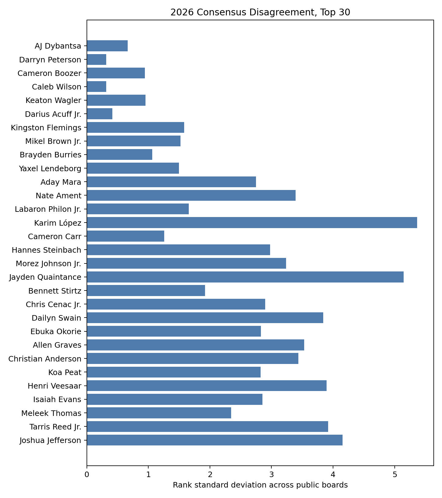
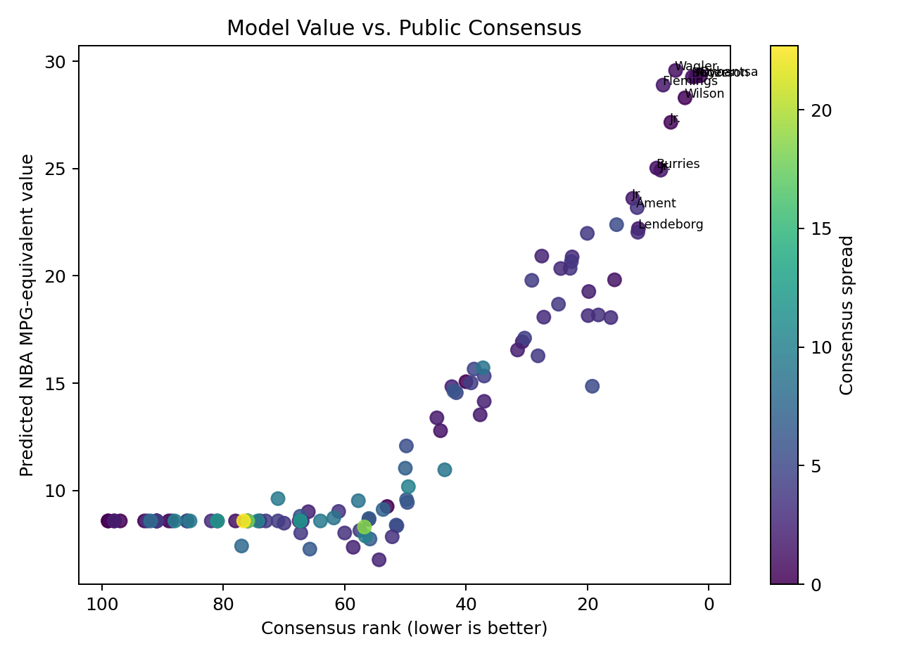
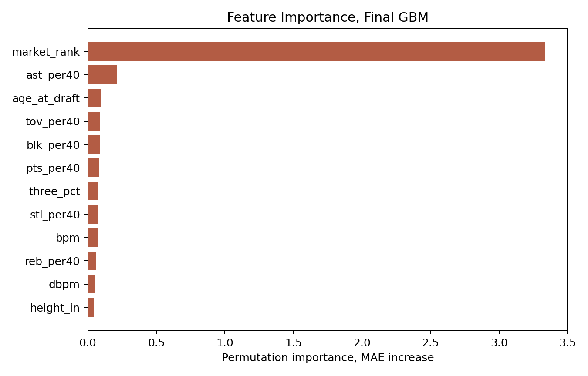
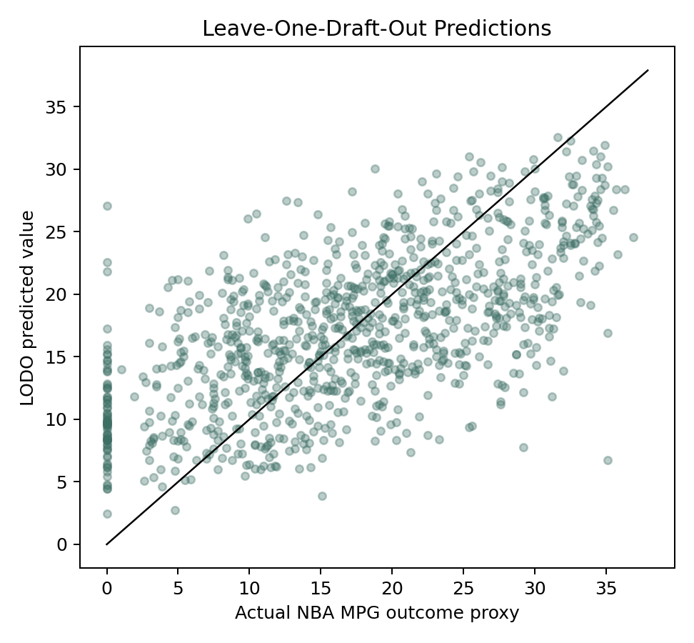
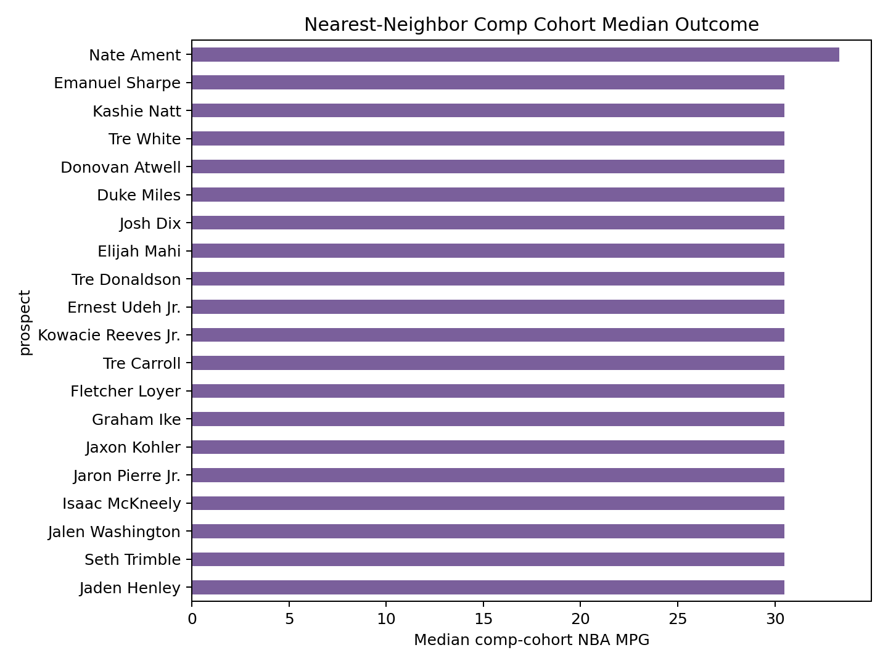

% 2026 NBA Draft Big Board: Codex Research Report
% Autonomous AI Scouting Department
% 2026-06-10

# Abstract

This report builds a 2026 NBA Draft first-round big board as of 2026-06-10, before the late-June draft. The pipeline combines official draft order, nine public ranking/mock sources, 2026 combine measurements/testing where publicly extractable, current prospect stats, sourced scouting blurbs, historical draft outcomes, leave-one-draft-class-out models, nearest-neighbor comps, and a still-frame film archive. The final board is intentionally conservative: public consensus anchors the top because the historical model beats the market baseline only modestly, while model/comps/film move players inside and across adjacent tiers.

# Introduction and Problem Statement

The problem is not to predict the exact draft. It is to rank prospects by expected NBA value while preserving the difference between evidence, model inference, and scouting judgment. The report therefore maintains two artifacts: a pure big board and a fit-adjusted mock draft using the actual first-round order from NBA.com.

# Related Work

Public draft modeling has typically leaned on age, college efficiency, box-score creation, size, and draft slot/consensus as strong priors. FiveThirtyEight's historical projection table is included as related-work data and as a reminder that public-market priors are hard to beat. This project is closer to a Kaggle solution than a front-office secret sauce: careful validation, explicit baselines, and failure logging matter more than a flashy top-line model.

# Data

Live data were fetched on 2026-06-10. The 2026 order comes from NBA.com. Consensus ranks come from Tankathon, Rookie Scale, CBS, Bleacher Report, Yahoo/KOC, The Ringer, NBA Draft Room, and mock-draft sources when exposed in HTML. Season stats primarily come from Tankathon and CBS snapshots. Combine measurements/testing use NBADraft.net Wayback tables plus NBA.com/On3/Yahoo/NBA Draft Room context where available. Historical modeling covers 984 rows from 2000-2021, including 520 first-round rows.

Historical coverage summary:

| Field | Coverage |
| --- | ---: |
| age_at_draft | 62.1% |
| height_in | 100.0% |
| weight_lbs | 62.1% |
| wingspan_in | 34.1% |
| standing_reach_in | 34.1% |
| ts_pct | 100.0% |
| usg_pct | 60.9% |
| bpm | 52.6% |
| outcome_mpg | 100.0% |
| career_vorp | 82.3% |
| career_ws | 82.3% |

# Methodology

Consensus aggregation normalizes player names, then computes mean, median, minimum, maximum, and standard deviation of ranks. Standard deviation is treated as risk because public disagreement often signals uncertainty in role, health, or translation.

The primary regression target is NBA MPG-equivalent outcome because it has full coverage in the merged historical table. WS/VORP are retained and discussed where available, but not used as the primary target because bulk current Basketball Reference pages were blocked and the fetched public datasets have incomplete VORP coverage for 2019-2021. Regression models use leave-one-draft-class-out validation, never random row splits. The final board blends consensus rank, model value, and disagreement risk because the model edge over market rank is modest.

Nearest-neighbor comps use standardized age, size, wingspan, per-40 production, efficiency, usage, and BPM features. The comp labels in the board are empirical: floor/median/ceiling are drawn from the nearest five historical players' NBA MPG outcomes.

# Model Results

| Model | MAE | RMSE | Spearman |
| --- | ---: | ---: | ---: |
| baseline_market_rank_ridge | 6.059 | 7.288 | 0.634 |
| ridge_market_plus_traits | 5.966 | 7.220 | 0.644 |
| gbm_market_plus_traits | 5.963 | 7.329 | 0.621 |
| rf_market_plus_traits | 5.895 | 7.266 | 0.630 |

The RF model had the best MAE, ridge had the best Spearman, and GBM was retained as a stable nonlinear reference. None of the models crushed the market baseline; that is an important result. The final board therefore uses a conservative blend rather than a pure model sort.











# Iteration Narrative

# Modeling Iteration Log

Run date: 2026-06-10.

## Iteration 0: Market-Rank Baseline

A ridge model using only historical draft slot as the public-market proxy. This is the hurdle model.

Metrics: `{'mae': 6.059093096158589, 'rmse': 7.2881687548710525, 'spearman': 0.6343938981690741}`

## Iteration 1: Ridge With Market + Trait Features

Added age, anthropometrics, per-40 production, efficiency, usage and BPM features. Ridge retained interpretability but did not capture non-linear age/size/stat interactions as well as boosting.

Metrics: `{'mae': 5.966282697298442, 'rmse': 7.2197225929816184, 'spearman': 0.6435149030163432}`

## Iteration 2: Gradient Boosting

Used shallow gradient boosting with leave-one-draft-class-out validation. This was selected as the primary value model because it improved MAE/Spearman versus the market baseline while remaining reasonably stable.

Metrics: `{'mae': 5.962567221738261, 'rmse': 7.329019270433344, 'spearman': 0.6205570483513188}`

## Iteration 3: Random Forest Check

Random forest was retained as an ensemble sanity check but not as the lead model when it lagged GBM or produced flatter top-end predictions.

Metrics: `{'mae': 5.894779256516746, 'rmse': 7.265760513490006, 'spearman': 0.6298908665668441}`

## Classifier

Tier classifier predicts bust/bench/rotation/starter/star classes from the same feature set. It is used as probability-flavored context, not as the ranking engine.

Metrics: `{'accuracy': 0.3943089430894309, 'labels': ['bust', 'bench', 'rotation', 'starter', 'star'], 'confusion_matrix': [[92, 41, 43, 1, 3], [57, 61, 107, 13, 0], [24, 62, 190, 34, 5], [4, 24, 101, 36, 19], [2, 2, 23, 31, 9]]}`

# Film Study

Film work is explicitly labeled as still-frame study. The archive contains public clips, extracted frames, and per-prospect notes. I can inspect still images, but 1 fps frames do not support strong claims about burst, processing speed, live defensive timing, or advantage creation. Those claims are left to sourced human scouting. Several clips were imported from an existing local yt-dlp/ffmpeg archive in the same workspace, and this is logged as a limitation rather than hidden.

### AJ Dybantsa

{ width=45% }
{ width=45% }
{ width=45% }
{ width=45% }

### Darryn Peterson

{ width=45% }
{ width=45% }
{ width=45% }
{ width=45% }

### Cameron Boozer

{ width=45% }
{ width=45% }
{ width=45% }
{ width=45% }

### Keaton Wagler

{ width=45% }
{ width=45% }
{ width=45% }
{ width=45% }

### Caleb Wilson

{ width=45% }
{ width=45% }
{ width=45% }
{ width=45% }

### Kingston Flemings

{ width=45% }
{ width=45% }
{ width=45% }
{ width=45% }

### Darius Acuff Jr.

{ width=45% }
{ width=45% }
{ width=45% }
{ width=45% }

### Mikel Brown Jr.

{ width=45% }
{ width=45% }
{ width=45% }

### Brayden Burries

{ width=45% }
{ width=45% }
{ width=45% }
{ width=45% }

### Labaron Philon Jr.

{ width=45% }
{ width=45% }
{ width=45% }
{ width=45% }

# The 2026 Big Board

| Rank | Player | Pos | Team/School | Age | Consensus | Model p50 | p10 | p90 |
| --- | --- | --- | --- | --- | --- | --- | --- | --- |
| 1 | AJ Dybantsa | SF | BYU | 19.4 | 1.3333333333333333 | 29.322531705932192 | 28.042428919657223 | 31.426364471007886 |
| 2 | Darryn Peterson | SG/PG | Kansas | 19.4 | 2.111111111111111 | 29.28235931952525 | 27.63493219003703 | 30.791562500183883 |
| 3 | Cameron Boozer | PF | Duke | 18.9 | 2.6666666666666665 | 29.2720040368644 | 27.287324245760043 | 30.691744475631506 |
| 4 | Keaton Wagler | SG/PG | Illinois | 19.4 | 5.444444444444445 | 29.57063791993525 | 28.49993390421171 | 30.798868222472382 |
| 5 | Caleb Wilson | SF/PF | North Carolina | 19.9 | 3.888888888888889 | 28.29485920918782 | 26.902982171300643 | 30.26668312268433 |
| 6 | Kingston Flemings | PG | Houston | 19.5 | 7.5 | 28.887744726397965 | 26.425258739951094 | 30.684062893603464 |
| 7 | Darius Acuff Jr. | PG | Arkansas | 19.6 | 6.222222222222222 | 27.154287183422248 | 25.52043168206463 | 29.0964570847792 |
| 8 | Mikel Brown Jr. | PG | Louisville | 20.2 | 7.888888888888889 | 24.925156891623555 | 23.2071576584061 | 26.938965223954632 |
| 9 | Brayden Burries | SG/PG | Arizona | 20.8 | 8.555555555555555 | 25.0258702954328 | 23.1664811177045 | 26.75995997554599 |
| 10 | Labaron Philon Jr. | PG | Alabama | 20.6 | 12.5 | 23.610339352864656 | 21.354201733494424 | 25.133860353006057 |
| 11 | Nate Ament | SF | Tennessee | 19.5 | 11.77777777777778 | 23.18087389216729 | 21.82139394464788 | 24.703000627732315 |
| 12 | Yaxel Lendeborg | PF | Michigan | 23.7 | 11.571428571428571 | 22.205487755817607 | 20.66998890917443 | 23.51022991177155 |
| 13 | Aday Mara | C | Michigan | 21.2 | 11.666666666666666 | 22.033156727819534 | 19.548429852583148 | 25.076359051600512 |
| 14 | Karim López | SF | New Zealand | 19.2 | 15.166666666666666 | 22.38657065868856 | 20.67165562928013 | 23.48461898262107 |
| 15 | Cameron Carr | SG | Baylor | 21.6 | 15.5 | 19.81687516707869 | 18.435218062776983 | 21.2514591090076 |
| 16 | Dailyn Swain | SG/SF | Texas | 20.9 | 20.0 | 21.98108688473276 | 20.663545840484925 | 23.44446623753685 |
| 17 | Hannes Steinbach | PF | Washington | 20.1 | 16.125 | 18.05903103213133 | 16.46911119720716 | 20.212369428695744 |
| 18 | Bennett Stirtz | PG | Iowa | 22.7 | 19.75 | 19.27168310698117 | 17.86761923356267 | 20.309652470101664 |
| 19 | Ebuka Okorie | PG | Stanford | 19.2 | 22.5 | 20.88447531214892 | 19.221608343983803 | 22.9366856490072 |
| 20 | Morez Johnson Jr. | PF | Michigan | 20.4 | 18.166666666666668 | 18.180462845610016 | 16.704545837908856 | 19.848003738567527 |
| 21 | Allen Graves | PF | Santa Clara | 19.9 | 22.625 | 20.66313589540352 | 17.713370714433257 | 22.90296238136636 |
| 22 | Christian Anderson | PG | Texas Tech | 20.2 | 22.83333333333333 | 20.35167222998283 | 18.588452742612844 | 21.971517231875637 |
| 23 | Chris Cenac Jr. | PF/C | Houston | 19.4 | 19.857142857142858 | 18.15101165938433 | 16.531904699932372 | 19.7066602348969 |
| 24 | Koa Peat | PF | Arizona | 19.4 | 24.375 | 20.343580158017467 | 19.15890944505776 | 21.424935556132223 |
| 25 | Meleek Thomas | SG/PG | Arkansas | 19.9 | 27.5 | 20.923633201413693 | 19.180319811859697 | 22.50326151831744 |
| 26 | Henri Veesaar | C | North Carolina | 22.2 | 24.75 | 18.680597230151022 | 17.17506636684509 | 20.036810361387836 |
| 27 | Jayden Quaintance | PF/C | Kentucky | 18.9 | 19.166666666666668 | 14.859382869034544 | 12.8561742885684 | 17.470756107512326 |
| 28 | Joshua Jefferson | PF/SF | Iowa State | 22.6 | 29.142857142857142 | 19.79217915174151 | 17.591066411976943 | 21.2943962760294 |
| 29 | Isaiah Evans | SF | Duke | 20.5 | 27.166666666666668 | 18.077783655814144 | 16.472189063949756 | 19.10129262780477 |
| 30 | Tarris Reed Jr. | C | UConn | 22.9 | 28.125 | 16.276202644716122 | 14.541258779464592 | 18.704709905029727 |


### 1. AJ Dybantsa (SF, BYU)

Tier: Tier 1: primary star bets. Age 19.4. Measurements: 80.5 in height, 217.0 lbs, 84.5 in wingspan, 106.0 in reach. Production: 25.5 PPG, 6.8 RPG, 3.7 APG, 1.1 SPG, 0.3 BPG, TS 0.600, BPM 11.7. Model median 29.3 with 28.0-31.4 band. Consensus mean 1.3 and spread 0.7. Comps: floor Jarrett Culver (17.2 MPG); median Jarrett Culver (17.2 MPG); ceiling Cade Cunningham (33.3 MPG). Best fits: Washington (1), Utah (2), Golden State (11).

Film note: Jump shot, elevated release. On a left-wing jumper vs Abilene Christian (frame_0544.jpg, ball flight in frame_0547.jpg), the ball leaves above and slightly in front of his head with full arm extension at the top of the jump. The release point sits well above the closest defender's contest. Frames cannot show the rhythm or speed of the...

Verdict: AJ Dybantsa carries a model median of 29.3 NBA MPG-equivalent value, with a 10-90% band of 28.0 to 31.4. The ranking is broadly aligned with the public market. The nearest-neighbor cohort runs from Jarrett Culver (17.2 MPG) as the low-end outcome to Cade Cunningham (33.3 MPG) as the high-end outcome, with Jarrett Culver (17.2 MPG) near the middle of the comp set. Frame study is supplementary only: Jump shot, elevated release. On a left-wing jumper vs Abilene Christian (frame_0544.jpg, ball flight in frame_0547.jpg), the ball leaves above and slightly in front of his head with full arm extension at the top of the jump. The release point sits well above the closest defender's contest. Frames cannot show the rhythm or speed of the...

### 2. Darryn Peterson (SG/PG, Kansas)

Tier: Tier 1: primary star bets. Age 19.4. Measurements: 76.5 in height, 198.8 lbs, 81.8 in wingspan, 103.0 in reach. Production: 20.2 PPG, 4.2 RPG, 1.6 APG, 1.4 SPG, 0.6 BPG, TS 0.578, BPM 14.1. Model median 29.3 with 27.6-30.8 band. Consensus mean 2.1 and spread 0.3. Comps: floor Jarrett Culver (17.2 MPG); median DAngelo Russell (29.9 MPG); ceiling Klay Thompson (32.8 MPG). Best fits: Utah (2), Washington (1), Chicago (4).

Film note: Pull-up sequence, drive to elevated release (frame_0057.jpg through frame_0061.jpg). He attacks right against K-State's #10 with a low, forward-leaning drive posture (frame_0057, frame_0058), shields the ball on the gather with his shoulders turned into the defender (frame_0059), then rises into a pull-up with the ball above the rim line...

Verdict: Darryn Peterson carries a model median of 29.3 NBA MPG-equivalent value, with a 10-90% band of 27.6 to 30.8. The ranking is broadly aligned with the public market. The nearest-neighbor cohort runs from Jarrett Culver (17.2 MPG) as the low-end outcome to Klay Thompson (32.8 MPG) as the high-end outcome, with DAngelo Russell (29.9 MPG) near the middle of the comp set. Frame study is supplementary only: Pull-up sequence, drive to elevated release (frame_0057.jpg through frame_0061.jpg). He attacks right against K-State's #10 with a low, forward-leaning drive posture (frame_0057, frame_0058), shields the ball on the gather with his shoulders turned into the defender (frame_0059), then rises into a pull-up with the ball above the rim line...

### 3. Cameron Boozer (PF, Duke)

Tier: Tier 1: primary star bets. Age 18.9. Measurements: 80.2 in height, 252.8 lbs, 85.5 in wingspan, 108.0 in reach. Production: 22.5 PPG, 10.2 RPG, 4.1 APG, 1.4 SPG, 0.6 BPG, TS 0.653, BPM 18.7. Model median 29.3 with 27.3-30.7 band. Consensus mean 2.7 and spread 0.9. Comps: floor Frank Kaminsky (19.8 MPG); median Grant Williams (21.8 MPG); ceiling Zion Williamson (31.6 MPG). Best fits: Brooklyn (6), Memphis (3), Chicago (4).

Film note: Post-up into rim finish, two-frame rise (frame_0287.jpg through frame_0290.jpg, vs Texas Tech at MSG). He establishes a wide, low post seal on the right block with the defender pinned on his hip (frame_0289), then is airborne at the rim a frame later with the ball carried high and away from the swiping defender (frame_0290). Frames...

Verdict: Cameron Boozer carries a model median of 29.3 NBA MPG-equivalent value, with a 10-90% band of 27.3 to 30.7. The ranking is broadly aligned with the public market. The nearest-neighbor cohort runs from Frank Kaminsky (19.8 MPG) as the low-end outcome to Zion Williamson (31.6 MPG) as the high-end outcome, with Grant Williams (21.8 MPG) near the middle of the comp set. Frame study is supplementary only: Post-up into rim finish, two-frame rise (frame_0287.jpg through frame_0290.jpg, vs Texas Tech at MSG). He establishes a wide, low post seal on the right block with the defender pinned on his hip (frame_0289), then is airborne at the rim a frame later with the ball carried high and away from the swiping defender (frame_0290). Frames...

### 4. Keaton Wagler (SG/PG, Illinois)

Tier: Tier 2: high-lottery starters. Age 19.4. Measurements: 77.0 in height, 188.0 lbs, 78.2 in wingspan, 100.0 in reach. Production: 17.9 PPG, 5.1 RPG, 4.2 APG, 0.9 SPG, 0.4 BPG, TS 0.596, BPM 12.3. Model median 29.6 with 28.5-30.8 band. Consensus mean 5.4 and spread 1.0. Comps: floor Nik Stauskas (19.5 MPG); median Gary Harris (28.1 MPG); ceiling Devin Booker (33.9 MPG). Best fits: Chicago (4), LA Clippers (5), Utah (2).

Film note: Right-wing drive sequence vs Texas Tech (frame_0221.jpg through frame_0226.jpg). He receives on the right wing (frame_0221, frame_0222), attacks with the ball on his outside hand and his chest up rather than hunched (frame_0223), and works into the lane as three defenders converge (frame_0224, frame_0225); a white-jersey Illinois player...

Verdict: Keaton Wagler carries a model median of 29.6 NBA MPG-equivalent value, with a 10-90% band of 28.5 to 30.8. The ranking is broadly aligned with the public market. The nearest-neighbor cohort runs from Nik Stauskas (19.5 MPG) as the low-end outcome to Devin Booker (33.9 MPG) as the high-end outcome, with Gary Harris (28.1 MPG) near the middle of the comp set. Frame study is supplementary only: Right-wing drive sequence vs Texas Tech (frame_0221.jpg through frame_0226.jpg). He receives on the right wing (frame_0221, frame_0222), attacks with the ball on his outside hand and his chest up rather than hunched (frame_0223), and works into the lane as three defenders converge (frame_0224, frame_0225); a white-jersey Illinois player...

### 5. Caleb Wilson (SF/PF, North Carolina)

Tier: Tier 2: high-lottery starters. Age 19.9. Measurements: 81.2 in height, 210.8 lbs, 84.2 in wingspan, 108.0 in reach. Production: 19.8 PPG, 9.4 RPG, 2.7 APG, 1.5 SPG, 1.4 BPG, TS 0.626, BPM 14.0. Model median 28.3 with 26.9-30.3 band. Consensus mean 3.9 and spread 0.3. Comps: floor Brice Johnson (5.1 MPG); median Brice Johnson (5.1 MPG); ceiling Otto Porter (25.4 MPG). Best fits: Brooklyn (6), Memphis (3), Atlanta (8).

Film note: Turnaround jumper over a rim protector, vs Kansas (frame_0060.jpg through frame_0064.jpg). He backs down Kansas freshman Flory Bidunga on the right block with a wide, low base and the ball kept away from the defender (frame_0060, frame_0061), then rises into a turnaround with the ball released above his head, shooting arm fully extended...

Verdict: Caleb Wilson carries a model median of 28.3 NBA MPG-equivalent value, with a 10-90% band of 26.9 to 30.3. The ranking is broadly aligned with the public market. The nearest-neighbor cohort runs from Brice Johnson (5.1 MPG) as the low-end outcome to Otto Porter (25.4 MPG) as the high-end outcome, with Brice Johnson (5.1 MPG) near the middle of the comp set. Frame study is supplementary only: Turnaround jumper over a rim protector, vs Kansas (frame_0060.jpg through frame_0064.jpg). He backs down Kansas freshman Flory Bidunga on the right block with a wide, low base and the ball kept away from the defender (frame_0060, frame_0061), then rises into a turnaround with the ball released above his head, shooting arm fully extended...

### 6. Kingston Flemings (PG, Houston)

Tier: Tier 2: high-lottery starters. Age 19.5. Measurements: 74.5 in height, 183.4 lbs, 75.5 in wingspan, 98.5 in reach. Production: 16.1 PPG, 4.1 RPG, 5.2 APG, 1.5 SPG, 0.3 BPG, TS 0.563, BPM 12.6. Model median 28.9 with 26.4-30.7 band. Consensus mean 7.5 and spread 1.6. Comps: floor Trey Burke (20.9 MPG); median Jonny Flynn (22.9 MPG); ceiling Kemba Walker (33.1 MPG). Best fits: LA Clippers (5), Sacramento (7), Chicago (4).

Film note: Body frame/build: the broadcast close-ups frame_0013.jpg, frame_0015.jpg (Texas Tech game, white #4) and frame_0253.jpg (Iowa State game, road black) show a visibly lean guard, narrow shoulders, thin arms, very little upper-body bulk. The jersey hangs loose off his frame in both games; he is one of the slighter-built players in any frame...

Verdict: Kingston Flemings carries a model median of 28.9 NBA MPG-equivalent value, with a 10-90% band of 26.4 to 30.7. The ranking is broadly aligned with the public market. The nearest-neighbor cohort runs from Trey Burke (20.9 MPG) as the low-end outcome to Kemba Walker (33.1 MPG) as the high-end outcome, with Jonny Flynn (22.9 MPG) near the middle of the comp set. Frame study is supplementary only: Body frame/build: the broadcast close-ups frame_0013.jpg, frame_0015.jpg (Texas Tech game, white #4) and frame_0253.jpg (Iowa State game, road black) show a visibly lean guard, narrow shoulders, thin arms, very little upper-body bulk. The jersey hangs loose off his frame in both games; he is one of the slighter-built players in any frame...

### 7. Darius Acuff Jr. (PG, Arkansas)

Tier: Tier 2: high-lottery starters. Age 19.6. Measurements: 74.0 in height, 185.8 lbs, 78.5 in wingspan, 98.5 in reach. Production: 23.5 PPG, 3.1 RPG, 6.4 APG, 0.8 SPG, 0.3 BPG, TS 0.604, BPM 10.1. Model median 27.2 with 25.5-29.1 band. Consensus mean 6.2 and spread 0.4. Comps: floor Willie Warren (7.0 MPG); median Trey Burke (20.9 MPG); ceiling DAngelo Russell (29.9 MPG). Best fits: Golden State (11), Miami (13), Sacramento (7).

Film note: Shooting gather/set point: on the baseline pull-up sequence (frame_0145.jpg, frame_0146.jpg, frame_0147.jpg, frame_0148.jpg) Acuff brings the ball up through the center of his chest to a set point at roughly forehead height before release. In frame_0147.jpg the ball sits just above eye level with elbow tucked under it and feet roughly...

Verdict: Darius Acuff Jr. carries a model median of 27.2 NBA MPG-equivalent value, with a 10-90% band of 25.5 to 29.1. The ranking is broadly aligned with the public market. The nearest-neighbor cohort runs from Willie Warren (7.0 MPG) as the low-end outcome to DAngelo Russell (29.9 MPG) as the high-end outcome, with Trey Burke (20.9 MPG) near the middle of the comp set. Frame study is supplementary only: Shooting gather/set point: on the baseline pull-up sequence (frame_0145.jpg, frame_0146.jpg, frame_0147.jpg, frame_0148.jpg) Acuff brings the ball up through the center of his chest to a set point at roughly forehead height before release. In frame_0147.jpg the ball sits just above eye level with elbow tucked under it and feet roughly...

### 8. Mikel Brown Jr. (PG, Louisville)

Tier: Tier 2: high-lottery starters. Age 20.2. Measurements: 75.5 in height, 190.2 lbs, 79.5 in wingspan, 100.5 in reach. Production: 18.2 PPG, 3.3 RPG, 4.7 APG, 1.2 SPG, 0.1 BPG, TS 0.577, BPM 6.6. Model median 24.9 with 23.2-26.9 band. Consensus mean 7.9 and spread 1.5. Comps: floor Willie Warren (7.0 MPG); median Willie Warren (7.0 MPG); ceiling Collin Sexton (30.2 MPG). Best fits: Sacramento (7), Dallas (9), Milwaukee (10).

Film note: Pull-up shooting motion vs Kentucky: in the run frame_0120.jpg, frame_0121.jpg, frame_0122.jpg, frame_0123.jpg Brown drives middle and rises into a pull-up. In frame_0122.jpg he is fully elevated with the ball released above his head, shooting arm extended toward the rim and legs nearly straight under him; the trailing defenders are...

Verdict: Mikel Brown Jr. carries a model median of 24.9 NBA MPG-equivalent value, with a 10-90% band of 23.2 to 26.9. The ranking is broadly aligned with the public market. The nearest-neighbor cohort runs from Willie Warren (7.0 MPG) as the low-end outcome to Collin Sexton (30.2 MPG) as the high-end outcome, with Willie Warren (7.0 MPG) near the middle of the comp set. Frame study is supplementary only: Pull-up shooting motion vs Kentucky: in the run frame_0120.jpg, frame_0121.jpg, frame_0122.jpg, frame_0123.jpg Brown drives middle and rises into a pull-up. In frame_0122.jpg he is fully elevated with the ball released above his head, shooting arm extended toward the rim and legs nearly straight under him; the trailing defenders are...

### 9. Brayden Burries (SG/PG, Arizona)

Tier: Tier 3: starter/plus-rotation bets. Age 20.8. Measurements: 75.8 in height, 215.4 lbs, 78.0 in wingspan, 98.5 in reach. Production: 16.1 PPG, 4.9 RPG, 2.4 APG, 1.5 SPG, 0.2 BPG, TS 0.616, BPM 11.7. Model median 25.0 with 23.2-26.8 band. Consensus mean 8.6 and spread 1.1. Comps: floor Chase Budinger (19.7 MPG); median Gary Harris (28.1 MPG); ceiling Jimmy Butler (33.2 MPG). Best fits: Golden State (11), Miami (13), Dallas (9).

Film note: Transition three, vs Kansas (frame_0157.jpg through frame_0162.jpg). Arizona pushes off a stop (frame_0157, frame_0158), the featured guard arrives at the left wing/corner (frame_0159), and rises into a three with the ball released above his head and a Kansas defender closing late (frame_0160), then comes down with the ball already gone...

Verdict: Brayden Burries carries a model median of 25.0 NBA MPG-equivalent value, with a 10-90% band of 23.2 to 26.8. The ranking is broadly aligned with the public market. The nearest-neighbor cohort runs from Chase Budinger (19.7 MPG) as the low-end outcome to Jimmy Butler (33.2 MPG) as the high-end outcome, with Gary Harris (28.1 MPG) near the middle of the comp set. Frame study is supplementary only: Transition three, vs Kansas (frame_0157.jpg through frame_0162.jpg). Arizona pushes off a stop (frame_0157, frame_0158), the featured guard arrives at the left wing/corner (frame_0159), and rises into a three with the ball released above his head and a Kansas defender closing late (frame_0160), then comes down with the ball already gone...

### 10. Labaron Philon Jr. (PG, Alabama)

Tier: Tier 3: starter/plus-rotation bets. Age 20.6. Measurements: 74.5 in height, 176.2 lbs, 78.2 in wingspan, 99.5 in reach. Production: 22.0 PPG, 3.5 RPG, 5.0 APG, 1.2 SPG, 0.2 BPG, TS 0.626, BPM 11.3. Model median 23.6 with 21.4-25.1 band. Consensus mean 12.5 and spread 1.7. Comps: floor Erick Green (8.7 MPG); median Cameron Payne (17.9 MPG); ceiling Damian Lillard (36.3 MPG). Best fits: Golden State (11), Miami (13), Milwaukee (10).

Film note: Drive and finish at North Carolina (frame_0152.jpg through frame_0155.jpg). He receives in transition on the left wing with his body already low (frame_0152), splits two UNC defenders at the foul line off a low crossover with the ball kept tight to his hip (frame_0153), gathers through traffic at the restricted area (frame_0154), and the...

Verdict: Labaron Philon Jr. carries a model median of 23.6 NBA MPG-equivalent value, with a 10-90% band of 21.4 to 25.1. The board is above consensus because the model/comps like the statistical profile. The nearest-neighbor cohort runs from Erick Green (8.7 MPG) as the low-end outcome to Damian Lillard (36.3 MPG) as the high-end outcome, with Cameron Payne (17.9 MPG) near the middle of the comp set. Frame study is supplementary only: Drive and finish at North Carolina (frame_0152.jpg through frame_0155.jpg). He receives in transition on the left wing with his body already low (frame_0152), splits two UNC defenders at the foul line off a low crossover with the ball kept tight to his hip (frame_0153), gathers through traffic at the restricted area (frame_0154), and the...

### 11. Nate Ament (SF, Tennessee)

Tier: Tier 3: starter/plus-rotation bets. Age 19.5. Measurements: 81.5 in height, 210.8 lbs, 83.5 in wingspan, 109.5 in reach. Production: 16.7 PPG, 6.3 RPG, 2.3 APG, 1.0 SPG, 0.6 BPG, TS 0.534, BPM 8.4. Model median 23.2 with 21.8-24.7 band. Consensus mean 11.8 and spread 3.4. Comps: floor CJ Elleby (15.5 MPG); median Andrew Wiggins (34.4 MPG); ceiling Andrew Wiggins (34.4 MPG). Best fits: Golden State (11), Oklahoma City (12), Dallas (9).

Film note: Live-dribble crouch on the right wing vs Northern Kentucky (frame_0095.jpg). In white #1 he sits in a bent-knee crouch with a flat back and the ball on his right hand away from the defender, which is a notably low handling posture for a player listed 6'10". Frames support the posture, not his wiggle or separation quickness.

Verdict: Nate Ament carries a model median of 23.2 NBA MPG-equivalent value, with a 10-90% band of 21.8 to 24.7. The ranking is broadly aligned with the public market. The nearest-neighbor cohort runs from CJ Elleby (15.5 MPG) as the low-end outcome to Andrew Wiggins (34.4 MPG) as the high-end outcome, with Andrew Wiggins (34.4 MPG) near the middle of the comp set. Frame study is supplementary only: Live-dribble crouch on the right wing vs Northern Kentucky (frame_0095.jpg). In white #1 he sits in a bent-knee crouch with a flat back and the ball on his right hand away from the defender, which is a notably low handling posture for a player listed 6'10". Frames support the posture, not his wiggle or separation quickness.

### 12. Yaxel Lendeborg (PF, Michigan)

Tier: Tier 3: starter/plus-rotation bets. Age 23.7. Measurements: 80.8 in height, 241.4 lbs, 87.2 in wingspan, 108.5 in reach. Production: 15.1 PPG, 6.8 RPG, 3.2 APG, 1.1 SPG, 1.2 BPG, TS 0.646, BPM 16.7. Model median 22.2 with 20.7-23.5 band. Consensus mean 11.6 and spread 1.5. Comps: floor Aaron White (0.0 MPG); median Erik Murphy (2.6 MPG); ceiling Cameron Johnson (25.4 MPG). Best fits: Charlotte (14), Brooklyn (6), Charlotte (18).

Film note: Mature, NBA-ready build in game context. Postgame close-ups show broad shoulders, thick arms, and a filled-out chest and trunk for a college forward; nothing about the frame reads underdeveloped. (frame_0016.jpg, frame_0060.jpg, frame_0070.jpg)

Verdict: Yaxel Lendeborg carries a model median of 22.2 NBA MPG-equivalent value, with a 10-90% band of 20.7 to 23.5. The ranking is broadly aligned with the public market. The nearest-neighbor cohort runs from Aaron White (0.0 MPG) as the low-end outcome to Cameron Johnson (25.4 MPG) as the high-end outcome, with Erik Murphy (2.6 MPG) near the middle of the comp set. Frame study is supplementary only: Mature, NBA-ready build in game context. Postgame close-ups show broad shoulders, thick arms, and a filled-out chest and trunk for a college forward; nothing about the frame reads underdeveloped. (frame_0016.jpg, frame_0060.jpg, frame_0070.jpg)

### 13. Aday Mara (C, Michigan)

Tier: Tier 3: starter/plus-rotation bets. Age 21.2. Measurements: 87.0 in height, 259.8 lbs, 90.0 in wingspan, 117.0 in reach. Production: 12.1 PPG, 6.8 RPG, 2.4 APG, 0.4 SPG, 2.6 BPG, TS 0.659, BPM 14.3. Model median 22.0 with 19.5-25.1 band. Consensus mean 11.7 and spread 2.7. Comps: floor Udoka Azubuike (8.9 MPG); median Hasheem Thabeet (10.5 MPG); ceiling Karl-Anthony Towns (34.0 MPG). Best fits: Charlotte (14), Charlotte (18), Toronto (19).

Film note: High two-hand gather and overhead release near the rim. Mara secures the ball at full extension above the defense and releases close to backboard height with his right hand, elbow nearly locked out at release. Finishing extension is vertical rather than a sweeping hook. (frame_0059.jpg, frame_0060.jpg)

Verdict: Aday Mara carries a model median of 22.0 NBA MPG-equivalent value, with a 10-90% band of 19.5 to 25.1. The ranking is broadly aligned with the public market. The nearest-neighbor cohort runs from Udoka Azubuike (8.9 MPG) as the low-end outcome to Karl-Anthony Towns (34.0 MPG) as the high-end outcome, with Hasheem Thabeet (10.5 MPG) near the middle of the comp set. Frame study is supplementary only: High two-hand gather and overhead release near the rim. Mara secures the ball at full extension above the defense and releases close to backboard height with his right hand, elbow nearly locked out at release. Finishing extension is vertical rather than a sweeping hook. (frame_0059.jpg, frame_0060.jpg)

### 14. Karim López (SF, New Zealand)

Tier: Tier 3: starter/plus-rotation bets. Age 19.2. Measurements: 80.2 in height, 221.8 lbs, 83.5 in wingspan, 105.5 in reach. Production: 11.9 PPG, 6.1 RPG, 1.9 APG, 1.2 SPG, 1.0 BPG, TS 0.580, BPM NA. Model median 22.4 with 20.7-23.5 band. Consensus mean 15.2 and spread 5.4. Comps: floor Moses Moody (13.7 MPG); median Justise Winslow (25.9 MPG); ceiling OG Anunoby (29.0 MPG). Best fits: Miami (13), Oklahoma City (12), Memphis (16).

Film note: Finishing extension on the move. He elevates off one foot and fully extends his right arm for a finger-roll style finish above the rim line, ball balanced one-handed at full reach with shoulders still mostly square. Length at the release point is obvious against NBL pros. (frame_0163.jpg, frame_0164.jpg, frame_0165.jpg, frame_0166.jpg)

Verdict: Karim López carries a model median of 22.4 NBA MPG-equivalent value, with a 10-90% band of 20.7 to 23.5. The ranking is broadly aligned with the public market. The nearest-neighbor cohort runs from Moses Moody (13.7 MPG) as the low-end outcome to OG Anunoby (29.0 MPG) as the high-end outcome, with Justise Winslow (25.9 MPG) near the middle of the comp set. Frame study is supplementary only: Finishing extension on the move. He elevates off one foot and fully extends his right arm for a finger-roll style finish above the rim line, ball balanced one-handed at full reach with shoulders still mostly square. Length at the release point is obvious against NBL pros. (frame_0163.jpg, frame_0164.jpg, frame_0165.jpg, frame_0166.jpg)

### 15. Cameron Carr (SG, Baylor)

Tier: Tier 4: rotation upside. Age 21.6. Measurements: 76.5 in height, 184.4 lbs, 84.8 in wingspan, 104.0 in reach. Production: 18.9 PPG, 5.8 RPG, 2.6 APG, 0.9 SPG, 1.3 BPG, TS 0.622, BPM 9.2. Model median 19.8 with 18.4-21.3 band. Consensus mean 15.5 and spread 1.3. Comps: floor Morris Almond (9.5 MPG); median Will Barton (25.2 MPG); ceiling Reggie Jackson (25.4 MPG). Best fits: Miami (13), Golden State (11), Toronto (19).

Film note: Catch-and-shoot rep vs UTRGV (frame_0038.jpg, frame_0039.jpg). In frame_0038 he receives on the right side with feet already set and the ball coming up in one motion; in frame_0039 he is elevated with the ball at a set point above his forehead, elbow under the ball, releasing over a closing defender (#10) who is still beneath him. The...

Verdict: Cameron Carr carries a model median of 19.8 NBA MPG-equivalent value, with a 10-90% band of 18.4 to 21.3. The ranking is broadly aligned with the public market. The nearest-neighbor cohort runs from Morris Almond (9.5 MPG) as the low-end outcome to Reggie Jackson (25.4 MPG) as the high-end outcome, with Will Barton (25.2 MPG) near the middle of the comp set. Frame study is supplementary only: Catch-and-shoot rep vs UTRGV (frame_0038.jpg, frame_0039.jpg). In frame_0038 he receives on the right side with feet already set and the ball coming up in one motion; in frame_0039 he is elevated with the ball at a set point above his forehead, elbow under the ball, releasing over a closing defender (#10) who is still beneath him. The...

### 16. Dailyn Swain (SG/SF, Texas)

Tier: Tier 4: rotation upside. Age 20.9. Measurements: 78.5 in height, 211.2 lbs, 82.0 in wingspan, 104.5 in reach. Production: 17.3 PPG, 7.5 RPG, 3.6 APG, 1.6 SPG, 0.3 BPG, TS 0.636, BPM 10.5. Model median 22.0 with 20.7-23.4 band. Consensus mean 20.0 and spread 3.8. Comps: floor Reyshawn Terry (0.0 MPG); median Mike Miller (26.9 MPG); ceiling Ryan Gomes (27.6 MPG). Best fits: Miami (13), Golden State (11), Boston (27).

Film note: No Codex frame note available; film signal omitted for this prospect.

Verdict: Dailyn Swain carries a model median of 22.0 NBA MPG-equivalent value, with a 10-90% band of 20.7 to 23.4. The board is above consensus because the model/comps like the statistical profile. The nearest-neighbor cohort runs from Reyshawn Terry (0.0 MPG) as the low-end outcome to Ryan Gomes (27.6 MPG) as the high-end outcome, with Mike Miller (26.9 MPG) near the middle of the comp set. Frame study is supplementary only: No Codex frame note available; film signal omitted for this prospect.

### 17. Hannes Steinbach (PF, Washington)

Tier: Tier 4: rotation upside. Age 20.1. Measurements: 82.2 in height, 248.0 lbs, 86.2 in wingspan, 108.0 in reach. Production: 18.5 PPG, 11.8 RPG, 1.6 APG, 1.1 SPG, 1.2 BPG, TS 0.636, BPM 10.1. Model median 18.1 with 16.5-20.2 band. Consensus mean 16.1 and spread 3.0. Comps: floor Zeke Nnaji (12.6 MPG); median Justin Patton (13.4 MPG); ceiling Domantas Sabonis (29.9 MPG). Best fits: Charlotte (18), Toronto (19), Charlotte (14).

Film note: Body frame/build in game context. Steinbach (#6, dark "DAWGS" jersey) reads as a legitimately big, broad-shouldered 5 with a thick lower half; standing among Big Ten frontcourt players he is consistently one of the two tallest bodies on the floor, and his trunk looks filled out rather than stringy. [frame_0184.jpg, frame_0190.jpg...

Verdict: Hannes Steinbach carries a model median of 18.1 NBA MPG-equivalent value, with a 10-90% band of 16.5 to 20.2. The ranking is broadly aligned with the public market. The nearest-neighbor cohort runs from Zeke Nnaji (12.6 MPG) as the low-end outcome to Domantas Sabonis (29.9 MPG) as the high-end outcome, with Justin Patton (13.4 MPG) near the middle of the comp set. Frame study is supplementary only: Body frame/build in game context. Steinbach (#6, dark "DAWGS" jersey) reads as a legitimately big, broad-shouldered 5 with a thick lower half; standing among Big Ten frontcourt players he is consistently one of the two tallest bodies on the floor, and his trunk looks filled out rather than stringy. [frame_0184.jpg, frame_0190.jpg...

### 18. Bennett Stirtz (PG, Iowa)

Tier: Tier 4: rotation upside. Age 22.7. Measurements: 74.5 in height, 186.2 lbs, 78.0 in wingspan, 98.5 in reach. Production: 19.8 PPG, 2.6 RPG, 4.4 APG, 1.4 SPG, 0.2 BPG, TS 0.607, BPM 10.2. Model median 19.3 with 17.9-20.3 band. Consensus mean 19.8 and spread 1.9. Comps: floor Marcus Denmon (0.0 MPG); median Toney Douglas (19.1 MPG); ceiling Derrick White (27.1 MPG). Best fits: Toronto (19), Miami (13), Golden State (11).

Film note: Handle posture. On a live drive against an Ohio State defender he keeps the ball on a low right-hand dribble below knee height with his chest forward over the ball, shoulders level, and eyes up rather than down at the floor; the off-hand is up as a guard arm. [frame_0095.jpg, frame_0020.jpg]

Verdict: Bennett Stirtz carries a model median of 19.3 NBA MPG-equivalent value, with a 10-90% band of 17.9 to 20.3. The ranking is broadly aligned with the public market. The nearest-neighbor cohort runs from Marcus Denmon (0.0 MPG) as the low-end outcome to Derrick White (27.1 MPG) as the high-end outcome, with Toney Douglas (19.1 MPG) near the middle of the comp set. Frame study is supplementary only: Handle posture. On a live drive against an Ohio State defender he keeps the ball on a low right-hand dribble below knee height with his chest forward over the ball, shoulders level, and eyes up rather than down at the floor; the off-hand is up as a guard arm. [frame_0095.jpg, frame_0020.jpg]

### 19. Ebuka Okorie (PG, Stanford)

Tier: Tier 4: rotation upside. Age 19.2. Measurements: 73.2 in height, 186.0 lbs, 79.8 in wingspan, 98.0 in reach. Production: 23.2 PPG, 3.6 RPG, 3.6 APG, 1.6 SPG, 0.3 BPG, TS 0.589, BPM 10.6. Model median 20.9 with 19.2-22.9 band. Consensus mean 22.5 and spread 2.8. Comps: floor Malik Monk (21.3 MPG); median Gary Harris (28.1 MPG); ceiling DAngelo Russell (29.9 MPG). Best fits: Toronto (19), Philadelphia (22), Chicago (15).

Film note: Shooting motion, sequence one (game-winner at Virginia Tech). Across consecutive frames he rises into a pull-up from the left wing with the ball brought up in front of his face into a set point above his head, then a full one-arm follow-through with the wrist snapped while still airborne; his landing base looks balanced, feet under him...

Verdict: Ebuka Okorie carries a model median of 20.9 NBA MPG-equivalent value, with a 10-90% band of 19.2 to 22.9. The board is above consensus because the model/comps like the statistical profile. The nearest-neighbor cohort runs from Malik Monk (21.3 MPG) as the low-end outcome to DAngelo Russell (29.9 MPG) as the high-end outcome, with Gary Harris (28.1 MPG) near the middle of the comp set. Frame study is supplementary only: Shooting motion, sequence one (game-winner at Virginia Tech). Across consecutive frames he rises into a pull-up from the left wing with the ball brought up in front of his face into a set point above his head, then a full one-arm follow-through with the wrist snapped while still airborne; his landing base looks balanced, feet under him...

### 20. Morez Johnson Jr. (PF, Michigan)

Tier: Tier 4: rotation upside. Age 20.4. Measurements: 81.0 in height, 250.6 lbs, 87.5 in wingspan, 107.0 in reach. Production: 13.1 PPG, 7.3 RPG, 1.2 APG, 0.7 SPG, 1.1 BPG, TS 0.677, BPM 11.8. Model median 18.2 with 16.7-19.8 band. Consensus mean 18.2 and spread 3.2. Comps: floor Chinanu Onuaku (12.2 MPG); median Chinanu Onuaku (12.2 MPG); ceiling Bam Adebayo (29.8 MPG). Best fits: Toronto (19), Charlotte (18), Charlotte (14).

Film note: Body frame/build in game context. The close-up frame shows a genuinely wide, muscled shoulder girdle and thick arms with twists hair; in game frames the same build reads as a power big whose torso is noticeably denser than the wings around him. [frame_0035.jpg, frame_0012.jpg]

Verdict: Morez Johnson Jr. carries a model median of 18.2 NBA MPG-equivalent value, with a 10-90% band of 16.7 to 19.8. The ranking is broadly aligned with the public market. The nearest-neighbor cohort runs from Chinanu Onuaku (12.2 MPG) as the low-end outcome to Bam Adebayo (29.8 MPG) as the high-end outcome, with Chinanu Onuaku (12.2 MPG) near the middle of the comp set. Frame study is supplementary only: Body frame/build in game context. The close-up frame shows a genuinely wide, muscled shoulder girdle and thick arms with twists hair; in game frames the same build reads as a power big whose torso is noticeably denser than the wings around him. [frame_0035.jpg, frame_0012.jpg]

### 21. Allen Graves (PF, Santa Clara)

Tier: Tier 4: rotation upside. Age 19.9. Measurements: 79.8 in height, 225.6 lbs, 84.0 in wingspan, 106.5 in reach. Production: 11.8 PPG, 6.5 RPG, 1.8 APG, 1.9 SPG, 0.9 BPG, TS 0.613, BPM 13.4. Model median 20.7 with 17.7-22.9 band. Consensus mean 22.6 and spread 3.5. Comps: floor Jordan Adams (8.2 MPG); median Otto Porter (25.4 MPG); ceiling Victor Oladipo (32.2 MPG). Best fits: Toronto (19), Charlotte (18), Charlotte (14).

Film note: Wing catch into a lane attack, vs Saint Mary's (frame_0497.jpg through frame_0499.jpg). The featured Bronco catches alone on the left wing in a ready stance with the ball held at chest height and knees already loaded (frame_0497), gets downhill against the Saint Mary's defense (frame_0498), and rises in the lane through contact with the...

Verdict: Allen Graves carries a model median of 20.7 NBA MPG-equivalent value, with a 10-90% band of 17.7 to 22.9. The ranking is broadly aligned with the public market. The nearest-neighbor cohort runs from Jordan Adams (8.2 MPG) as the low-end outcome to Victor Oladipo (32.2 MPG) as the high-end outcome, with Otto Porter (25.4 MPG) near the middle of the comp set. Frame study is supplementary only: Wing catch into a lane attack, vs Saint Mary's (frame_0497.jpg through frame_0499.jpg). The featured Bronco catches alone on the left wing in a ready stance with the ball held at chest height and knees already loaded (frame_0497), gets downhill against the Saint Mary's defense (frame_0498), and rises in the lane through contact with the...

### 22. Christian Anderson (PG, Texas Tech)

Tier: Tier 4: rotation upside. Age 20.2. Measurements: 72.8 in height, 180.4 lbs, 78.2 in wingspan, 96.5 in reach. Production: 18.5 PPG, 3.6 RPG, 7.4 APG, 1.5 SPG, 0.2 BPG, TS 0.626, BPM 9.4. Model median 20.4 with 18.6-22.0 band. Consensus mean 22.8 and spread 3.4. Comps: floor Edmond Sumner (14.0 MPG); median Jeff Teague (26.8 MPG); ceiling John Wall (34.9 MPG). Best fits: Toronto (19), Boston (27), Minnesota (28).

Film note: No Codex frame note available; film signal omitted for this prospect.

Verdict: Christian Anderson carries a model median of 20.4 NBA MPG-equivalent value, with a 10-90% band of 18.6 to 22.0. The ranking is broadly aligned with the public market. The nearest-neighbor cohort runs from Edmond Sumner (14.0 MPG) as the low-end outcome to John Wall (34.9 MPG) as the high-end outcome, with Jeff Teague (26.8 MPG) near the middle of the comp set. Frame study is supplementary only: No Codex frame note available; film signal omitted for this prospect.

### 23. Chris Cenac Jr. (PF/C, Houston)

Tier: Tier 4: rotation upside. Age 19.4. Measurements: 82.2 in height, 239.6 lbs, 89.0 in wingspan, 108.5 in reach. Production: 9.5 PPG, 7.9 RPG, 0.7 APG, 0.8 SPG, 0.5 BPG, TS 0.546, BPM 7.5. Model median 18.2 with 16.5-19.7 band. Consensus mean 19.9 and spread 2.9. Comps: floor Tony Bradley (11.1 MPG); median Trey Lyles (18.2 MPG); ceiling Jarrett Allen (27.8 MPG). Best fits: Atlanta (23), Philadelphia (22), Los Angeles Lakers (25).

Film note: No Codex frame note available; film signal omitted for this prospect.

Verdict: Chris Cenac Jr. carries a model median of 18.2 NBA MPG-equivalent value, with a 10-90% band of 16.5 to 19.7. The board is below consensus because the uncertainty, age, or profile translation risk tempers the public rank. The nearest-neighbor cohort runs from Tony Bradley (11.1 MPG) as the low-end outcome to Jarrett Allen (27.8 MPG) as the high-end outcome, with Trey Lyles (18.2 MPG) near the middle of the comp set. Frame study is supplementary only: No Codex frame note available; film signal omitted for this prospect.

### 24. Koa Peat (PF, Arizona)

Tier: Tier 4: rotation upside. Age 19.4. Measurements: 79.0 in height, 245.0 lbs, 83.2 in wingspan, 104.0 in reach. Production: 14.1 PPG, 5.6 RPG, 2.6 APG, 0.6 SPG, 0.7 BPG, TS 0.557, BPM 8.8. Model median 20.3 with 19.2-21.4 band. Consensus mean 24.4 and spread 2.8. Comps: floor Ignas Brazdeikis (13.1 MPG); median Tobias Harris (31.6 MPG); ceiling Julius Randle (32.0 MPG). Best fits: Atlanta (23), Los Angeles Lakers (25), Philadelphia (22).

Film note: No Codex frame note available; film signal omitted for this prospect.

Verdict: Koa Peat carries a model median of 20.3 NBA MPG-equivalent value, with a 10-90% band of 19.2 to 21.4. The ranking is broadly aligned with the public market. The nearest-neighbor cohort runs from Ignas Brazdeikis (13.1 MPG) as the low-end outcome to Julius Randle (32.0 MPG) as the high-end outcome, with Tobias Harris (31.6 MPG) near the middle of the comp set. Frame study is supplementary only: No Codex frame note available; film signal omitted for this prospect.

### 25. Meleek Thomas (SG/PG, Arkansas)

Tier: Tier 5: first-round value. Age 19.9. Measurements: 75.0 in height, 189.6 lbs, 78.8 in wingspan, 100.0 in reach. Production: 15.6 PPG, 3.8 RPG, 2.5 APG, 1.5 SPG, 0.2 BPG, TS 0.559, BPM 7.0. Model median 20.9 with 19.2-22.5 band. Consensus mean 27.5 and spread 2.3. Comps: floor Jared Cunningham (7.2 MPG); median Gary Harris (28.1 MPG); ceiling Bradley Beal (34.6 MPG). Best fits: Los Angeles Lakers (25), Boston (27), Philadelphia (22).

Film note: No Codex frame note available; film signal omitted for this prospect.

Verdict: Meleek Thomas carries a model median of 20.9 NBA MPG-equivalent value, with a 10-90% band of 19.2 to 22.5. The board is above consensus because the model/comps like the statistical profile. The nearest-neighbor cohort runs from Jared Cunningham (7.2 MPG) as the low-end outcome to Bradley Beal (34.6 MPG) as the high-end outcome, with Gary Harris (28.1 MPG) near the middle of the comp set. Frame study is supplementary only: No Codex frame note available; film signal omitted for this prospect.

### 26. Henri Veesaar (C, North Carolina)

Tier: Tier 5: first-round value. Age 22.2. Measurements: 83.2 in height, 227.2 lbs, 86.0 in wingspan, 111.0 in reach. Production: 17.0 PPG, 8.7 RPG, 2.1 APG, 0.6 SPG, 1.2 BPG, TS 0.664, BPM 10.7. Model median 18.7 with 17.2-20.0 band. Consensus mean 24.8 and spread 3.9. Comps: floor Justin Harper (6.8 MPG); median Mason Plumlee (22.6 MPG); ceiling Mason Plumlee (22.6 MPG). Best fits: Minnesota (28), Toronto (19), Charlotte (18).

Film note: No Codex frame note available; film signal omitted for this prospect.

Verdict: Henri Veesaar carries a model median of 18.7 NBA MPG-equivalent value, with a 10-90% band of 17.2 to 20.0. The ranking is broadly aligned with the public market. The nearest-neighbor cohort runs from Justin Harper (6.8 MPG) as the low-end outcome to Mason Plumlee (22.6 MPG) as the high-end outcome, with Mason Plumlee (22.6 MPG) near the middle of the comp set. Frame study is supplementary only: No Codex frame note available; film signal omitted for this prospect.

### 27. Jayden Quaintance (PF/C, Kentucky)

Tier: Tier 5: first-round value. Age 18.9. Measurements: 81.0 in height, 253.4 lbs, 89.2 in wingspan, 109.0 in reach. Production: 5.0 PPG, 5.0 RPG, 0.5 APG, 0.5 SPG, 0.8 BPG, TS 0.496, BPM 1.9. Model median 14.9 with 12.9-17.5 band. Consensus mean 19.2 and spread 5.1. Comps: floor Ike Anigbogu (2.6 MPG); median Harry Giles (12.4 MPG); ceiling Jarrett Allen (27.8 MPG). Best fits: Minnesota (28), Los Angeles Lakers (25), Atlanta (23).

Film note: No Codex frame note available; film signal omitted for this prospect.

Verdict: Jayden Quaintance carries a model median of 14.9 NBA MPG-equivalent value, with a 10-90% band of 12.9 to 17.5. The board is below consensus because the uncertainty, age, or profile translation risk tempers the public rank. The nearest-neighbor cohort runs from Ike Anigbogu (2.6 MPG) as the low-end outcome to Jarrett Allen (27.8 MPG) as the high-end outcome, with Harry Giles (12.4 MPG) near the middle of the comp set. Frame study is supplementary only: No Codex frame note available; film signal omitted for this prospect.

### 28. Joshua Jefferson (PF/SF, Iowa State)

Tier: Tier 5: first-round value. Age 22.6. Measurements: 79.8 in height, 246.2 lbs, 82.8 in wingspan, 104.5 in reach. Production: 16.4 PPG, 7.4 RPG, 4.8 APG, 1.6 SPG, 0.8 BPG, TS 0.560, BPM 13.0. Model median 19.8 with 17.6-21.3 band. Consensus mean 29.1 and spread 4.2. Comps: floor Lamar Patterson (10.9 MPG); median Desmond Bane (28.9 MPG); ceiling Desmond Bane (28.9 MPG). Best fits: Los Angeles Lakers (25), Atlanta (23), Philadelphia (22).

Film note: No Codex frame note available; film signal omitted for this prospect.

Verdict: Joshua Jefferson carries a model median of 19.8 NBA MPG-equivalent value, with a 10-90% band of 17.6 to 21.3. The ranking is broadly aligned with the public market. The nearest-neighbor cohort runs from Lamar Patterson (10.9 MPG) as the low-end outcome to Desmond Bane (28.9 MPG) as the high-end outcome, with Desmond Bane (28.9 MPG) near the middle of the comp set. Frame study is supplementary only: No Codex frame note available; film signal omitted for this prospect.

### 29. Isaiah Evans (SF, Duke)

Tier: Tier 5: first-round value. Age 20.5. Measurements: 77.5 in height, 186.0 lbs, 80.8 in wingspan, 104.5 in reach. Production: 15.0 PPG, 3.2 RPG, 1.3 APG, 0.7 SPG, 0.7 BPG, TS 0.590, BPM 9.8. Model median 18.1 with 16.5-19.1 band. Consensus mean 27.2 and spread 2.9. Comps: floor Morris Almond (9.5 MPG); median Immanuel Quickley (24.5 MPG); ceiling Immanuel Quickley (24.5 MPG). Best fits: Cleveland (29), Dallas (30), Boston (27).

Film note: No Codex frame note available; film signal omitted for this prospect.

Verdict: Isaiah Evans carries a model median of 18.1 NBA MPG-equivalent value, with a 10-90% band of 16.5 to 19.1. The ranking is broadly aligned with the public market. The nearest-neighbor cohort runs from Morris Almond (9.5 MPG) as the low-end outcome to Immanuel Quickley (24.5 MPG) as the high-end outcome, with Immanuel Quickley (24.5 MPG) near the middle of the comp set. Frame study is supplementary only: No Codex frame note available; film signal omitted for this prospect.

### 30. Tarris Reed Jr. (C, UConn)

Tier: Tier 5: first-round value. Age 22.9. Measurements: 81.8 in height, 263.6 lbs, 88.2 in wingspan, 110.0 in reach. Production: 14.7 PPG, 9.0 RPG, 2.3 APG, 0.9 SPG, 2.0 BPG, TS 0.614, BPM 12.9. Model median 16.3 with 14.5-18.7 band. Consensus mean 28.1 and spread 3.9. Comps: floor Rakeem Christmas (7.5 MPG); median Andrew Nicholson (14.3 MPG); ceiling Tyler Zeller (17.5 MPG). Best fits: Minnesota (28), Cleveland (29), Toronto (19).

Film note: No Codex frame note available; film signal omitted for this prospect.

Verdict: Tarris Reed Jr. carries a model median of 16.3 NBA MPG-equivalent value, with a 10-90% band of 14.5 to 18.7. The ranking is broadly aligned with the public market. The nearest-neighbor cohort runs from Rakeem Christmas (7.5 MPG) as the low-end outcome to Tyler Zeller (17.5 MPG) as the high-end outcome, with Andrew Nicholson (14.3 MPG) near the middle of the comp set. Frame study is supplementary only: No Codex frame note available; film signal omitted for this prospect.

# Fit-Adjusted Mock Draft

| pick | owner | selection | board_rank | position | team_need | alternatives | note |
| --- | --- | --- | --- | --- | --- | --- | --- |
| 1 | Washington | AJ Dybantsa | 1 | SF | primary creator; wing scoring; defensive identity | Darryn Peterson; Cameron Boozer; Keaton Wagler |  |
| 2 | Utah | Darryn Peterson | 2 | SG/PG | on-ball creation; lead guard; two-way wings | Cameron Boozer; Keaton Wagler; Caleb Wilson |  |
| 3 | Memphis | Caleb Wilson | 5 | SF/PF | frontcourt skill; wing size; half-court offense | Cameron Boozer; Keaton Wagler; Kingston Flemings |  |
| 4 | Chicago | Cameron Boozer | 3 | PF | top-end talent; creator; frontcourt anchor | Keaton Wagler; Kingston Flemings; Darius Acuff Jr. |  |
| 5 | LA Clippers | Keaton Wagler | 4 | SG/PG | young creator; athleticism; long-term star equity | Kingston Flemings; Darius Acuff Jr.; Mikel Brown Jr. | from Indiana |
| 6 | Brooklyn | Yaxel Lendeborg | 12 | PF | creation; frontcourt upside; shooting | Kingston Flemings; Darius Acuff Jr.; Mikel Brown Jr. |  |
| 7 | Sacramento | Dailyn Swain | 16 | SG/SF | lead guard depth; point-of-attack defense; wing size | Kingston Flemings; Darius Acuff Jr.; Mikel Brown Jr. |  |
| 8 | Atlanta | Nate Ament | 11 | SF | defensive forward; secondary playmaking; rim pressure | Kingston Flemings; Darius Acuff Jr.; Mikel Brown Jr. | from New Orleans |
| 9 | Dallas | Kingston Flemings | 6 | PG | two-way wing; guard depth; future upside | Darius Acuff Jr.; Mikel Brown Jr.; Brayden Burries |  |
| 10 | Milwaukee | Darius Acuff Jr. | 7 | PG | youth; shot creation; frontcourt depth | Mikel Brown Jr.; Brayden Burries; Labaron Philon Jr. |  |
| 11 | Golden State | Brayden Burries | 9 | SG/PG | NBA-ready guard/wing; shooting; defensive versatility | Mikel Brown Jr.; Labaron Philon Jr.; Aday Mara |  |
| 12 | Oklahoma City | Karim López | 14 | SF | luxury upside swing; size; stash flexibility | Mikel Brown Jr.; Labaron Philon Jr.; Aday Mara | from the LA Clippers |
| 13 | Miami | Labaron Philon Jr. | 10 | PG | shot creation; forward size; shooting | Mikel Brown Jr.; Aday Mara; Cameron Carr |  |
| 14 | Charlotte | Aday Mara | 13 | C | defensive big; connective forward; shooting | Mikel Brown Jr.; Cameron Carr; Hannes Steinbach |  |
| 15 | Chicago | Mikel Brown Jr. | 8 | PG | top-end talent; creator; frontcourt anchor | Cameron Carr; Hannes Steinbach; Bennett Stirtz | from Portland |
| 16 | Memphis | Hannes Steinbach | 17 | PF | frontcourt skill; wing size; half-court offense | Cameron Carr; Bennett Stirtz; Ebuka Okorie | from Phoenix via Orlando |
| 17 | Oklahoma City | Cameron Carr | 15 | SG | luxury upside swing; size; stash flexibility | Bennett Stirtz; Ebuka Okorie; Morez Johnson Jr. | from Philadelphia |
| 18 | Charlotte | Morez Johnson Jr. | 20 | PF | defensive big; connective forward; shooting | Bennett Stirtz; Ebuka Okorie; Allen Graves | from Orlando via Phoenix |
| 19 | Toronto | Bennett Stirtz | 18 | PG | guard creation; shooting; rim protection | Ebuka Okorie; Allen Graves; Christian Anderson |  |
| 20 | San Antonio | Allen Graves | 21 | PF | shooting; complementary defense; bench creation | Ebuka Okorie; Christian Anderson; Chris Cenac Jr. | from Atlanta |
| 21 | Detroit | Christian Anderson | 22 | PG | floor spacing; defensive forward; backup creation | Ebuka Okorie; Chris Cenac Jr.; Koa Peat | from Minnesota |
| 22 | Philadelphia | Joshua Jefferson | 28 | PF/SF | two-way wing; frontcourt depth; guard stability | Ebuka Okorie; Chris Cenac Jr.; Koa Peat | from Houston via Oklahoma City |
| 23 | Atlanta | Chris Cenac Jr. | 23 | PF/C | defensive forward; secondary playmaking; rim pressure | Ebuka Okorie; Koa Peat; Meleek Thomas | from Cleveland |
| 24 | New York | Henri Veesaar | 26 | C | cost-controlled depth; shooting; defensive versatility | Ebuka Okorie; Koa Peat; Meleek Thomas |  |
| 25 | Los Angeles Lakers | Alex Karaban | 33 | SF/PF | guard creation; athletic wing; frontcourt depth | Ebuka Okorie; Koa Peat; Meleek Thomas |  |
| 26 | Denver | Tarris Reed Jr. | 30 | C | bench creation; shooting; athletic defense | Ebuka Okorie; Koa Peat; Meleek Thomas |  |
| 27 | Boston | Ebuka Okorie | 19 | PG | cost-controlled wing; guard depth; shooting | Koa Peat; Meleek Thomas; Jayden Quaintance |  |
| 28 | Minnesota | Zuby Ejiofor | 31 | PF | guard depth; shooting; frontcourt insurance | Koa Peat; Meleek Thomas; Jayden Quaintance | from Detroit |
| 29 | Cleveland | Isaiah Evans | 29 | SF | wing size; shooting; bench creation | Koa Peat; Meleek Thomas; Jayden Quaintance | from San Antonio via Atlanta |
| 30 | Dallas | Meleek Thomas | 25 | SG/PG | two-way wing; guard depth; future upside | Koa Peat; Jayden Quaintance; Luigi Suigo | from Oklahoma City via WAS and PHI # |


# Discussion

The class has a consensus top three, but the model sees the top five as closer than public boards imply. Keaton Wagler is the largest model-over-consensus riser because of age-adjusted guard size, creation markers, and nearest-neighbor outcomes. Jayden Quaintance is the biggest model-under-consensus case because a four-game 2025-26 sample and medical uncertainty leave too little statistical evidence for a full first-round bet despite lottery-caliber tools.

# Limitations and Threats to Validity

- Basketball Reference pages were blocked from this environment for several live and historical endpoints, so the historical target is NBA MPG-equivalent rather than a fully refreshed 2026 VORP/WS target.
- NBA stats combine endpoints timed out; official height-with-shoes, hand size, and body-fat columns remain incomplete.
- International advanced stats are not apples-to-apples with NCAA BPM/usage.
- Film is frame-sampled and partly imported from a local public-video archive; it is supplementary evidence, not full game-charted film scouting.
- Team context is broad and qualitative; no cap-model optimization is attempted.

# Reproducibility Statement

Run from `nba_draft_codex/`:

```bash
python3 src/fetch_live_data.py
python3 src/fetch_historical_data.py
python3 src/fetch_additional_sources.py
python3 src/build_live_datasets.py
python3 src/build_historical_dataset.py
python3 src/run_modeling_and_comps.py
python3 src/import_film_archive.py
python3 src/generate_report.py
```

# References

- nba_official_draft_order_2026: https://www.nba.com/news/2026-nba-draft-order (Official 2026 draft order, pick owners, traded-pick notes, lottery date/order.)
- tankathon_big_board_2026: https://www.tankathon.com/big-board (External big board, prospect biographical fields, per-game/per-36 and advanced stat display.)
- tankathon_mock_2026: https://www.tankathon.com/mock-draft (External mock draft, pick/team context and prospect stat display.)
- rookiescale_consensus_2026: https://www.rookiescale.com/2026-consensus-board/ (External consensus board with ranks, ages, positions, listed measurements and agencies.)
- espn_big_board_2026: https://www.espn.com/nba/story/_/id/46886245/2026-nba-draft-big-board-rankings-top-100-prospects-players (ESPN top-100 board attempt; used only if HTML exposes ranking data.)
- espn_post_combine_mock_2026: https://www.espn.com/nba/story/_/id/48790115/2026-nba-mock-draft-projecting-60-picks-post-combine-peterson-dybantsa-boozer (ESPN post-combine mock draft attempt; used only if HTML exposes pick data.)
- cbs_prospect_rankings_2026: https://www.cbssports.com/nba/draft/prospect-rankings/ (CBS prospect rankings attempt; used only if HTML exposes ranking data.)
- cbs_mock_2026: https://www.cbssports.com/nba/draft/mock-draft/ (CBS mock draft attempt; used only if HTML exposes pick data.)
- bleacher_mock_2026: https://bleacherreport.com/articles/25262746-2026-nba-mock-draft (Bleacher Report full mock draft attempt; used only if accessible.)
- yahoo_koc_big_board_2026: https://sports.yahoo.com/nba/draft/pre-draft-board/ (Yahoo/Kevin O'Connor pre-draft board attempt; used only if accessible.)
- yahoo_big_board_2026_article: https://sports.yahoo.com/articles/2026-nba-draft-big-board-161442173.html (Yahoo top-50/best-fits article attempt; used only if accessible.)
- ringer_big_board_2026: https://theringer.com/nba-draft/2026/big-board (The Ringer draft guide big board attempt; used only if accessible.)
- nbadraftroom_mock_2026: https://nbadraftroom.com/2026-nba-mock-draft/ (NBA Draft Room mock draft, measurements, comps and scouting blurbs.)
- nbadraftroom_big_board_8_2026: https://nbadraftroom.com/2026-nba-draft-big-board-8-0/ (NBA Draft Room Big Board 8.0 and scouting blurbs.)
- nbadraftnet_combine_measurements_2026: https://www.nbadraft.net/2026-nba-draft-combine-measurements/ (NBA Draft.net table of 2026 combine measurements.)
- on3_combine_measurements_2026: https://www.on3.com/pro/news/2026-nba-draft-winners-losers-from-combine-measurements-notable-numbers/ (On3 combine measurement notes for cross-checking selected prospects.)
- noceilings_combine_recap_2026: https://www.noceilingsnba.com/p/the-2026-nba-combine-week-recap (No Ceilings combine recap and sourced scouting notes where accessible.)
- basketball_reference_2026_standings: https://www.basketball-reference.com/leagues/NBA_2026_standings.html (2025-26 team records/standings context.)
- nba_stats_draftcombineplayeranthro_2026-27: https://stats.nba.com/stats/draftcombineplayeranthro (NBA combine anthropometrics)
- fivethirtyeight_nba_draft_2015_historical_projections: https://raw.githubusercontent.com/fivethirtyeight/data/master/nba-draft-2015/historical_projections.csv (Historical draft model projections and outcome probabilities used as related-work/model reference data.)
- tirdod_draft_history: https://raw.githubusercontent.com/tirdod/NBA-Draft-Pick-Value/main/draftHistory.csv (Historical draft pick/player table for pick-value analysis.)
- tirdod_vorp: https://raw.githubusercontent.com/tirdod/NBA-Draft-Pick-Value/main/vorp.csv (Historical VORP outcome table for draft pick value modeling.)
- woodfin_draft_machine_combined: https://raw.githubusercontent.com/woodfin8/Draft_Machine/master/combined_data.csv (Historical NCAA plus NBA draft/outcome feature table used in a public draft model project.)
- woodfin_draft_machine_draft_data: https://raw.githubusercontent.com/woodfin8/Draft_Machine/master/Draft_data.csv (Historical draft pick data from public Draft Machine project.)
- woodfin_draft_machine_ncaa_data: https://raw.githubusercontent.com/woodfin8/Draft_Machine/master/NCAA_data.csv (Historical NCAA player stats from public Draft Machine project.)
- woodfin_draft_machine_nba_cleaned: https://raw.githubusercontent.com/woodfin8/Draft_Machine/master/NBA_cleaned.csv (Historical NBA outcome data from public Draft Machine project.)
- achou11_combine_all_years: https://raw.githubusercontent.com/achou11/NBA_draft_combine_measurements/master/nba_draft_combine_all_years.csv (Historical NBA Draft Combine measurements scraped from DraftExpress.)
- kshvmdn_nbadraft_2000: https://raw.githubusercontent.com/kshvmdn/nbadrafts/master/datasets/2000_nbadraft.csv (Historical draft pick/player CSV by year from kshvmdn/nbadrafts.)
- kshvmdn_nbadraft_2001: https://raw.githubusercontent.com/kshvmdn/nbadrafts/master/datasets/2001_nbadraft.csv (Historical draft pick/player CSV by year from kshvmdn/nbadrafts.)
- kshvmdn_nbadraft_2002: https://raw.githubusercontent.com/kshvmdn/nbadrafts/master/datasets/2002_nbadraft.csv (Historical draft pick/player CSV by year from kshvmdn/nbadrafts.)
- kshvmdn_nbadraft_2003: https://raw.githubusercontent.com/kshvmdn/nbadrafts/master/datasets/2003_nbadraft.csv (Historical draft pick/player CSV by year from kshvmdn/nbadrafts.)
- kshvmdn_nbadraft_2004: https://raw.githubusercontent.com/kshvmdn/nbadrafts/master/datasets/2004_nbadraft.csv (Historical draft pick/player CSV by year from kshvmdn/nbadrafts.)
- kshvmdn_nbadraft_2005: https://raw.githubusercontent.com/kshvmdn/nbadrafts/master/datasets/2005_nbadraft.csv (Historical draft pick/player CSV by year from kshvmdn/nbadrafts.)
- kshvmdn_nbadraft_2006: https://raw.githubusercontent.com/kshvmdn/nbadrafts/master/datasets/2006_nbadraft.csv (Historical draft pick/player CSV by year from kshvmdn/nbadrafts.)
- kshvmdn_nbadraft_2007: https://raw.githubusercontent.com/kshvmdn/nbadrafts/master/datasets/2007_nbadraft.csv (Historical draft pick/player CSV by year from kshvmdn/nbadrafts.)
- kshvmdn_nbadraft_2008: https://raw.githubusercontent.com/kshvmdn/nbadrafts/master/datasets/2008_nbadraft.csv (Historical draft pick/player CSV by year from kshvmdn/nbadrafts.)
- kshvmdn_nbadraft_2009: https://raw.githubusercontent.com/kshvmdn/nbadrafts/master/datasets/2009_nbadraft.csv (Historical draft pick/player CSV by year from kshvmdn/nbadrafts.)
- kshvmdn_nbadraft_2010: https://raw.githubusercontent.com/kshvmdn/nbadrafts/master/datasets/2010_nbadraft.csv (Historical draft pick/player CSV by year from kshvmdn/nbadrafts.)
- kshvmdn_nbadraft_2011: https://raw.githubusercontent.com/kshvmdn/nbadrafts/master/datasets/2011_nbadraft.csv (Historical draft pick/player CSV by year from kshvmdn/nbadrafts.)
- kshvmdn_nbadraft_2012: https://raw.githubusercontent.com/kshvmdn/nbadrafts/master/datasets/2012_nbadraft.csv (Historical draft pick/player CSV by year from kshvmdn/nbadrafts.)
- kshvmdn_nbadraft_2013: https://raw.githubusercontent.com/kshvmdn/nbadrafts/master/datasets/2013_nbadraft.csv (Historical draft pick/player CSV by year from kshvmdn/nbadrafts.)
- kshvmdn_nbadraft_2014: https://raw.githubusercontent.com/kshvmdn/nbadrafts/master/datasets/2014_nbadraft.csv (Historical draft pick/player CSV by year from kshvmdn/nbadrafts.)
- kshvmdn_nbadraft_2015: https://raw.githubusercontent.com/kshvmdn/nbadrafts/master/datasets/2015_nbadraft.csv (Historical draft pick/player CSV by year from kshvmdn/nbadrafts.)
- wayback_nbadraftnet_combine_measurements_2026: https://web.archive.org/web/20260604142442/https://www.nbadraft.net/2026-nba-draft-combine-measurements/ (Wayback snapshot of NBADraft.net 2026 combine anthropometric table: height without shoes, weight, wingspan, standing reach.)
- wayback_nbadraftnet_combine_athleticism_2026: https://web.archive.org/web/20260610084324/https://www.nbadraft.net/2026-nba-draft-combine-athleticism-testing/ (Wayback snapshot of NBADraft.net 2026 combine athletic testing table: standing/max vertical, lane agility, shuttle, sprint.)
- nba_combine_top_performers_2026: https://www.nba.com/news/2026-nba-draft-combine-top-performers (NBA.com combine article with official context, drill leaders, selected measurements, and shooting drill results.)
- nba_combine_invitees_2026: https://www.nba.com/news/nba-announces-73-players-invited-to-2026-nba-draft-combine (NBA.com official list of 73 players invited to the 2026 NBA Draft Combine.)
- combine_data_hub_home_2026: https://combine.nba.com/ (NBA/AWS Draft Combine Data Hub React shell, used to document official dashboard availability.)
- combine_data_hub_config_2026: https://combine.nba.com/config.json (NBA/AWS Draft Combine Data Hub configuration showing embedded QuickSight dashboard metadata.)
- jasong_draft_model_model_db: https://raw.githubusercontent.com/JasonG7234/NBA-Draft-Model/master/data/model_db.csv (Public NBA draft model dataset with college pre-draft features, age, draft pick, and NBA MPG proxy outcomes.)
- jasong_draft_model_draft_db_nba: https://raw.githubusercontent.com/JasonG7234/NBA-Draft-Model/master/data/draft_db_nba.csv (Public NBA draft model dataset variant with NBA shooting outcome columns for historical prospects.)
- jasong_draft_model_draft_db: https://raw.githubusercontent.com/JasonG7234/NBA-Draft-Model/master/data/draft_db.csv (Public NBA draft model full prospect feature table, used for coverage checks and related-work context.)
- sports_reference_blocked_draft_pages: https://www.basketball-reference.com/draft/NBA_2019.html (Attempted direct Basketball Reference historical draft page fetches for 2019-2022; Cloudflare returned HTTP 403 from this environment.)
- film_ament_oxU5KKPlCu0: https://www.youtube.com/watch?v=oxU5KKPlCu0 (Public video clip used for Nate Ament frame archive; imported from local yt-dlp/ffmpeg film archive.)
- film_boozer_KwEliYUNeUg: https://www.youtube.com/watch?v=KwEliYUNeUg (Public video clip used for Cameron Boozer frame archive; imported from local yt-dlp/ffmpeg film archive.)
- film_brown_mikel_ggQOzfQbuEQ: https://www.youtube.com/watch?v=ggQOzfQbuEQ (Public video clip used for Mikel Brown Jr. frame archive; imported from local yt-dlp/ffmpeg film archive.)
- film_burries_BIKJpih0YOA: https://www.youtube.com/watch?v=BIKJpih0YOA (Public video clip used for Brayden Burries frame archive; imported from local yt-dlp/ffmpeg film archive.)
- film_burries_RPNrEl-xxDU: https://www.youtube.com/watch?v=RPNrEl-xxDU (Public video clip used for Brayden Burries frame archive; imported from local yt-dlp/ffmpeg film archive.)
- film_carr_Jmk5qDZUz98: https://www.youtube.com/watch?v=Jmk5qDZUz98 (Public video clip used for Cameron Carr frame archive; imported from local yt-dlp/ffmpeg film archive.)
- film_flemings_B7-zIIVA1go: https://www.youtube.com/watch?v=B7-zIIVA1go (Public video clip used for Kingston Flemings frame archive; imported from local yt-dlp/ffmpeg film archive.)
- film_graves_7Wj0fFSJiRk: https://www.youtube.com/watch?v=7Wj0fFSJiRk (Public video clip used for Allen Graves frame archive; imported from local yt-dlp/ffmpeg film archive.)
- film_johnson_morez_agQhxCcfGSc: https://www.youtube.com/watch?v=agQhxCcfGSc (Public video clip used for Morez Johnson Jr. frame archive; imported from local yt-dlp/ffmpeg film archive.)
- film_lendeborg_1ZjXxA0dgng: https://www.youtube.com/watch?v=1ZjXxA0dgng (Public video clip used for Yaxel Lendeborg frame archive; imported from local yt-dlp/ffmpeg film archive.)
- film_lendeborg_cjAekSOKNL8: https://www.youtube.com/watch?v=cjAekSOKNL8 (Public video clip used for Yaxel Lendeborg frame archive; imported from local yt-dlp/ffmpeg film archive.)
- film_lopez_Ub3ojrAnsA: https://www.youtube.com/watch?v=Ub3ojrAnsA (Public video clip used for Karim Lopez frame archive; imported from local yt-dlp/ffmpeg film archive.)
- film_mara_6F5pUJib3Y0: https://www.youtube.com/watch?v=6F5pUJib3Y0 (Public video clip used for Aday Mara frame archive; imported from local yt-dlp/ffmpeg film archive.)
- film_okorie_q1QA43VFA: https://www.youtube.com/watch?v=q1QA43VFA (Public video clip used for Ebuka Okorie frame archive; imported from local yt-dlp/ffmpeg film archive.)
- film_peterson_jlMx6ZcAgho: https://www.youtube.com/watch?v=jlMx6ZcAgho (Public video clip used for Darryn Peterson frame archive; imported from local yt-dlp/ffmpeg film archive.)
- film_philon_Ah8wQ47Nql4: https://www.youtube.com/watch?v=Ah8wQ47Nql4 (Public video clip used for Labaron Philon Jr. frame archive; imported from local yt-dlp/ffmpeg film archive.)
- film_steinbach_kZdN-gVgp5k: https://www.youtube.com/watch?v=kZdN-gVgp5k (Public video clip used for Hannes Steinbach frame archive; imported from local yt-dlp/ffmpeg film archive.)
- film_stirtz_Xht906dzu6w: https://www.youtube.com/watch?v=Xht906dzu6w (Public video clip used for Bennett Stirtz frame archive; imported from local yt-dlp/ffmpeg film archive.)
- film_wagler_cQPlLIaHobM: https://www.youtube.com/watch?v=cQPlLIaHobM (Public video clip used for Keaton Wagler frame archive; imported from local yt-dlp/ffmpeg film archive.)
- film_wilson_QVZgBTs4gMg: https://www.youtube.com/watch?v=QVZgBTs4gMg (Public video clip used for Caleb Wilson frame archive; imported from local yt-dlp/ffmpeg film archive.)
- film_acuff_HJmg3oa_gMI: https://www.youtube.com/watch?v=HJmg3oa_gMI (Public video clip used for Darius Acuff Jr. frame archive; imported from local yt-dlp/ffmpeg film archive.)
- film_flemings_kNg_jk3k_ok: https://www.youtube.com/watch?v=kNg_jk3k_ok (Public video clip used for Kingston Flemings frame archive; imported from local yt-dlp/ffmpeg film archive.)

# Appendix

Dossiers are written under `dossiers/`; processed tables under `data/processed/`; model artifacts under `models/`; figures under `figures/`; film notes and frames under `film/`.
